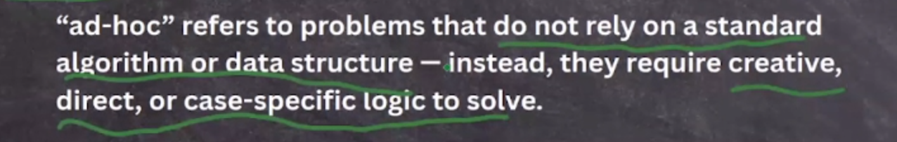
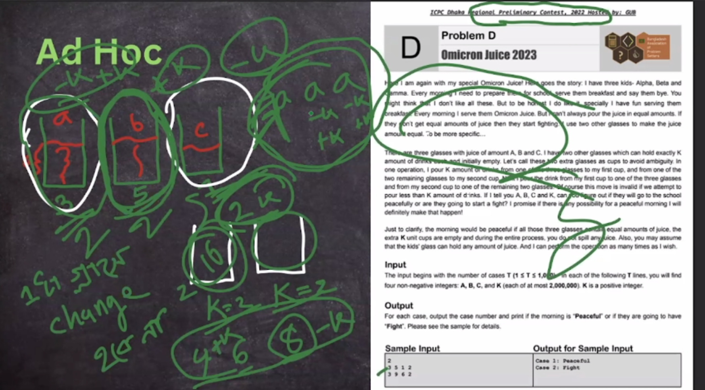
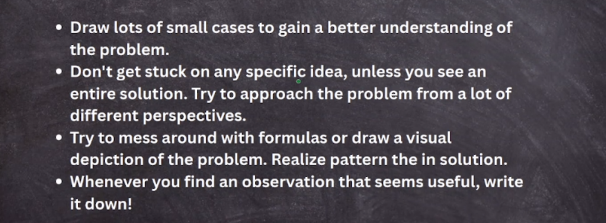

## Adhoc

- direct solution, no algorithms, observation based

- easy problems are most of the times adhoc problems

 ### Adhoc Problems

Adhoc problems **don't rely on specific algorithms or data structures**. They require creative, case-by-case solutions based on the problem description.

**Example**: Finding the second-largest number in a list.

example:

- [miaki-presents-kuet-iupc-onsite-2025_K-Beast]()

---