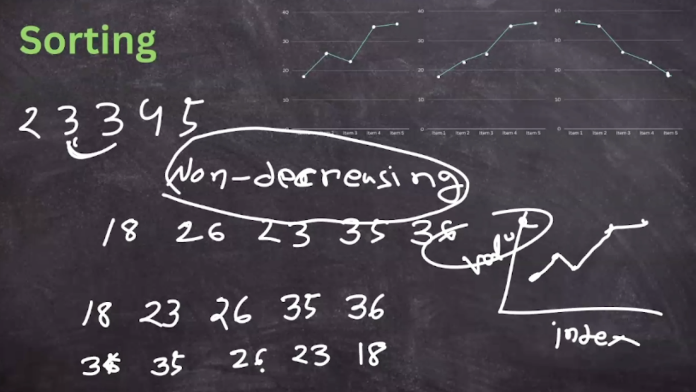
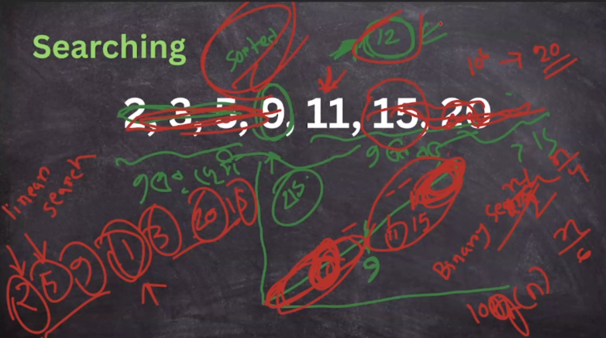
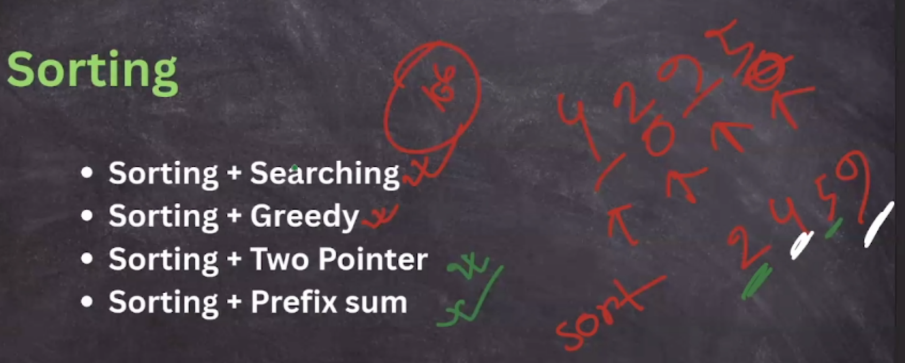
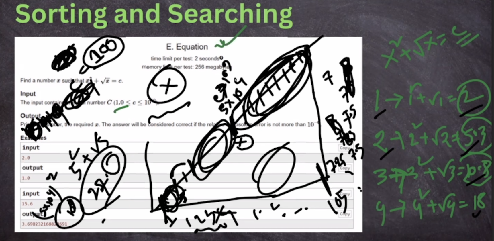

## Sorting & Searching Basics

https://visualgo.net/en/sorting



### Bubble Sort ->O(n\*n)

```cpp
//each operation bigger go to last index
//compare adjacent two by two
//iteration go upto n-1
for(int step = 1;step<n;step++){
  for(int i=1;i<n;i++){
    if(a[i]>a[i+1]){//1 based indexing
      swap(a[i],a[i+1]);
    }
  }
}
```

### Selection Sort -> 0(n\*n)

```cpp
//select smaller and swap that to first index
for(int i=1;i<n;i++){
  int min_index = i;
  for(int j=i+1;j<=n;j++){
    if(a[j]<a[min_index]){
      min_index = j;
    }
  }
  swap(a[i],a[min_index]);
}
```


example:

- [https://vjudge.net/problem/Gym-103860C](SelectionSortCount.cpp)

### Insertion Sort -> 0(n\*n)

```cpp
//each element(select) and move to the right positions
//insert new element to the right position
for(int i=2;i<=n;i++){
  int key = a[i];
  int j = i-1;
  while(j>=1 and a[j]>key){
    a[j+1] = a[j];
    j--;
  }
  a[j+1]=key;
}
```

### Counting Sort -> O(n+max)

Extra Space -> O(MAX)

```cpp
//store each in frequency array
//1 to max print i cnt[i] times
const int MAX = 1e6;
int cnt[MAX+1];
{
  for(int i=1;i<=n;i++){
    cnt[a[i]]++;
  }
  for(int i=1;i<=MAX;i++){
    for(int j=1;j<=cnt[i];j++){
      cout<<i<<" ";
    }
  }
}
```

## Searching



## Mixed up with sorting



- graphical view observation




example:

- [2027B_Stalin Sort](./1_sorting/2027B_Stalin%20Sort.cpp)

  <pre>
  starting from the second element in the array, if it is strictly smaller than the previous element (ignoring those which have already been deleted), then delete it. Continue iterating through the array until it is sorted in non-decreasing order. 
  
  We define an array as vulnerable if you can sort it in non-increasing order by repeatedly applying a Stalin Sort to any of its subarrays, as many times as is needed.
  
  Given an array a of n integers, determine the minimum number of integers which must be removed from the array to make it vulnerable?
  
  Therefore, we just need to find the longest subsequence in which the first element is the largest. This can be done easily in O(n2) — consider each index being the first item in the subsequence, and count all items to the right of it which are smaller or equal to it. Find the maximum over all of these, then subtract this from n.
  </pre>

- https://codeforces.com/contest/1741/problem/D

#### Greedy With Sorting

- [cses1629_Movie Festival](./1_sorting/cses1629_Movie%20Festival.cpp)

  <pre>
  In a movie festival n movies will be shown. You know the starting and ending time of each movie. What is the maximum number of movies you can watch entirely?
  
  - single time only watch single movie
  - sort ny ending time which is less comes first
  
  [Activity Selection Problem]
  </pre>

- [cses1074_Stick Lengths](./1_sorting/cses1074_Stick%20Lengths.cpp)

  <pre>There are n sticks with some lengths. Your task is to modify the sticks so that each stick has the same length.
  You can either lengthen and shorten each stick. Both operations cost x where x is the difference between the new and original length.
  What is the minimum total cost?
  
  - make everything to became middle element
  </pre>

- [cses1630_Tasks and Deadlines](./1_sorting/cses1630_Tasks%20and%20Deadlines.cpp)

  <pre>
  You have to process n tasks. Each task has a duration and a deadline, and you will process the tasks in some order one after another. Your reward for a task is d-f where d is its deadline and f is your finishing time. (The starting time is 0, and you have to process all tasks even if a task would yield negative reward.)
  
  What is your maximum reward if you act optimally?
  - we have to maximize sum(d - f) and do all work.
  - start first which has minimum duration 
  </pre>

- [cses1073_Towers](./1_sorting/cses1073_Towers.cpp)

  <pre>
  You are given n cubes in a certain order, and your task is to build towers using them. Whenever two cubes are one on top of the other, the upper cube must be smaller than the lower cube.
  You must process the cubes in the given order. You can always either place the cube on top of an existing tower, or begin a new tower. What is the minimum possible number of towers?
  </pre>

- [cses1161_Stick Divisions](./1_sorting/cses1161_Stick%20Divisions.cpp)
  <pre>
  You have a stick of length x and you want to divide it into n sticks, with given lengths, whose total length is x.
  On each move you can take any stick and divide it into two sticks. The cost of such an operation is the length of the original stick.
  What is the minimum cost needed to create the sticks?
  
  input has n integers d_1,d_2,\ldots,d_n: the length of each stick in the division.
  
  - first merge two min size stick
  </pre>

---
