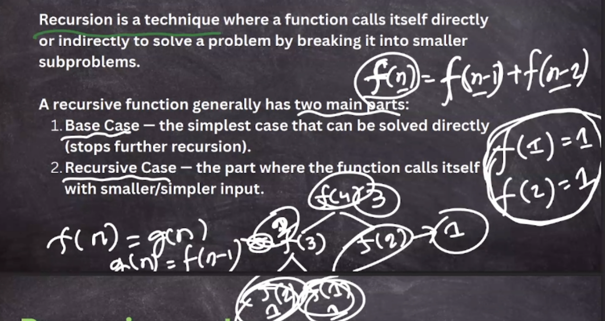
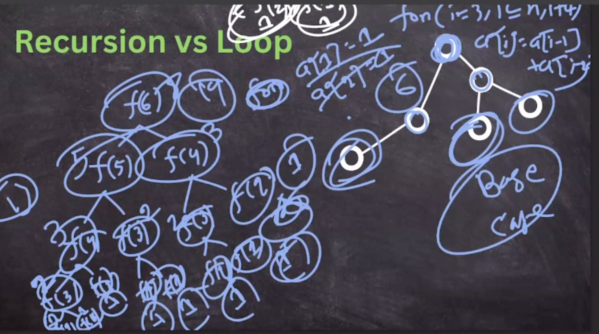
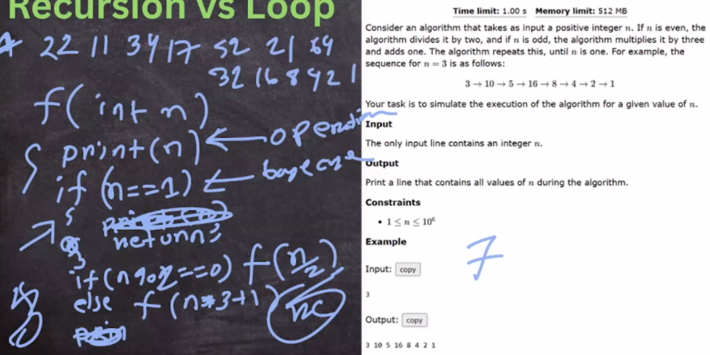
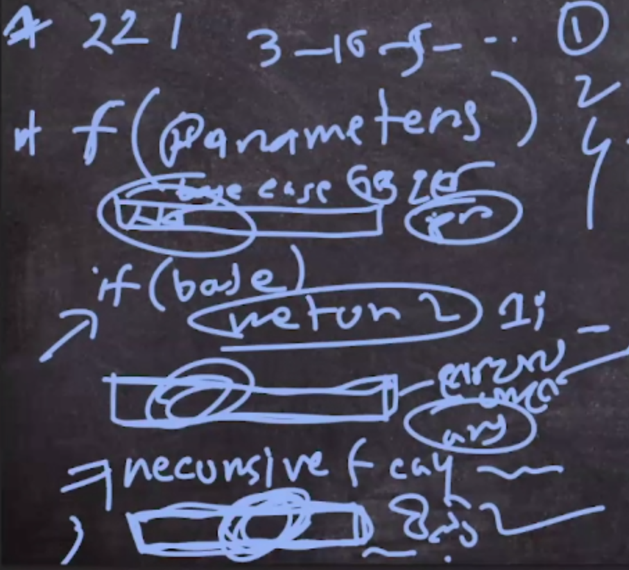

# Recursion

Recursion is a technique where a problem is broken down into smaller subproblems of the same type.
Each recursive call solves a smaller subproblem until it reaches a **base case**, which is solvable without further recursion.

- **Base case**: acts as the termination condition for recursion.
- Without a valid base case, recursion may lead to infinite loops and **stack overflow**.



- loop working linearly, where loop is work - we can't use recursion there 
- we can make relation using recursion, it can go multiple direction from one place
- in recurion, we can jump one state to another



- CSES Weird Algorithm



- General Recursion Structure



- CSES tower of hanoi
---

## 🌀 Examples of Recursion

### 1. Sum of first `n` numbers – _O(N)_

<details>
<summary>Code (C++)</summary>

```cpp
int sum(int n) {
  if (n == 0) return 0; // base case
  return n + sum(n - 1);
}
```

</details>

---

### 2. Factorial `n!`

<details>
<summary>Code (C++)</summary>

```cpp
int factorial(int n) {
  if (n == 0) return 1;
  return n * factorial(n - 1);
}
```

</details>

---

### 3. Fibonacci Sequence

<details>
<summary>Code (C++)</summary>

```cpp
int fibonacci(int n) {
  if (n == 0) return 0;
  if (n == 1) return 1;
  return fibonacci(n - 1) + fibonacci(n - 2);
}
```

</details>

---

### 4. Check if a string is palindrome

<details>
<summary>Code (C++)</summary>

```cpp
string s;
bool isPalindrome(int firstPos, int lastPos) {
    if (firstPos >= lastPos) return true; // base case
    if (s[firstPos] != s[lastPos]) return false;
    return isPalindrome(firstPos + 1, lastPos - 1);
}
int main() {
    cin >> s;
    if (s.size()) {
        cout << isPalindrome(0, s.size() - 1) << endl;
    }
    return 0;
}
```

</details>

---

### 5. Linear Search using recursion

<details>
<summary>Code (C++)</summary>

```cpp
int a[20], n, target;
bool isFind(int pos) {
    if (pos == n) return false;
    if (a[pos] == target) return true;
    return isFind(pos + 1);
}
int main() {
    n = 6;
    for (int i = 0; i < n; i++) {
        a[i] = i + 1;
    }
    target = 6;
    cout << isFind(0) << endl;
    return 0;
}
```

</details>

---

### 6. Print all subsequences/subsets

<details>
<summary>Recursive Approach</summary>

```cpp
int n, a[20];
bool isTaken[20];
void subSet(int pos) {
    if (pos > n) {
        for (int i = 1; i <= n; i++) {
            if (isTaken[i]) cout << a[i] << " ";
        }
        cout << endl;
        return;
    }
    isTaken[pos] = false; // not take
    subSet(pos + 1);
    isTaken[pos] = true;  // take
    subSet(pos + 1);
}
int main() {
    n = 5;
    for (int i = 1; i <= n; i++) a[i] = i;
    subSet(1);
    return 0;
}
```

</details>

- https://codeforces.com/group/MWSDmqGsZm/contest/223339/problem/W

- https://codeforces.com/group/MWSDmqGsZm/contest/223339/problem/N
- https://codeforces.com/group/MWSDmqGsZm/contest/223339/problem/X
<details>
<summary>Bitmask Approach (Compact)</summary>

```cpp
int n = 5;
int a[20];
for (int i = 0; i < n; i++) a[i] = i + 1;

// iterate over all possible subsets (2^n subsets)
for (int mask = 0; mask < (1 << n); mask++) {
    for (int i = 0; i < n; i++) {
        if (mask & (1 << i)) cout << a[i] << " ";
    }
    cout << endl;
}
```

</details>

---

### 7. Target subsequence sum

<details>
<summary>Code (C++)</summary>

```cpp
int n, a[20];
int targetSum, cnt;
void subSet(int pos, int curSum) {
    if (pos == n) {
        if (curSum == targetSum) cnt++;
        return;
    }
    subSet(pos + 1, curSum + a[pos]); // include
    subSet(pos + 1, curSum);          // exclude
}
int main() {
    n = 5;
    for (int i = 0; i < n; i++) a[i] = i + 1;
    targetSum = 3;
    cnt = 0;
    subSet(0, 0);
    cout << cnt << endl;
    return 0;
}
```

</details>

---

## 🔗 Useful Visualizers

- [Recursion Tree Visualizer](https://recursion.vercel.app/), [Visualizer-2](https://pythontutor.com/render.html#mode=edit)
- [Recursion Stack Visualizer](https://www.cs.usfca.edu/~galles/visualization/RecFact.html)

---

## 📊 Time and Space Complexity in Recursion

- **Time Complexity** = (time per node) × (number of nodes in recursion tree)
- **Space Complexity** = (maximum depth of recursion) × (space per call)

  | Problem           | Time Complexity | Space Complexity |
  | ----------------- | --------------- | ---------------- |
  | Fibonacci (naive) | **O(2^n)**      | **O(n)**         |
  | Factorial         | **O(n)**        | **O(n)**         |
  | Sum (1..n)        | **O(n)**        | **O(n)**         |
  | Subsets (n)       | **O(2^n)**      | **O(n)**         |

---

## ⚠️ Pitfalls

- **Stack Overflow**: occurs when recursion depth exceeds call stack capacity → Runtime Error/Segmentation Fault.
- **Infinite Recursion**: happens when recursion forms a **cycle** and has no valid base case.

Example:

```
f(n) = f(n-1) + f(n+1)
```

- To compute `f(n)`, you need `f(n-1)` and `f(n+1)`.
- But `f(n+1)` calls `f(n+2)`, and `f(n-1)` will eventually call `f(n)` again.
- 🚨 This recursion never terminates.

✅ Always ensure:

1. **Base cases** → stopping conditions exist.
2. **Progress towards base case** in every recursive call.

---
- https://codeforces.com/group/MWSDmqGsZm/contest/223339/problem/X
- https://vjudge.net/problem/HackerRank-matrix-land
