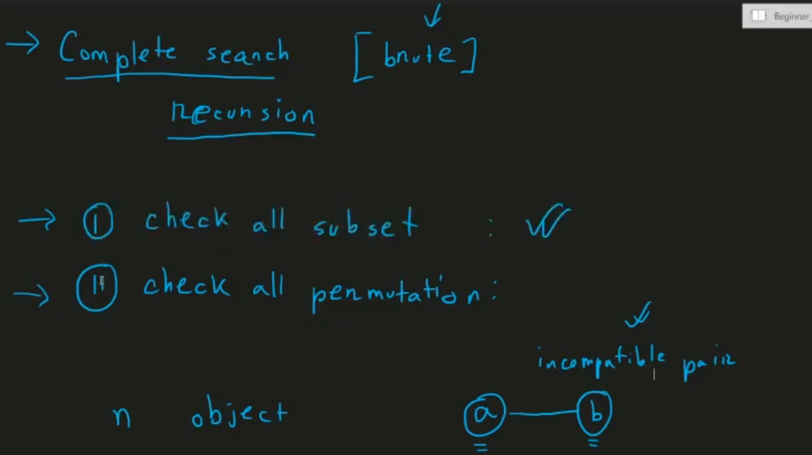
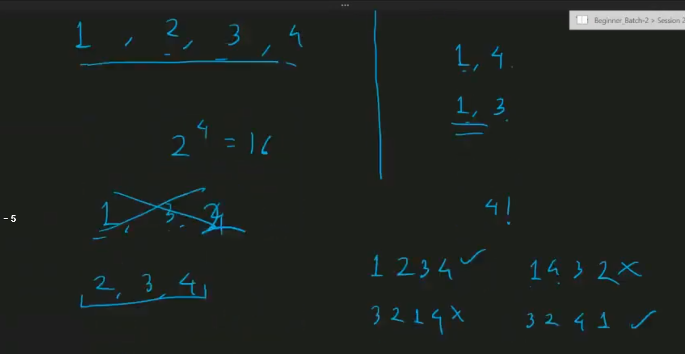
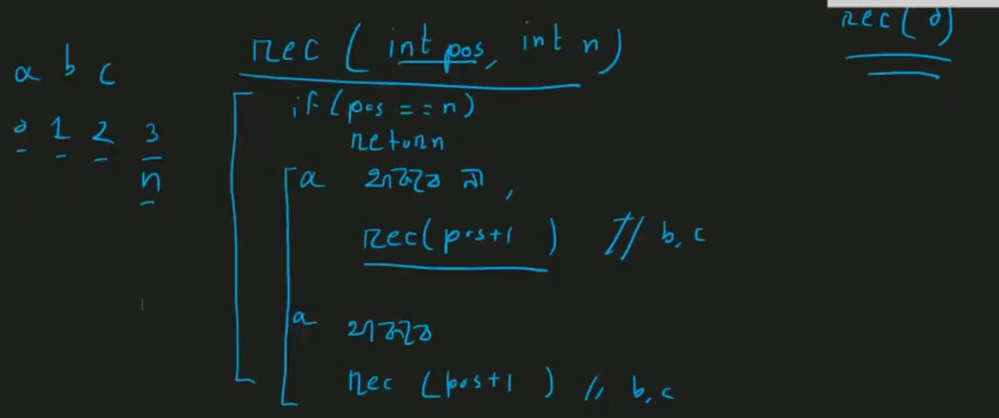
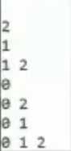
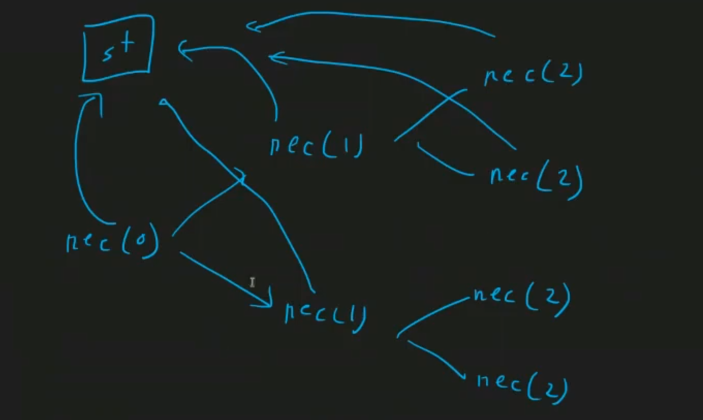
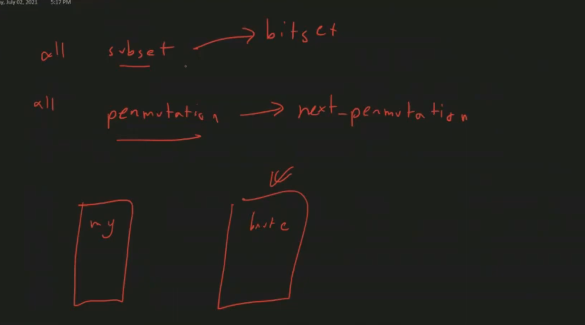

## Complete Search & Backtracking

### Complete Search (Bruteforces) -> use recursion

two type of problems

- check all subset
- check all permutation



- not have incompatible pair (if have 1 then 2 is not present or after 1 not have 4)



- subset generation




```cpp
vector<int> st;
//O(2^n)
void rec(int pos, int n) {
    if (pos == n) {
        for (int x : st) {
            cout << x << " ";
        }
        cout << "\n";
        return;
    }

    // Option 1: current element not in the subset
    rec(pos + 1, n);

    // Option 2: current element in the subset
    st.push_back(pos);
    rec(pos + 1, n);
    st.pop_back();
}

int main() {
    int n; cin >> n;
    rec(0, n);
    return 0;
}
```






- not have incompatible pair

```cpp
vector<int> st;
set<pair<int, int>> incompatible;
int cnt = 0;

void rec(int pos, int n) {
    if (pos == n) {
        bool invalid = false;

        // Check if any two elements in the subset are incompatible
        for (int i = 0; i < st.size(); i++) {
            for (int j = i + 1; j < st.size(); j++) {
                if (incompatible.count({st[i], st[j]}) > 0) {
                    invalid = true;
                    break;
                }
            }
            if (invalid) break;
        }

        if (!invalid) {
            cnt++;
            for (int x : st) {
                cout << x << " ";
            }
            cout << endl;
        }
        return;
    }

    // Option 1: current element not in the subset
    rec(pos + 1, n);

    // Option 2: current element in the subset
    st.push_back(pos);
    rec(pos + 1, n);
    st.pop_back();
}
// O(2^n) n at most 20-22

int main() {
    int n;
    cin >> n;

    int k;
    cin >> k;

    for (int i = 0; i < k; i++) {
        int u, v;
        cin >> u >> v;
        incompatible.insert({u, v});
        incompatible.insert({v, u});
    }

    rec(0, n);

    cout << cnt << endl;
    return 0;
}
```

<pre>
What the code does:
- Generates all subsets of {0, 1, 2, ..., n-1}
- For each subset, checks if it contains any incompatible pairs
- Only counts and prints valid subsets (those without incompatible pairs)
- Uses a set to store incompatible pairs for O(1) lookup

Time Complexity: O(2^n × k) where k is the number of incompatible pairs to check in each subset
</pre>

- difference between bitset & recursion
  > in recursion check instantly
  > decision in middle way... not depend on full path

```cpp
vector<int> st;
set<pair<int, int>> incompatible;
int cnt = 0;

void rec(int pos, int n) {
    if (pos == n) {
        cnt++;
        for (int x : st) {
            cout << x << " ";
        }
        cout << endl;
        return;
    }

    // Option 1: current element not in the set
    rec(pos + 1, n);

    // Option 2: current element in the set (only if compatible with all existing elements)
    bool compatible = true;
    for (int x : st) {
        if (incompatible.count({x, pos}) > 0) {  // Fixed: was '!ncompatible' and wrong syntax
            compatible = false;
            break;
        }
    }

    if (compatible) {
        st.push_back(pos);
        rec(pos + 1, n);
        st.pop_back();
    }
}
```

<pre>
How this version differs from the previous one:

Previous approach (from earlier screenshots):
Generates ALL subsets first
Then checks ALL pairs in each complete subset for incompatibility
Inefficient: Wastes time generating invalid subsets

Current approach (pruning):
Checks compatibility before adding each new element
If incompatible with any existing element, skips that branch entirely
More efficient: Prunes invalid branches early in the recursion

Time Complexity: Still O(2^n) in worst case, but with much better practical performance due to early pruning.
</pre>

- it's called backtrack
- it go upto 25-30 depend in case... but theoritical complexity not change

- fixed size subset... (permutation)

```cpp
vector<int> st;
set<pair<int, int>> incompatible;

void rec(int pos, int n, int s) {
    if (pos == n) {
        if (st.size() != s) return;  // Only print subsets of exact size s
        for (int x : st) {
            cout << x << " ";
        }
        cout << endl;
        return;
    }

    // Option 1: current element not in the set
    rec(pos + 1, n, s);

    // Option 2: current element in the set (if we haven't reached size limit and it's compatible)
    if (st.size() == s) return;  // Prune if we already have enough elements

    bool compatible = true;
    for (int x : st) {
        if (incompatible.count({x, pos}) > 0) {  // Fixed pair syntax
            compatible = false;
            break;
        }
    }

    if (compatible) {
        st.push_back(pos);
        rec(pos + 1, n, s);
        st.pop_back();
    }
}
// O(2^n) n at most 20-22

int main() {
    int n, k, s;
    cin >> n >> k >> s;

    for (int i = 0; i < k; i++) {
        int u, v;
        cin >> u >> v;
        incompatible.insert({u, v});
        incompatible.insert({v, u});
    }

    rec(0, n, s);
    return 0;
}
```

### all possible permutation

- n! > 2^n
- upto n 10-11

- easy way
  > n= 15 -> approx 3.3 hr
  > use do while loop (for printing initial value also)
  > only next print .... so we have to sort first

```cpp
int main() {
    int n;
    cin >> n;
    vector<int> input(n);
    for (int i = 0; i < n; i++) {
        cin >> input[i];
    }
    sort(input.begin(), input.end());  // Important: must sort first!

    do {
        for (int x : input) {
            cout << x << " ";
        }
        cout << endl;
    } while (next_permutation(input.begin(), input.end()));
}
```

<pre>
How next_permutation works:
- Requires sorted input: The array must be sorted in ascending order initially to generate all permutations
- Generates in lexicographical order: Each call generates the next permutation in sorted order
- Returns false when done: Returns false when no more permutations exist (already at largest permutation)
- Modifies the array in-place: Rearranges the elements to the next permutation
</pre>

- complete search way - recursion


```cpp
vector<int> perm;

void rec(int pos, int n){
    if(pos == n){
        for(int x: perm){
            cout<<x<<" ";
        }
        cout<<endl;
        return;
    }

    for(int i = 0; i<n; i++){
        bool possible = true;
        for(int x : perm){
            if(x == i)
                possible = false;
        }
        if(!possible)
            continue;
        perm.push_back(i);
        rec(pos+1, n);
        perm.pop_back();
    }
}
```

- 8 queen problem

- i not palce in ith place - dearrangement

```cpp
vector<int> perm;

void rec(int pos, int n) {
    if (pos == n) {
        for (int x : perm) {
            cout << x << " ";
        }
        cout << endl;
        return;
    }

    for (int i = 0; i < n; i++) {
        if (i == pos) continue;  // Skip if element would be in its original position

        bool possible = true;
        for (int x : perm) {
            if (x == i) {
                possible = false;
                break;
            }
        }
        if (!possible) continue;

        perm.push_back(i);
        rec(pos + 1, n);
        perm.pop_back();
    }
}

int main() {
    int n;
    cout << "Enter the value of n: ";
    cin >> n;

    rec(0, n);
    return 0;
}
```



### BackTracking

- count subsequence with given sum
- count paths in a matrix
- rat in a maze (print one ans, print all ans)
- N Queens

- https://codeforces.com/problemset/problem/1553/B

---
