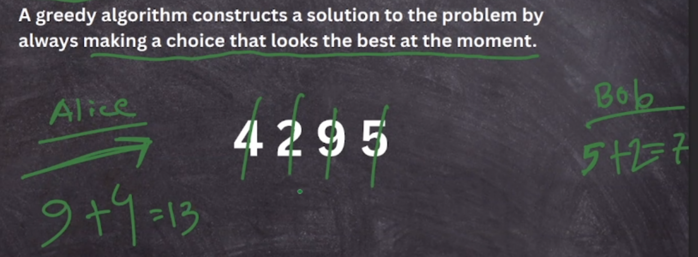
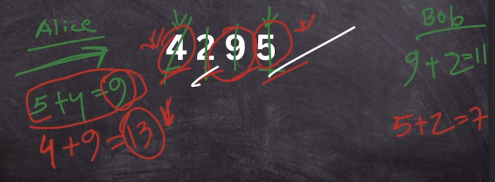
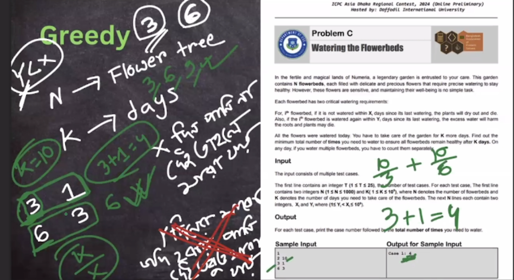
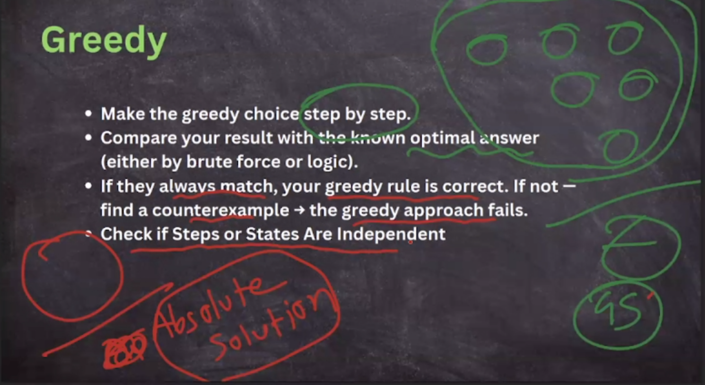

## Greedy

> Greedy problems involve making the best local choice at each step in the hope of achieving a globally optimal solution. These problems require the greedy-choice property to ensure the local optimum leads to the global optimum.

- sometimes local optimal not lead to global optimal - which is not greedy

- all summation of current solution is absotute solution -> greedy
- all state is independent

**Example**: The Activity Selection Problem or Huffman Coding.

---

- https://codeforces.com/problemset/problem/1534/B
- https://codeforces.com/problemset/problem/1471/B
- https://codeforces.com/problemset/problem/1553/C
- https://codeforces.com/contest/1498/problem/B

- https://codeforces.com/problemset/problem/1385/C

- https://codeforces.com/problemset/problem/1618/D
- https://codeforces.com/problemset/problem/1560/D

> https://www.geeksforgeeks.org/dsa/greedy-algorithms/

> https://codeforces.com/blog/entry/79019?f0a28=1

classic greedy bag carrying problem - https://codeforces.com/problemset/problem/1591/C

greedy with median tendency

- https://codeforces.com/problemset/problem/1520/E

greedy ds

- https://codeforces.com/problemset/problem/1506/D

mod + greedy

- https://codeforces.com/problemset/problem/1551/B2
