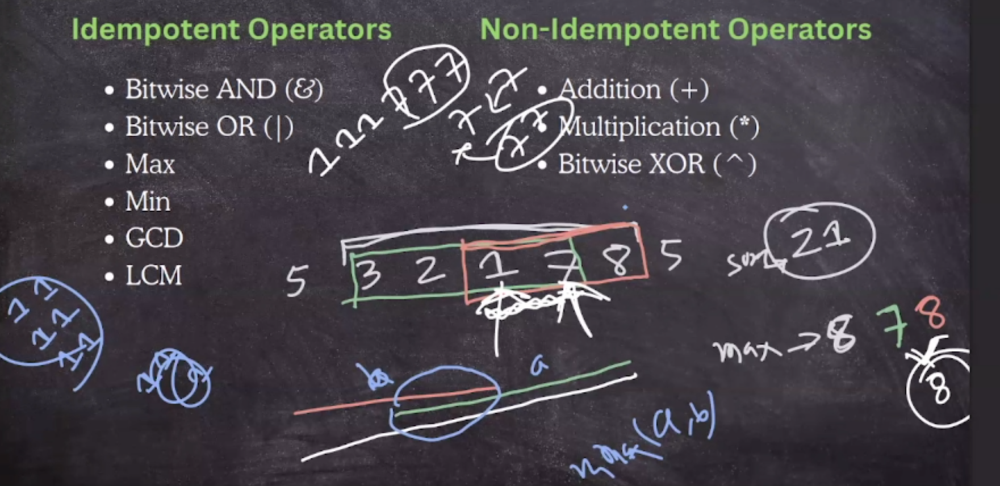
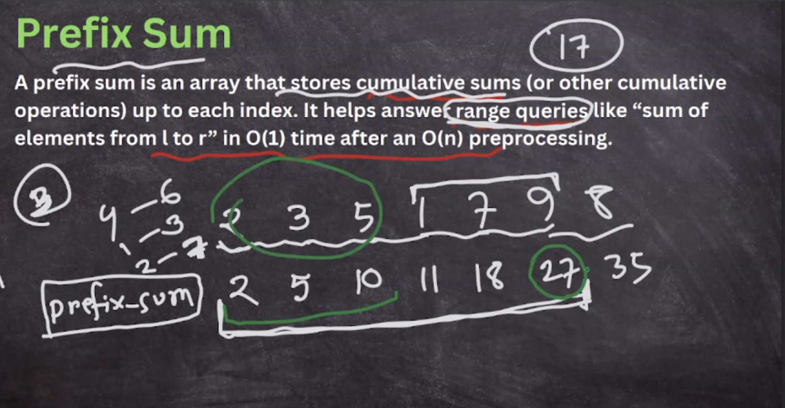
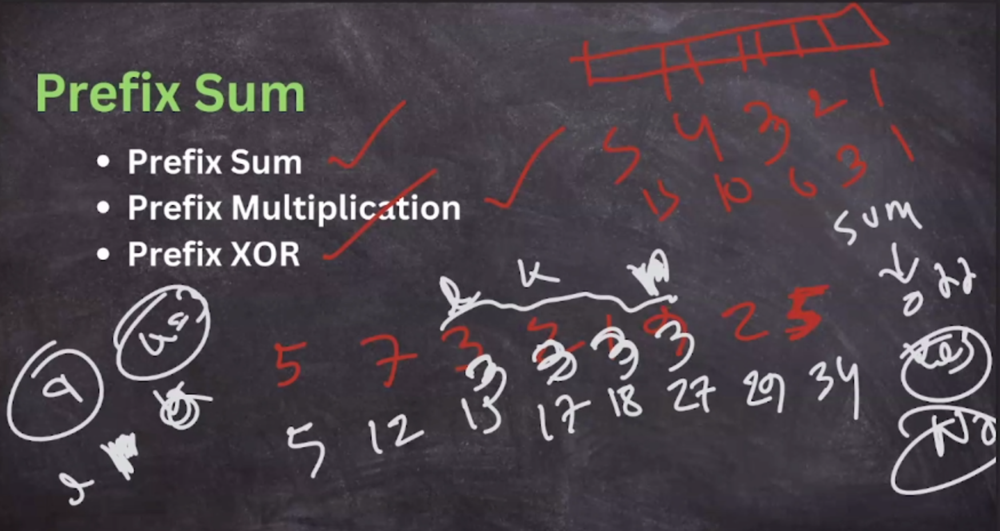

- idempotent (effect doesn't has) -> query ans -> sparse table
- non-idempotent (effect does has) (opposite operation has)-> query ans ->  prefix sum


## Prefix Sum/Suffix Sum



> - for i->n pref[i]=a[i]+pref[i-1]
> - pref_sum[l-r] = ps[r]-ps[l-1]
> - O(n^2) -> O(n)




> (r-l+1)*3

example:

- https://codeforces.com/problemset/problem/1504/B

- [CSUMQ - Cumulative Sum Query](./1.prefix_sum/spoj_CSUMQ%20-%20Cumulative%20Sum%20Query.cpp)

<pre>
You are given a list of N numbers and Q queries. Each query is specified by two numbers i and j; the answer to each query is the sum of every number between the range [i, j] (inclusive).

Note : 0 Based Indexing
</pre>

- https://codeforces.com/contest/2075/problem/C

### 2D Prefix Sum / Prefix Sum of Matrix

https://www.geeksforgeeks.org/prefix-sum-2d-array/

<pre>
- prefix[i][j] = ​prefix[i−1][j]+prefix[i][j−1] − prefix[i−1][j−1]+arr[i][j]​

- Corner Cases (First row and first column)
  If i = 0 and j = 0
    psa[i][j] = a[i][j]
  If i = 0 and j > 0
    psa[i][j] = psa[i][j-1] + a[i][j]
  If i > 0 and j = 0
    psa[i][j] = psa[i-1][j] + a[i][j]
</pre>


- Given n\*m matrix (n,m<=1000), and q queries, we have to find sum of submatrix in each query

```cpp
using ll = long long;

const int N = 1e3 + 9;
int a[N][N];
ll pref[N][N];

int32_t main() {
    ios_base::sync_with_stdio(false);
    cin.tie(NULL);

    int n, m; cin >> n >> m;
    for (int i = 1; i <= n; i++) {
        for (int j = 1; j <= m; j++) {
            cin >> a[i][j];
        }
    }
    for (int i = 1; i <= n; i++) {
        for (int j = 1; j <= m; j++) {
            pref[i][j] = pref[i - 1][j] + pref[i][j - 1] - pref[i - 1][j - 1] + a[i][j];
        }
    }
    int q; cin >> q;
    while (q--) {
        int x1, y1, x2, y2; cin >> x1 >> y1 >> x2 >> y2;
        ll ans = pref[x2][y2] - pref[x1 - 1][y2] - pref[x2][y1 - 1] + pref[x1 - 1][y1 - 1];
        cout << ans << endl;
    }
    return 0;
}
```

### 3D Prefix Sum
