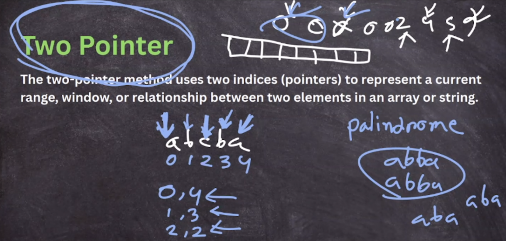
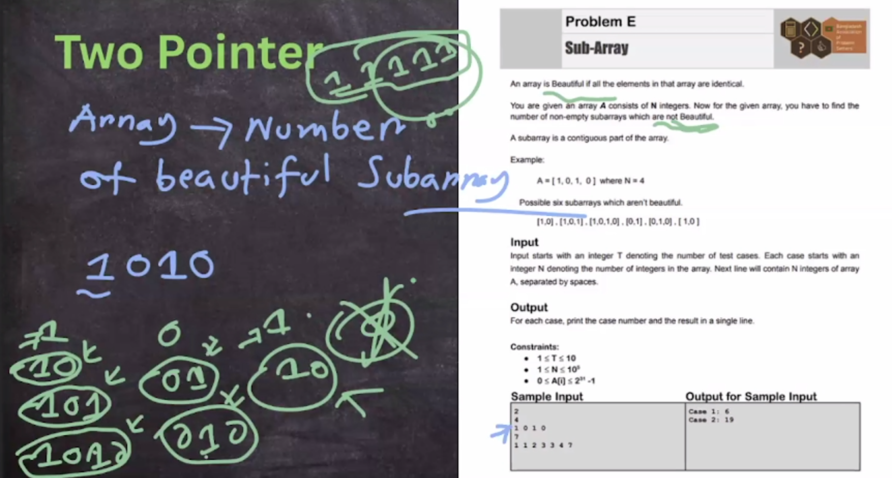
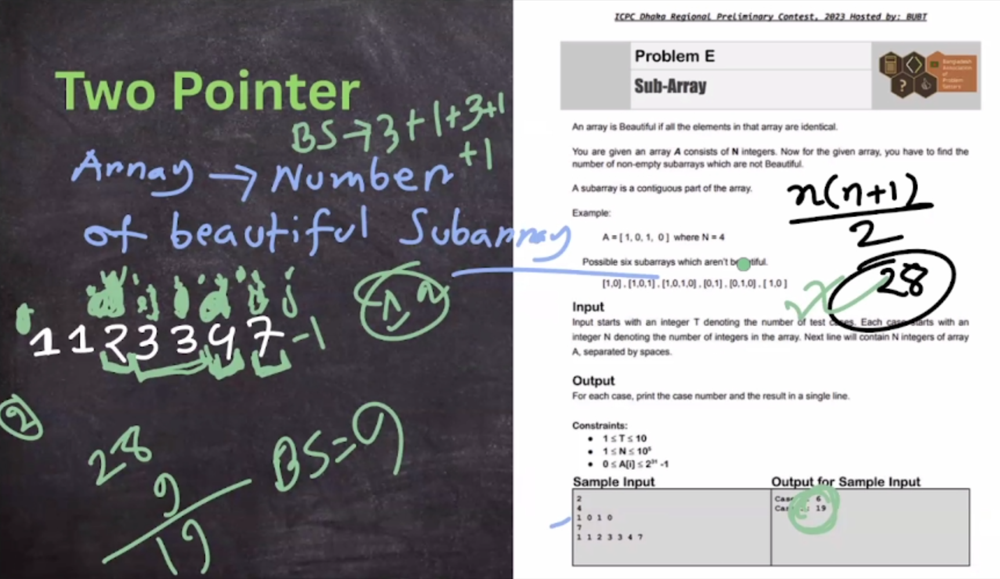
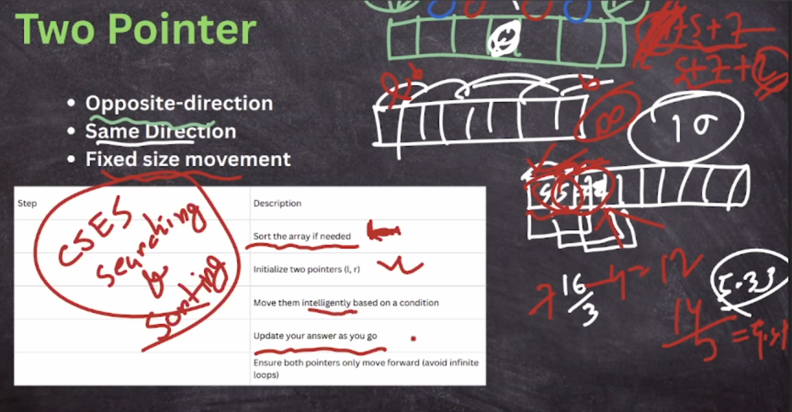

## Two Pointer

- https://codeforces.com/problemset/problem/1487/B

    1. Adhoc Two Pointer
    2. Good Segment Category*

https://usaco.guide/silver/two-pointers?lang=cpp

- Iterating two monotonic pointers across an array to search for a pair of indices satisfying some condition in linear time.

- _Each variable moves in a single direction_, and they only traverse the array a single time.
  Therefore, time complexity will be O(N+M)

##### Optimization_Technique

    Binary Search on Array O(NlogN)-> using two pointer O(N)
    Binary Search <-> Two Pointer

https://www.geeksforgeeks.org/two-pointers-technique/

#### Variable Size Sliding Window (Also known as two pointer)

The general steps to solve these questions by following below steps:

    In this type of sliding window problem, we increase our right pointer one by one till our condition is true.
    At any step if our condition does not match, we shrink the size of our window by increasing left pointer.
    Again, when our condition satisfies, we start increasing the right pointer and follow step 1.
    We follow these steps until we reach to the end of the array.

#### Good Segment Technique Tricks

    *If segment within [L,R] is good, segment enclosed within will be good.
        -> Increasing, Decreasing Technique
    *Do not use binary search in that problem
    *Good segment-> multiple of (j-i+1) for every i in (longest_subarray_length_sum<=k)




> no. of total subarrays -> n(n+1)/2



> O(n^3) -> O(n^2) -> O(n)



#### Some Technique

- Given two sorted array, we have to merge it within O(N+M) and makes array sorted.

```cpp
vector<int> merge(vector<int>&l, vector<int>&r) {
  int n = l.size(), m = r.size();
  vector<int>ans;
  int i = 0, j = 0;
  while (i < n and j < m) {
    if (l[i] < r[j]) {
      ans.push_back(l[i++]);
    } else {
      ans.push_back(r[j++]);
    }
  }
  while (i < n) ans.push_back(l[i++]);
  while (j < m) ans.push_back(r[j++]);
  return ans;
}
```

- [Given two sorted array, we have to find a[i] + b[i] = x](./2_two_pointer/ai_bi_x_where_a_b_sorted.cpp)

```cpp
//using two pointer O(N+M)... using bs it's go to O(NlogN)
for (int i = 0, j = m - 1; i < n; i++) // O(N){
  int rem = x - a[i];
  while (j >= 0 and b[j] > rem){ // O(M) in total
    j--;
  }
  if (j >= 0 and b[j] == rem){
    cout << i << " " << j << endl;
    return;
  }
}
```

https://usaco.guide/CPH.pdf#page=87

- [Subarray sum ->(Given an array of N (1<=N<=1e5 ) positive elements, find a contiguous subarray that sums to X.)](./2_two_pointer/gfg_find-subarray-with-given-sum.cpp)

<pre>A[] ={1 3 2 5 1 1 2 3} , x = 8 
Naive Method : Find all subarray and compare to x, but that give O(N\*N). 
This problem can be solved in O(n) time by using the two pointers method</pre>


<pre>The running time of the algorithm depends on the number of steps the right pointer moves. we know that the pointer moves a total of O(n) steps during the algorithm, because it only moves to the right.
  
Pros and Cons:
      f(A[i]<0) then it will give WRONG ANSWER
      The above solution does not work for arrays with negative numbers.
      Then, We use [Hashing + Prefix Sum] O(N) time and O(N) Space
</pre>

https://darrenyao.com/usacobook/cpp.pdf#page=70

- **2SUM problem** (Given an array of N elements (1<=N<=1e5 ), find two elements that sum to X)

<pre>We can solve this problem using two pointers; sort the array, then set one pointer at the beginning and one pointer at the end of the array. </pre>

```cpp
int left = 0; int right = n - 1;
while (left < right) {
    if (arr[left] + arr[right] == x) {
        break;
    } else if (arr[left] + arr[right] < x) {
        left++;
    } else {
        right--;
    }
}
// if left >= right after the loop ends, no answer exists.
```

- **Maximum subarray sum** (Given an array of N integers (1<=N<=1e5 ), which can be positive or negative, find the maximum sum of a contiguous subarray)
<pre>It is not solved by two pointers, but it similar to that kind of problem.We can solve this problem using Kadane’s algorithm.</pre>

```cpp
//kadane's algorithm
int best = 0, current = 0;
for (int i = 0; i < n; i++) {
  current = max(0, current + arr[i]);
  best = max(best, current);
}
```

- Largest Subarray with sum <=s

```cpp
//bruteforce solution O(N*N)
int ans = 0;
for (int l = 1; l <= n; l++) {
  int sum = 0;
  for (int r = l; r <= n; r++) {
    sum += a[r];
    if (sum <= s) {
      ans = max(ans, r - l + 1);
    }else{
      break;
    }
  }
}
cout << ans << endl;

//two pointer solution O(2N)-> O(N) -> everytime l is increament by 1 and r is increament by 1
//all value is positive
// if [l,r] is good then [l,r-1] or [l+1,r]  is also good
int ans = 0, r = 1;
ll sum = 0;
for (int l = 1; l <= n; l++) {
  while (r <= n and a[r] + sum <= s) {
    sum += a[r];
    r++;
  }
  ans = max(ans, r - l); //[l,r-1] is the largest subarray with sum<=s {r-l+1-1}
  sum -= a[l];
}
cout << ans << endl;
```

- Number of Subarray with sum <=s

```cpp
int r = 1;
ll sum = 0, ans = 0;
for (int l = 1; l <= n; l++) {
  while (r <= n and a[r] + sum <= s) {
    sum += a[r];
    r++;
  }
  ans += r - l; //[l,r-1] is the largest subarray with sum<=s {r-l+1-1}
  sum -= a[l];
}
cout << ans << endl;
```

- Number of Subarray with sum >=s

```cpp
int r = 1;
ll sum = 0, ans = 0;
for (int l = 1; l <= n; l++) {
  while (r <= n and a[r] + sum < s) {
    sum += a[r];
    r++;
  }
  ans += n - r + 1; //r is the smallest index in which sum of [l,r-1]<s
  sum -= a[l];
}
cout << ans << endl;
```

- Number of good segment where, in each segment abs(max-min) at most k (<=k)

```cpp
//always increase difference
//if [l,r] good then [l,r+1] also good
using ll = long long;

const int N = 1e5 + 9;
ll a[N];

struct DS {
  multiset<ll>ms;
  DS() {}
  void insert(ll x) {
    ms.insert(x);
  }
  void erase(ll x) {
    ms.erase(ms.find(x));
  }
  ll get_max() {
    return *(--ms.end());
  }
  ll get_min() {
    return *ms.begin();
  }
  ll get() {
    return get_max() - get_min();
  }
} ds;

int32_t main() {
  ios_base::sync_with_stdio(false);
  cin.tie(NULL);

  int n; cin >> n;
  ll k; cin >> k;
  for (int i = 1; i <= n; i++) {
    cin >> a[i];
  }
  int r = 1;
  ll  ans = 0;
  for (int l = 1; l <= n; l++) {
    while (r <= n) {
      ds.insert(a[r]);
      if (ds.get() > k) {
        ds.erase(a[r]);
        break;
      }
      r++;
    }
    ans += r - l; //r - 1 is the maximum index i, such that max(a[l...i])-min(a[l...i])<=k
    ds.erase(a[l]);
  }
  cout << ans << endl;
  return 0;
}
```

example:

2033D D. Kousuke's Assignment
