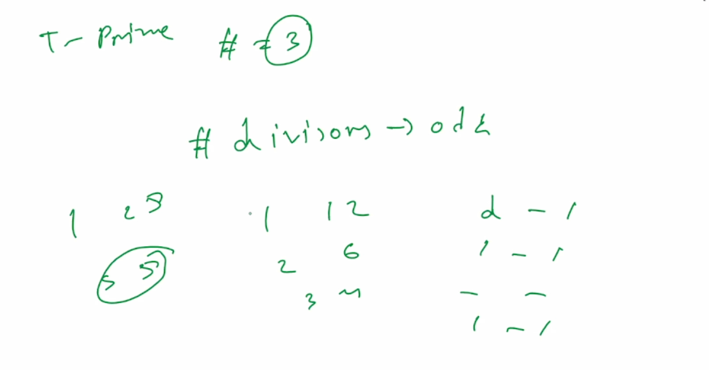
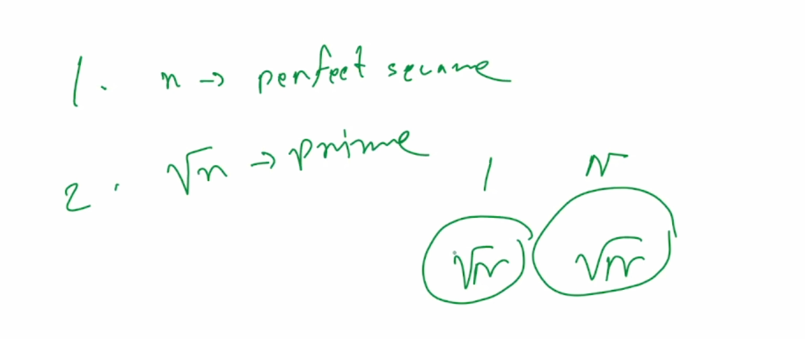

### Divisors

<pre>
- odd number of divisors are perfect square (i==n/i we eliminate one divisors because of unique divisors.) (ex. cf2020B)
- otherwise all other number has even number of divisors
</pre>

```cpp
//finding divisors using sqrt method O(sqrt(n))
//used to find single number
vector<int>divisors_of_n(int n) {
    vector<int>divisors;
    //we have to maintain (i*i) not go to overflow
    //if(overflow) then it go to infinite loop
    for (int i = 1; i * i <= n; i++) {//because of sqrt()-> may cause precision error
        if (n % i == 0) {
            divisors.push_back(i);
            if (i != n / i) {//because of unique divisors
                divisors.push_back(n / i);
            }
        }
    }
    sort(divisors.begin(), divisors.end());
    for (auto x : divisors) {
        cout << x << " ";
    }
    return divisors;
}
```

- Number of Divisors from 1 to N (Each Number)

<pre>
  normal way O(nsqrt(n) causes TLE) (n upto 1e5)-> O(nlogn)
</pre>

```cpp
//complexity O(nlogn)
//used to find multiple number
const int N = 1e7+9;
int d[N];
for(int i=1;i<N;i++){
  for(int j=i;j<N;j+=i){//harmonic series
    d[j]++;
  }
}
// if(d[i]==2) -> they are prime
```

```cpp
for(int i=1;i<=n;i++){
  if(n%i==0){
    cout<<i<<" ";
  }
}
```

- (b | a) -> b divide a

example:

- atcoder C - Cream puff

- [1485A_Add and Divide](https://codeforces.com/problemset/problem/1485/A)
  <pre>
  You can perform two kinds of operations:
  
      a=⌊a/b⌋ (replace a with the integer part of the division between a and b)
      b=b+1 (increase b by 1) 
  
  Find the minimum number of operations required to make a=0
  </pre>

  <pre>
  we can try to increase b to a certain value and then divide a by b until it is 0. Being careful as not to do this with b<2, the number of times we divide is going to be O(loga). In particular, if you reach b≥2 (this requires at most 1 move), you need at most ⌊log2(10^9)⌋=29 moves to finish.
  
  Let y be the number of moves of type 2; we can try all values of y (0≤y≤30) and, for each y, check how many moves of type 1 are necessary.
  
  Complexity: O(log^2 a)
  </pre>

- [2029A_Set]()
- One of the first 1234567 positive integers is chosen at random. Compute the
  probability that it is divisible by 3?

  <pre>
  -> Pattern Identification:
    Every third number in the sequence of positive integers is divisible by 3:
    - Example: 1, 2, 3, 4, 5, 6, 7, 8, 9, 10, 11, 12, ...
    - From this pattern, it's clear that every package of three numbers contains exactly **one** divisible by 3.
  
  -> Count Numbers Divisible by 3:
      To find how many numbers in the first 1234567 are divisible by 3: floor(1234567/3)
  
  -> Calculate Probability:
      The probability of selecting a number divisible by 3 is:
      P = Numbers Divisible by 3 / Total Numbers = 411522 / 1234567 ≈ 0.33333306
  
  -> Result:
      This matches the expected approximation of 1/3, derived from the pattern of divisibility.
  
  - The probability `P ≈ 1/3` arises naturally from the definition of divisibility.
  - The slight deviation from `1/3` comes from the truncation during integer division.
  
  This method demonstrates how understanding divisibility patterns simplifies complex calculations.
  </pre>

- Find all integers x for which it can be said that the positive integer 2x + 9 divides the positive integer 3x + 4?

  <pre>
  From the problem statement, we can extract the following requirements:
  x ∈ Z
  2x + 9 ∈ Z+ =⇒ x ∈ Z≥−4
  3x + 4 ∈ Z+ =⇒ x ∈ Z≥−1
  3x + 4 ≥ 2x + 9 =⇒ x ∈ Z≥5
  Additionally, we require
  (3x + 4)/(2x + 9) = 1 + (x − 5)/(2x + 9) =⇒ (x − 5)/(2x + 9) ∈ Z≥0.
  This secondary requirement means that either x = 5 or
  x − 5 ≥ 2x + 9 =⇒ x ∈ Z≤−14.
  The second case is clearly impossible due to the strict x ∈ Z≥5 requirement from earlier, so the only valid integer x is 5 .
  </pre>

- https://codeforces.com/problemset/problem/1463/A
- https://codeforces.com/contest/2132/problem/B

---

### Perfect Square

<pre>
- odd number of divisors are perfect square (i==n/i we eliminate one divisors because of unique divisors.)
- otherwise all other number has even number of divisors
</pre>

```cpp
bool isSquare(i64 n) {
    int x = std::sqrt(n);
    return 1LL * x * x == n;
}
```

example:

- https://codeforces.com/contest/2071/problem/B
- https://codeforces.com/contest/2020/problem/B
- https://codeforces.com/contest/2031/problem/C

- [230B_T-primes](230B_T-primes.cpp)
<pre>
A number is called a T-prime if it has exactly three distinct positive divisors. Given n numbers, determine if each is a T-prime.
</pre>




---

