### Number Theoretic Function

<pre>
Two important number theoretic functions in mathematics are:

- τ(n) (Tau function): Counts the number of positive divisors of n
- σ(n) (Sigma function): Calculates the sum of all positive divisors of n

other two are eulers and mobius function

n -> 1e16 => sqrt(n) -> 1e8 : it can pass
</pre>

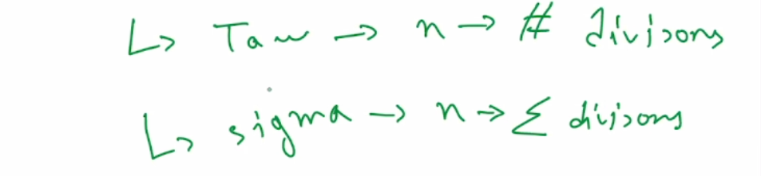
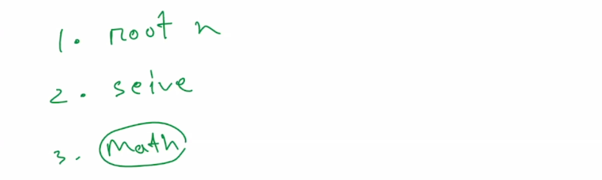

- <u>τ(n) (Tau function)</u>

<pre>τ(12) =>
- Step 1: Prime Factorization 12 = 2<sup>2</sup> × 3<sup>1</sup>
- Step 2: Use the divisor-counting formula 
If n = p<sub>1</sub><sup>a</sup> × p<sub>2</sub><sup>b</sup> × ... × p<sub>k</sub><sup>z</sup>, 
then <b>τ(n) = (a + 1)(b + 1)...(z + 1)</b> -> (+1 because of 0)

So, τ(12) = (2 + 1)(1 + 1) = 3 × 2 = 6 
- Step 3: List all divisors of 12 All numbers of the form 2<sup>i</sup> × 3<sup>j</sup> where 0 ≤ i ≤ 2, 0 ≤ j ≤ 1 

→ Possible combinations: 
i = 0, j = 0 → 1 
i = 0, j = 1 → 3 
i = 1, j = 0 → 2 
i = 1, j = 1 → 6 
i = 2, j = 0 → 4 
i = 2, j = 1 → 12 
→ Divisors of 12: 1, 2, 3, 4, 6, 12 Hence, τ(12) = 6 
✔ Confirmed: The number of positive divisors of 12 is 6. 
</pre>

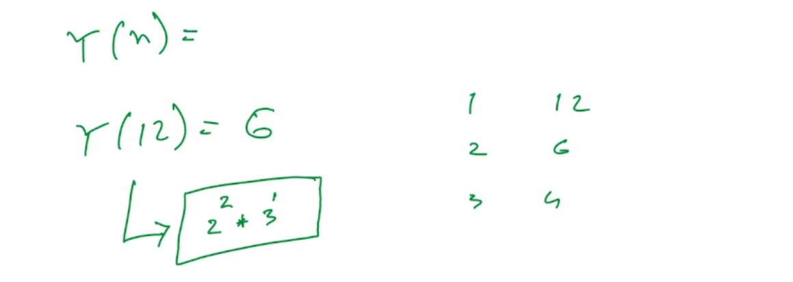

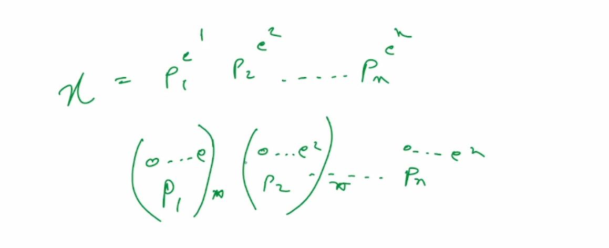
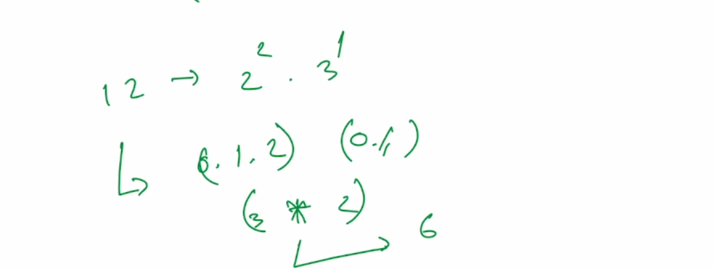
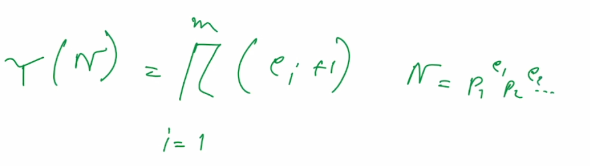

<pre>
-> odd divisors not count for 2
-> square divisors : a^x . b^y . c^z => (no.(o,2,4..x)).(no.(o,2,4..y)).(no.(o,2,4..z))
-> non square
-> squarefree (not divide by any square)
</pre>

```cpp
//number of disisors
using ll = long long
int tau(ll n) {
    int cnt = 0;
    for (ll i = 1; i * i <= n; i++) {
        if (n % i == 0) {
            cnt++;
            if (i != n / i)cnt++;
        }
    }
    return cnt;
}
```

- <u>Sieve-Based Implementation of τ(n)</u>

<pre>
1 2 3 4 5 6 7 8 9 10 ... n
|-||-||-|||-||-||||-||-||||-|||-|||| (for 1 to n go all divisor of i and add 1)
1 2 2 3 2 4 2 4 3 4
</pre>

```cpp
const int nmax = 1e5 + 10;

int tau[nmax];
int sigma[nmax];
//can go easily 1e6
void seive() { //O(nlog(n)) //can't go upto 9e7 but original can go
    for (int i = 1; i < nmax; i++) {
        for (int m = i; m < nmax; m += i) {
            tau[m]++
            sigma[m] += i;
        }
    }
}
/* original seive-> O(nloglogn) -> only find prime record ...
then apply math formula of tau and sigma...
try to use this all the time*/
```

```math
\log n \approx 1 + \frac{1}{2} + \frac{1}{3} + \cdots + \frac{1}{n}
```

- <u>Sieve-Based Implementation (Optimised)</u>

```cpp
/*
SPF sieve: O(n log log n)
Main loop: O(n) amortized
Total: O(n log log n) + O(n) = O(n log log n)*/

const int nmax = 1e5 + 10;
int spf[nmax]; // smallest prime factor
int tau[nmax];
int sigma[nmax];

void optimized_sieve() {
    // Initialize smallest prime factors
    iota(spf, spf + nmax, 0); // spf[i] = i

    // Sieve of Eratosthenes to find smallest prime factors
    for (int i = 2; i * i < nmax; i++) {
        if (spf[i] == i) { // i is prime
            for (int j = i * i; j < nmax; j += i) {
                if (spf[j] == j) spf[j] = i;
            }
        }
    }

    // Initialize tau and sigma for n = 1
    tau[1] = 1;
    sigma[1] = 1;

    for (int n = 2; n < nmax; n++) {
        if (spf[n] == n) { // n is prime
            tau[n] = 2;
            sigma[n] = n + 1;
        } else {
            // Factorize n using spf
            int p = spf[n];
            int m = n;
            int exponent = 0;
            while (m % p == 0) {
                m /= p;
                exponent++;
            }

            // Using multiplicative properties:
            // τ(n) = τ(m) * (exponent + 1)
            // σ(n) = σ(m) * (p^(exponent+1) - 1)/(p - 1)
            tau[n] = tau[m] * (exponent + 1);

            int power = 1;
            for (int i = 0; i <= exponent; i++) {
                power *= p;
            }
            sigma[n] = sigma[m] * (power - 1) / (p - 1);
        }
    }
}
```

- <u>σ(n) (Sigma function)</u>

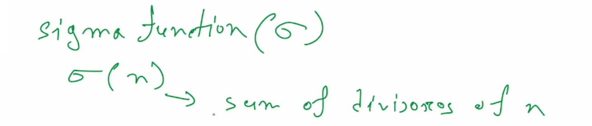

> math

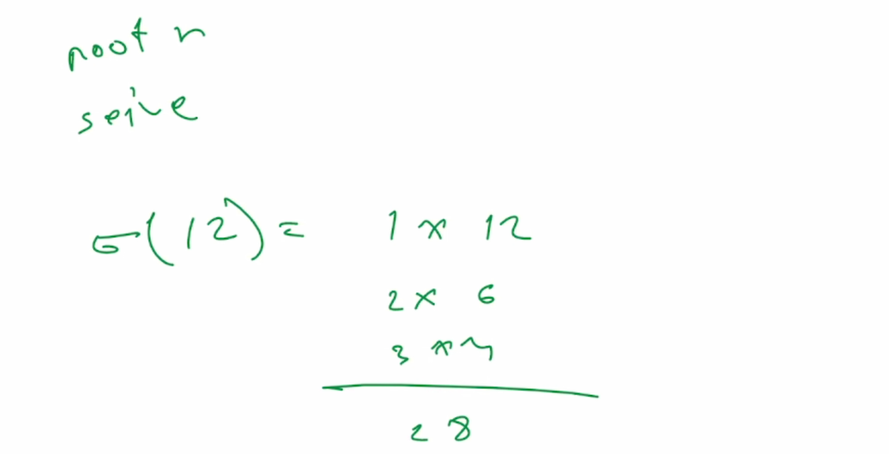
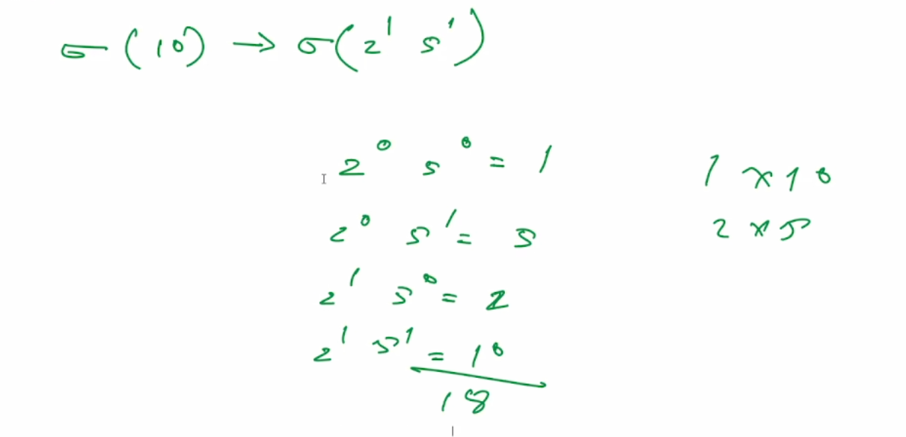
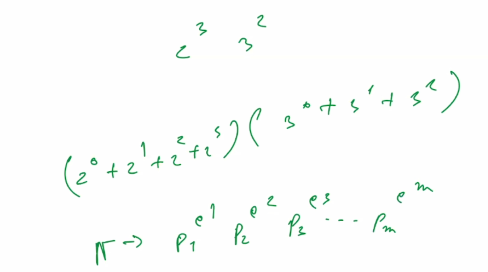

> geometric series

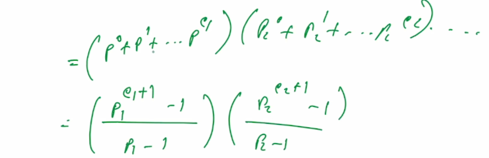

<pre>σ(12) => 
- Step 1: Prime Factorization 
12 = 2<sup>2</sup> × 3<sup>1</sup> 

- Step 2: Formula for sum of divisors 
If n = p<sub>1</sub><sup>a</sup> × p<sub>2</sub><sup>b</sup> × ... × p<sub>k</sub><sup>z</sup>, then 
σ(n) = [(p<sub>1</sub><sup>0</sup> + p<sub>1</sub><sup>1</sup> + ... + p<sub>1</sub><sup>a</sup>) × (p<sub>2</sub><sup>0</sup> + p<sub>2</sub><sup>1</sup> + ... + p<sub>2</sub><sup>b</sup>) × ... ] 

((p<sub>1</sub><sup>a<sub>1</sub>+1</sup>-1)/(p<sub>1</sub>-1)).((p<sub>2</sub><sup>a<sub>2</sub>+1</sup>-1)/(p<sub>2</sub>-1))...

So, σ(12) = (2<sup>0</sup> + 2<sup>1</sup> + 2<sup>2</sup>) × (3<sup>0</sup> + 3<sup>1</sup>) 
= (1 + 2 + 4) × (1 + 3) = 7 × 4 = 28 

=> 12 = 2<sup>2</sup> × 3<sup>1</sup> 
Apply the formula: 
σ(12) = ((2<sup>2+1</sup> - 1) / (2 - 1)) × ((3<sup>1+1</sup> - 1) / (3 - 1)) 
= ((2<sup>3</sup> - 1) / 1) × ((3<sup>2</sup> - 1) / 2) 
= (8 - 1) × (9 - 1) / 2 = 7 × 8 / 2 = 7 × 4 = 28 

- Step 3: List all divisors and sum them directly Divisors of 12: 1, 2, 3, 4, 6, 12 Sum = 1 + 2 + 3 + 4 + 6 + 12 = 28 
✔ Confirmed: σ(12) = 28 </pre>

```math
\sigma(n) =
\left( \frac{p_1^{a_1+1} - 1}{p_1 - 1} \right)
\cdot
\left( \frac{p_2^{a_2+1} - 1}{p_2 - 1} \right)
\cdot \dots \cdot
\left( \frac{p_k^{a_k+1} - 1}{p_k - 1} \right)
```

❗ So, even though the individual terms look like fractions, they always simplify to integers because they represent the sum of a geometric series of powers of integers.

```cpp
//sum of all disisors
using ll = long long
int sigma(ll n) {
    int sum = 0;
    for (ll i = 1; i * i <= n; i++) {
        if (n % i == 0) {
            sum += i;
            if (i != n / i) sum += n/i;
        }
    }
    return sum;
}
```

- <u>Sieve-Based Implementation of σ(n)</u>

<pre>
1 2 3 4 5 6 7 8 9 10 ... n
(for 1 to n go all divisor of i and add i everytime)
</pre>

```cpp
const int nmax = 1e5 + 10;

int tau[nmax];
int sigma[nmax];

void seive() {
    for (int i = 1; i < nmax; i++) {
        for (int m = i; m < nmax; m += i) {
            tau[m]++
            sigma[m] += i;
        }
    }
}
```

example:

- [spojABA12D - Sum of divisors!](spojABA12D_Sum_of_divisors.cpp)

<pre>
he decided to look out for numbers whose sum of divisors is a prime number and he was the inventor of these special numbers he gave them the name K-numbers.

Given a range [A, B] you are expected to find the number of K-numbers in this range.

1 <= T <= 10000, 1<=A<=B<=10^6
</pre>

> kth-number -> sum of divisors is prime number, how much kth numbers in a given range

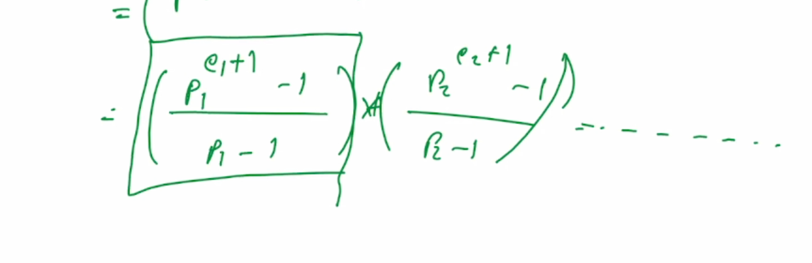

> always have one part - because of prime

- [2018 icpc dhaka regional](https://codeforces.com/gym/102040/problem/C)

<pre>
Divisors of the Divisors of an Integer

The function d(n) denotes the number of positive divisors of an integer n. For example d(24) = 8, because there
are 8 divisors of 24 and they are 1, 2, 3, 4, 6, 8, 12 and 24. The function sndd(n) is a new function defined for this
problem. This denotes “The summation of number of divisors of the divisors” of an integer n. For example,
sndd(24) = d(1) + d(2) + d(3) + d(4) + d(6) + d(8) + d(12) + d(24) = 1 + 2 + 2 + 3 + 4 + 4 + 6 + 8 = 30.
Given the value of n, you will have to find sndd(n!), here n! means factorial of n. So n! = 1 × 2 × 3 × … × n.

n<=1e6
</pre>


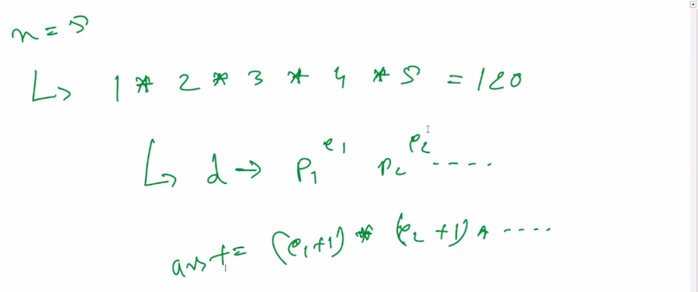
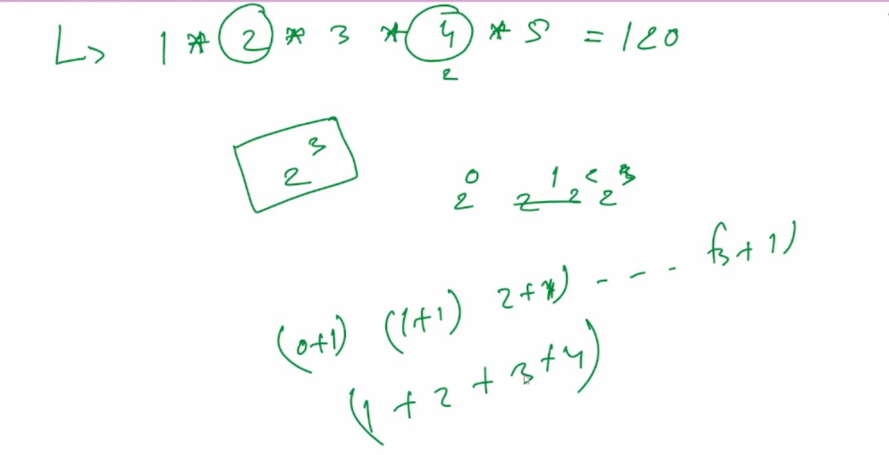
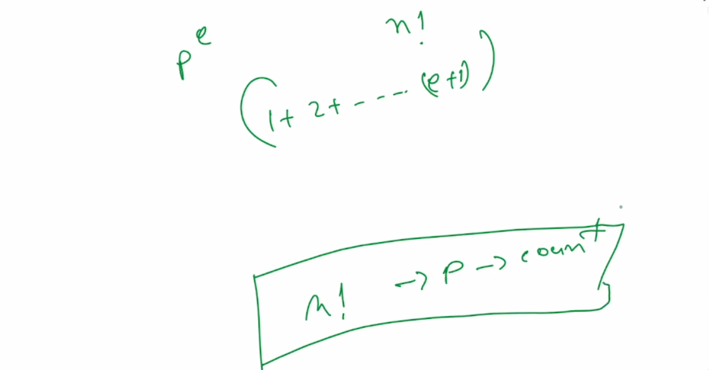

---

### Legendre's Formula

- https://artofproblemsolving.com/wiki/index.php/Legendre's_Formula

Legendre's formula gives the exponent of a prime number \( p \) in the factorization of \( n! \). It is expressed as:

```math
e_p(n!) = \sum_{i=1}^{\infty} \left\lfloor \dfrac{n}{p^i} \right\rfloor = \frac{n - S_p(n)}{p - 1} = \left\lfloor \frac{n}{p} \right\rfloor + \left\lfloor \frac{n}{p^2} \right\rfloor + \left\lfloor \frac{n}{p^3} \right\rfloor + \cdots
```

Where:

- e_p(n!) is the exponent of prime p in n!
- S_p(n) is the sum of digits of n in base p
- floor(x) denotes the floor function ⎣x⎦ (greatest integer less than or equal to x)

This formula is especially useful in number theory and combinatorics for evaluating factorial prime powers efficiently.

```cpp
int legendre(int n, int p) {
    int exponent = 0;
    while (n > 0) {
        n /= p;
        exponent += n;
    }
    return exponent;
}

//Count trailing zeros in n! (exponent of 5 in n!)
int countTrailingZeros(int n) {
    return legendre(n, 5);
}
```

example:

- To determine how many times the prime number **2** appears in the factorization of **10!** (10 factorial), we can use **Legendre's Formula**.

**Calculation for \( p = 2 \) in \( 10! \)**

```math
e_2(10!) = \left\lfloor \frac{10}{2} \right\rfloor + \left\lfloor \frac{10}{4} \right\rfloor + \left\lfloor \frac{10}{8} \right\rfloor + \left\lfloor \frac{10}{16} \right\rfloor + \cdots
\\
= 5 + 2 + 1 + 0 + \cdots= 8
```

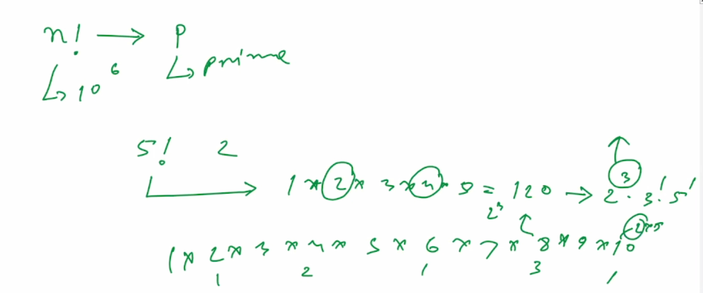
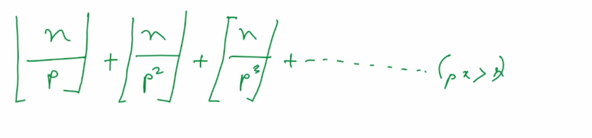

- [lightoj\_ Trailing Zeroes (II)](lightoj_Trailing_Zeroes2.cpp)

<pre>
Find the number of trailing zeroes for the following function:

(nCr)×p<sup>q</sup>

where n, r, p, q are given as Input.
Input starts with an integer T (≤ 10000), denoting the number of test cases.
Each case contains four integers: n, r, p, q (1 ≤ n, r, p, q ≤ 1e6, r ≤ n).

=>
2^x, 5^y -> min(x,y)

n! -> cnt 2,5
r! -> cnt 2,5
(n-r)! -> cnt 2,5

total = (n! -> cnt 2,5)-((r! -> cnt 2,5) + ((n-r)! -> cnt 2,5))
</pre>

- how much trailing zeros menas how much 10 multiplied

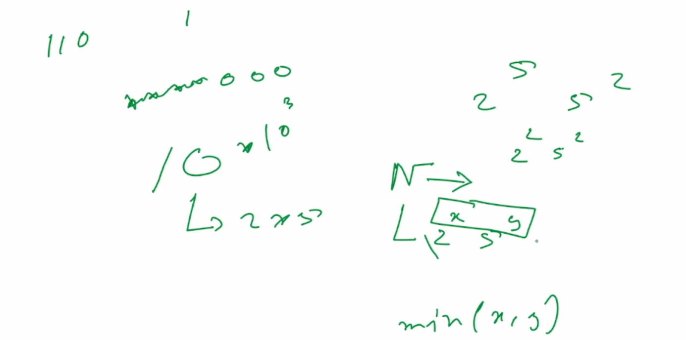
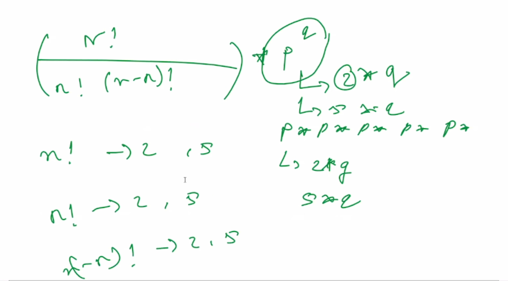

---


