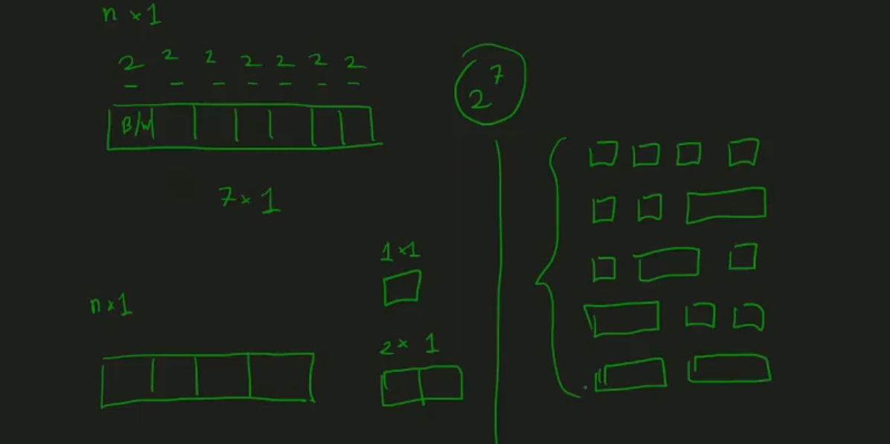
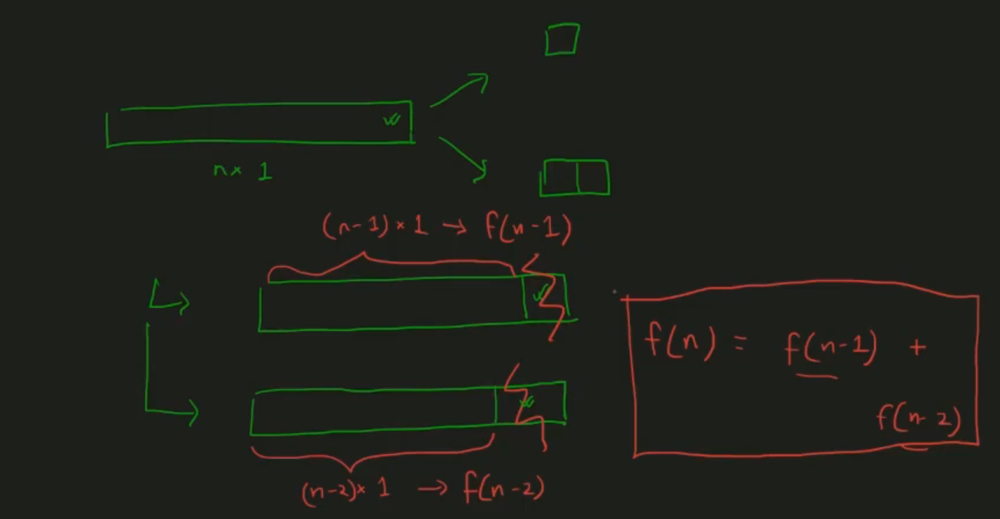
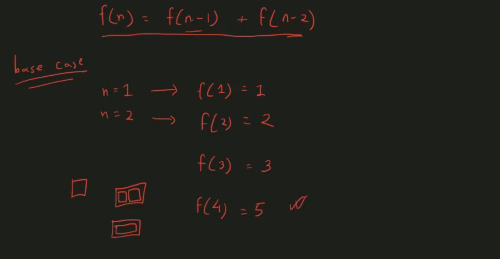
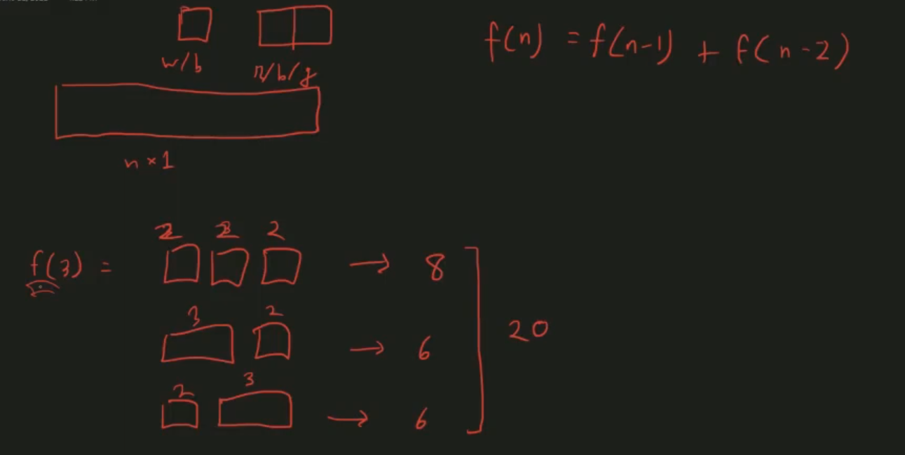
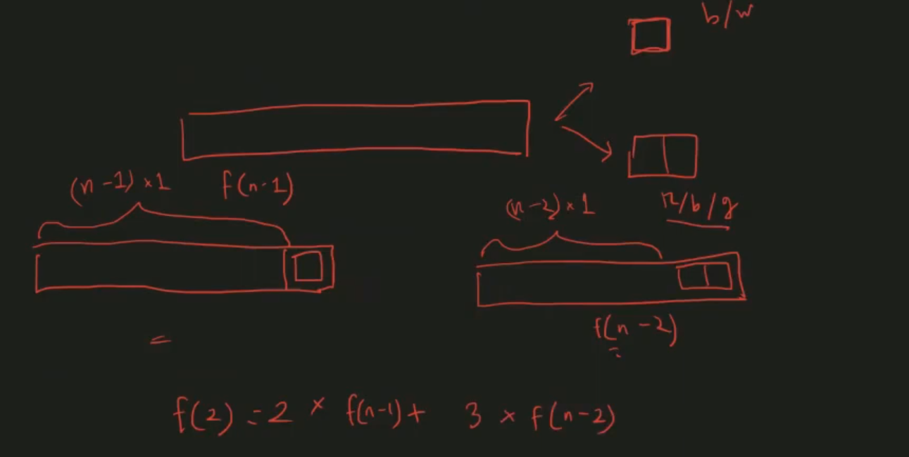
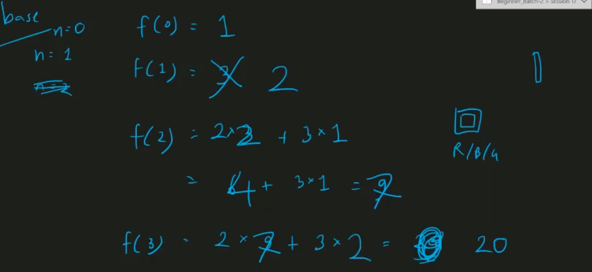
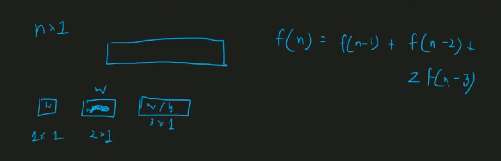
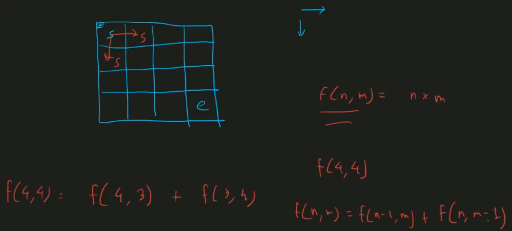
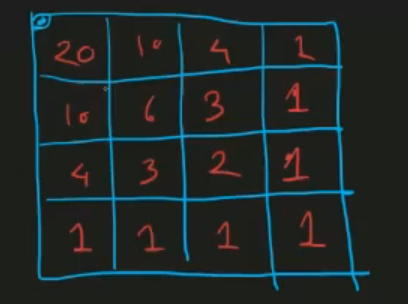
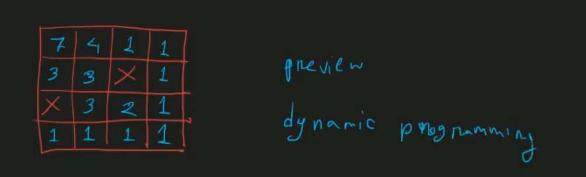

## Counting by Recursion

> not all the time is feasible to find mathematics formula to do counting. sometimes we have to do it in different ways. one of the ways to do it in recursions.

> - in union(previous) our idea is divide large problems by many of small problems
> - but in recursion we divide large problem by divide one small problem, not necessarilly large problem is make of many of those small problems, we have to separate one task from big task

> - generally recursion not work for small numbers, we have to do that(base case) in manually

> 

- more complex

- Grid Problems (2D)

> we find the same solution by using math formula also ((n-1)+(m-1),(n-1))
> but what if we have obstacle in my path? in that case we use recursion for currect paths

