## Counting by Principle of Inclusion & Exclusion

https://cp-algorithms.com/combinatorics/inclusion-exclusion.html

- 2 types

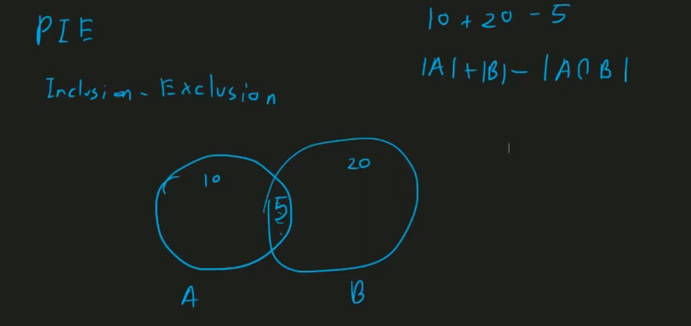

- 3 types

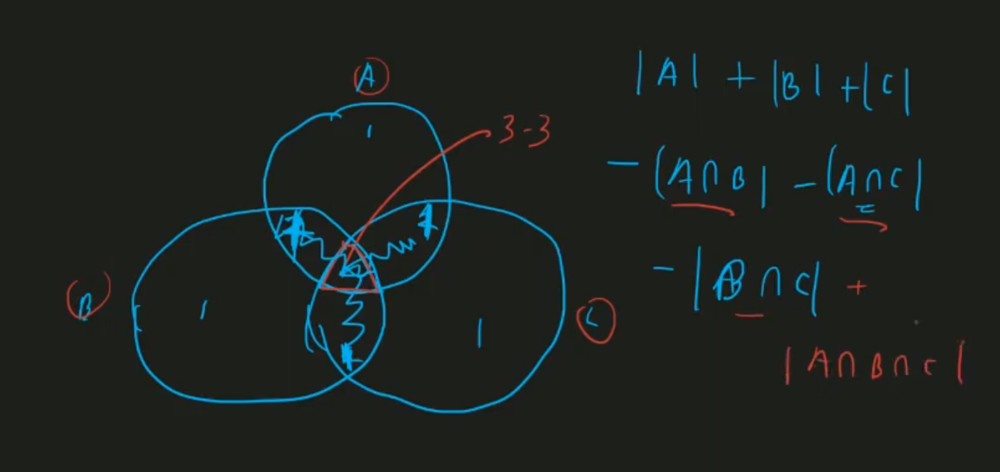

- for multiple

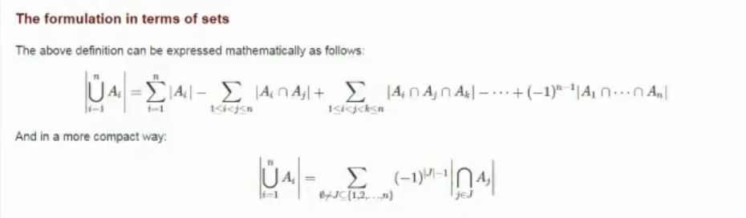

- those equation is increasing very first. (after some we can't do it manually)

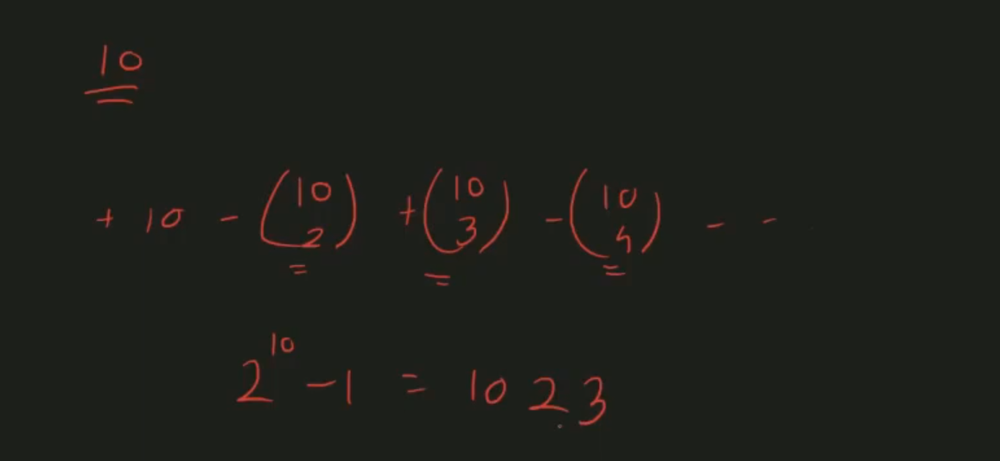

- examples:

> - how much english word whose length is 10? (26^10)
> - now 10 length words where it has atleast 1 a, atleast 1 b, atleast 1 c?

### Sometimes easier to count inverse

- reverse of (and -> or)

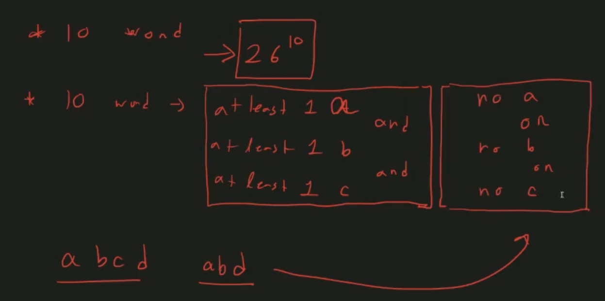
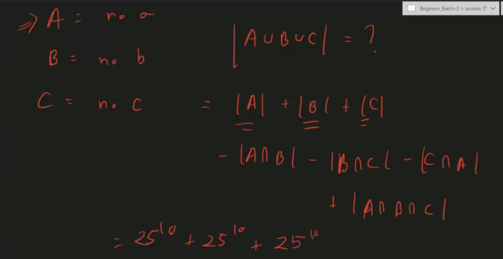
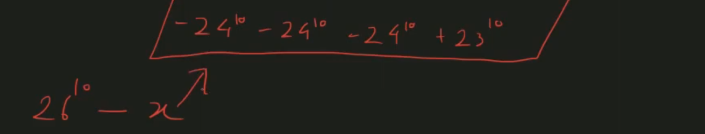

- for multiples

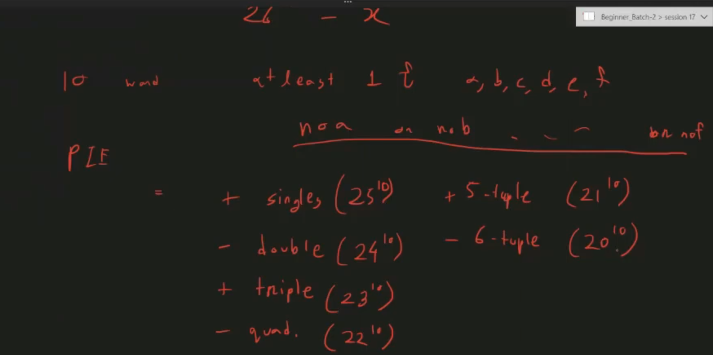
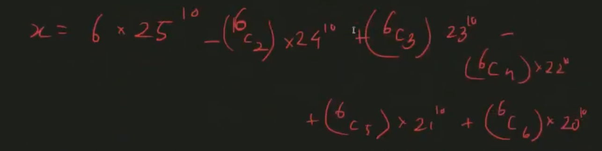

## Recap for Counting by PIE

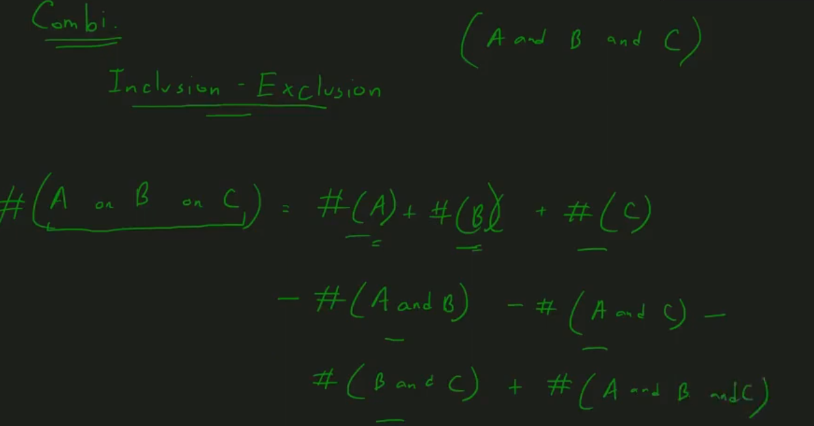

- untill now conditions is similar
- now condition is not similar

examples1:


> 1 to n, which is divisible by at least one of those numbers?

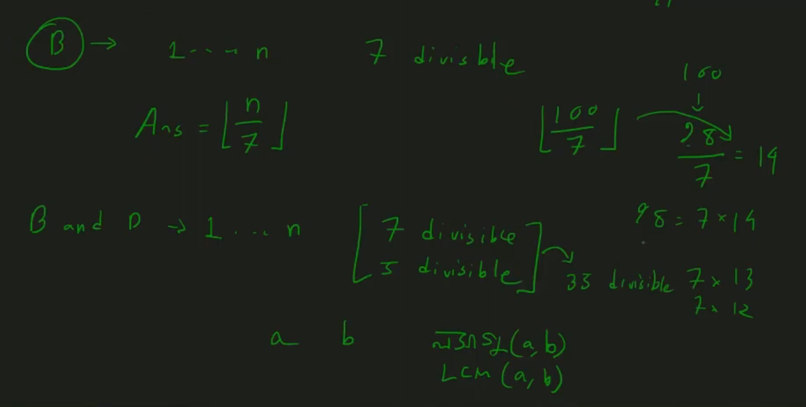

> if divisible by multiple numbers then it also divisible by their lcm

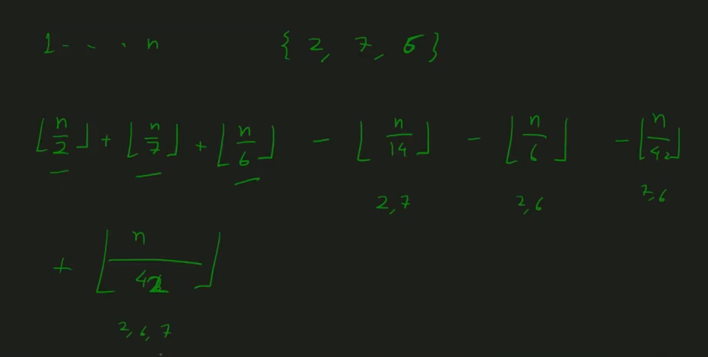

> - 2^k terms has, where k is the size of a set; k<=20
> - like this problems -> we have to generate all possible subset of conditions

> generate all possible subset using bitmask

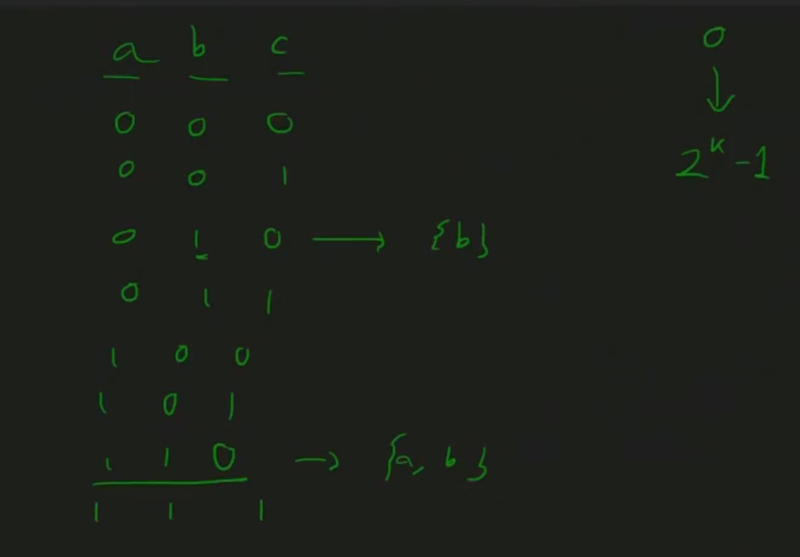

> we have to enclose left shift & right shift operator inside braces because it's precedence is too low

```cpp
int k; cin >> k;
vector<int> input(k);
for (int i = 0; i < k; i++) {
    cin >> input[i];
}
for (int mask = 0; mask < (1 << k); mask++) {
    vector<int> subset;
    //mask = 10 ? binary = 1010
    for (int i = 0; i < k; i++) { //checking each bit
        if ((1 << i)&mask) { //is ith bit on?
            subset.push_back(input[i]);
        }
    }
    for (auto x : subset) {
        cout << x << " ";
    }
    cout << endl;
}
```

```cpp
//for each subset
int y = lcm(subset);
if(subset.size()%2==0){
  ans -= n/y;
}else{
  ans += n/y;
}
```

> - for PIE size == even -> (-ve) otherwise (+ve)

examples2:
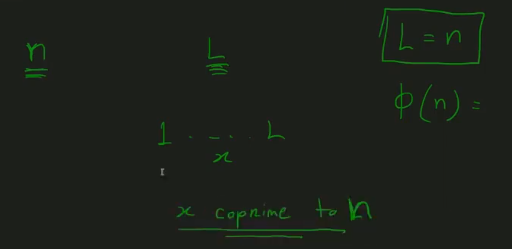

> 1 to L how much x, which is coprime to n?

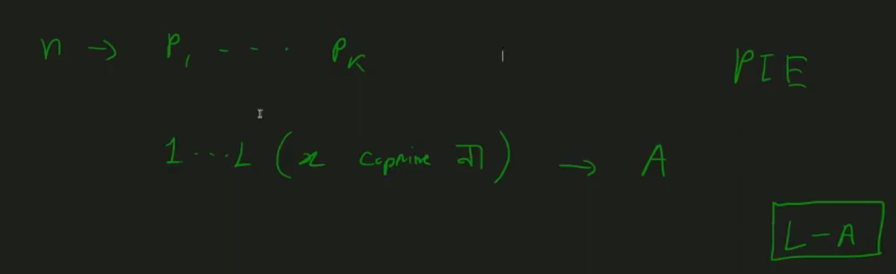
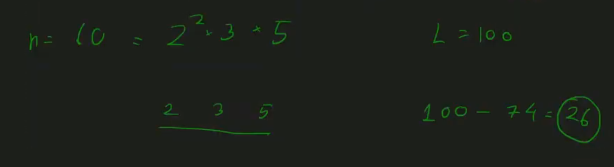
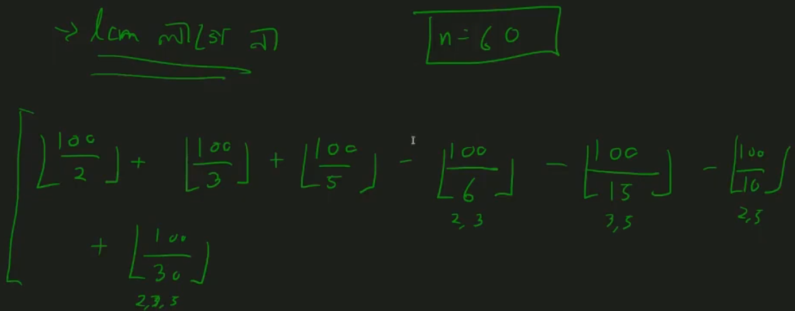
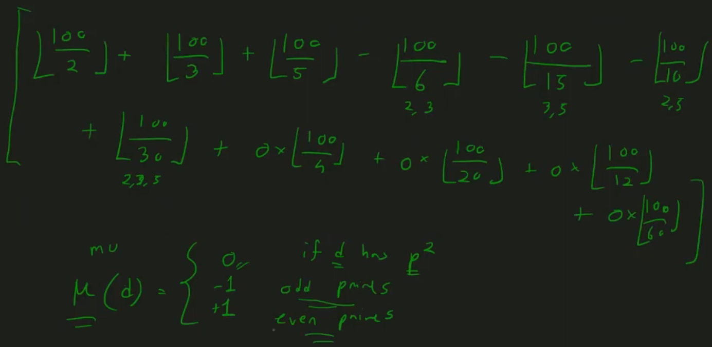
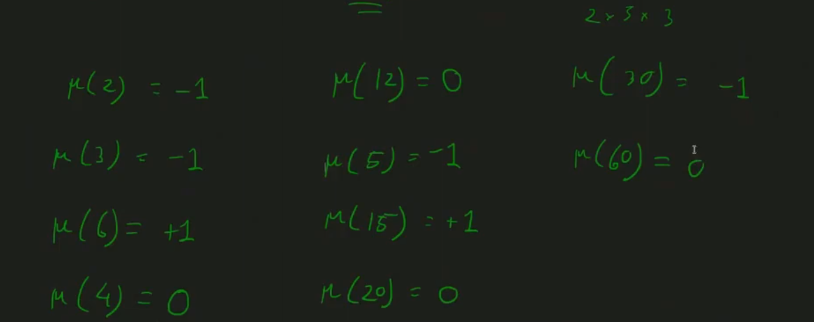

### Mobius Function

> we can use meu function instead of bitmask
> https://codeforces.com/blog/entry/53925

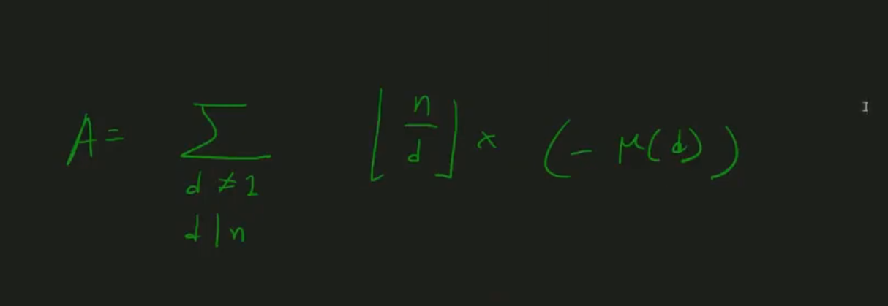
