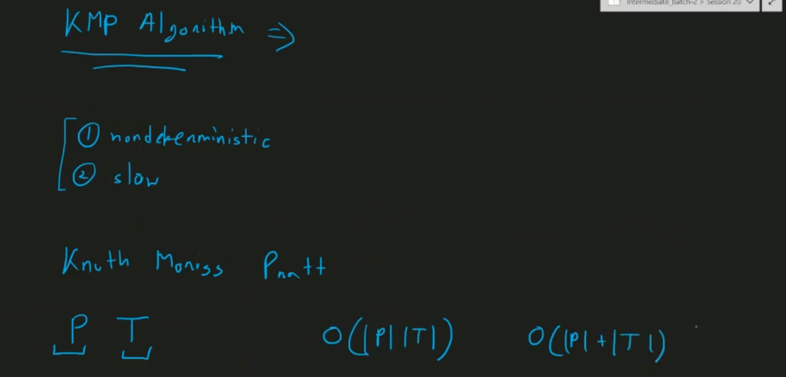

- failure array 

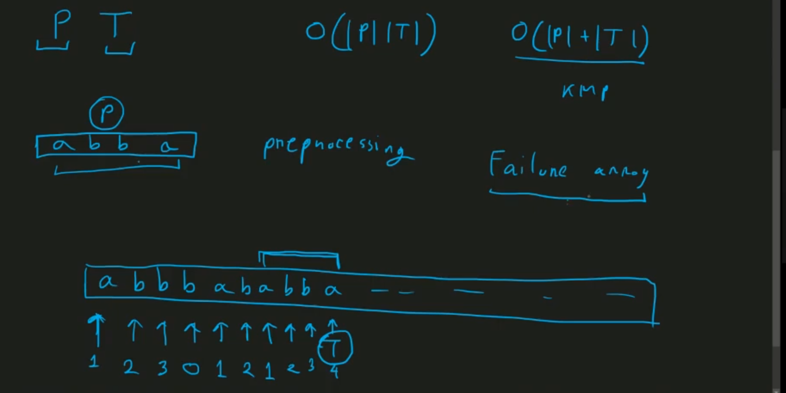
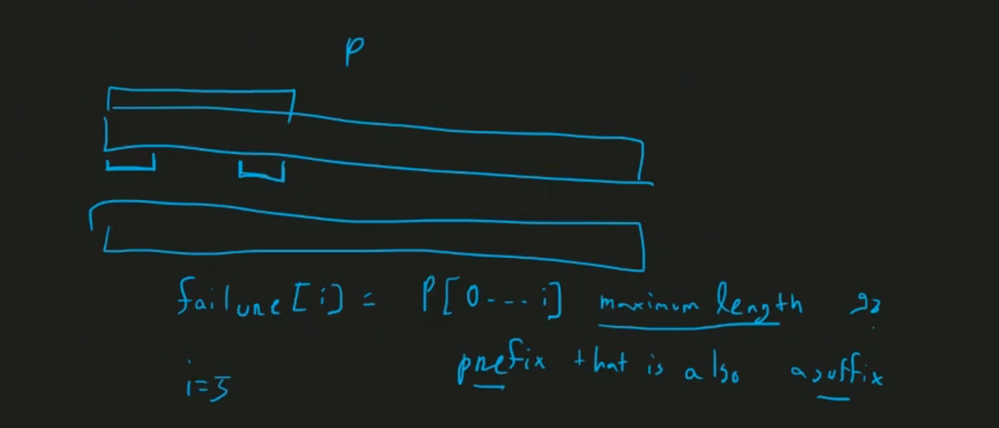
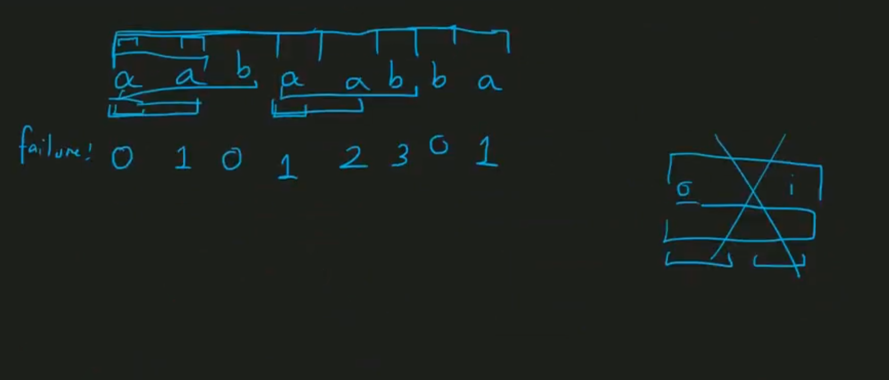
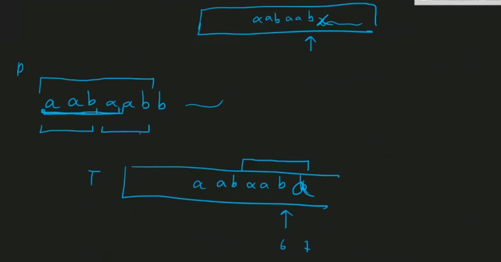
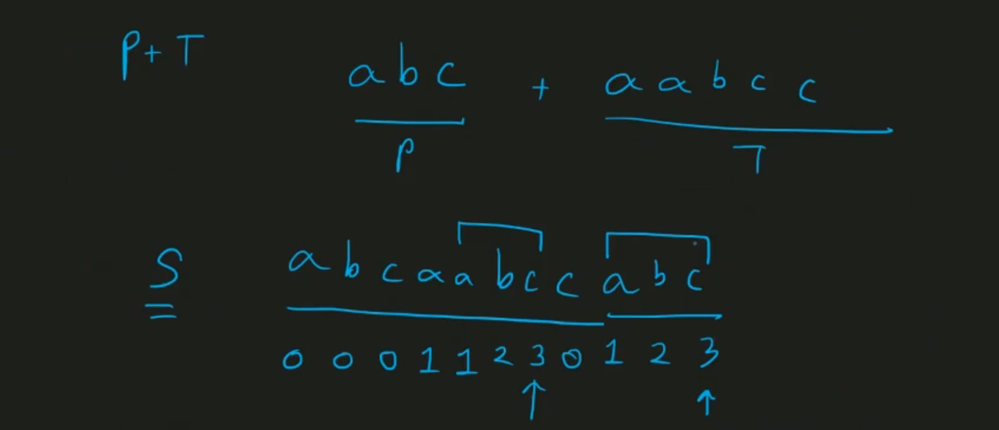
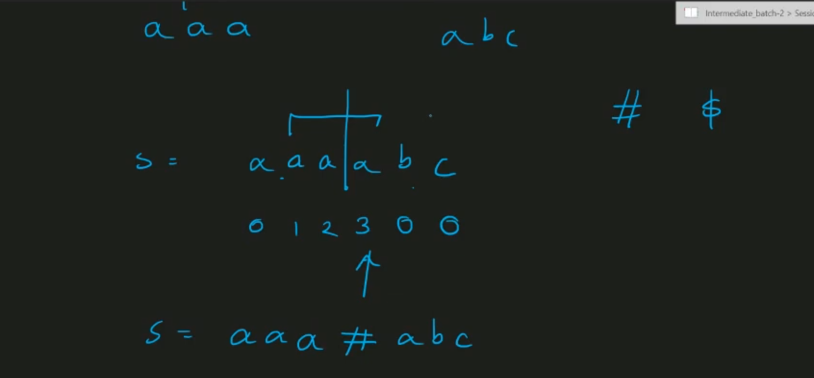
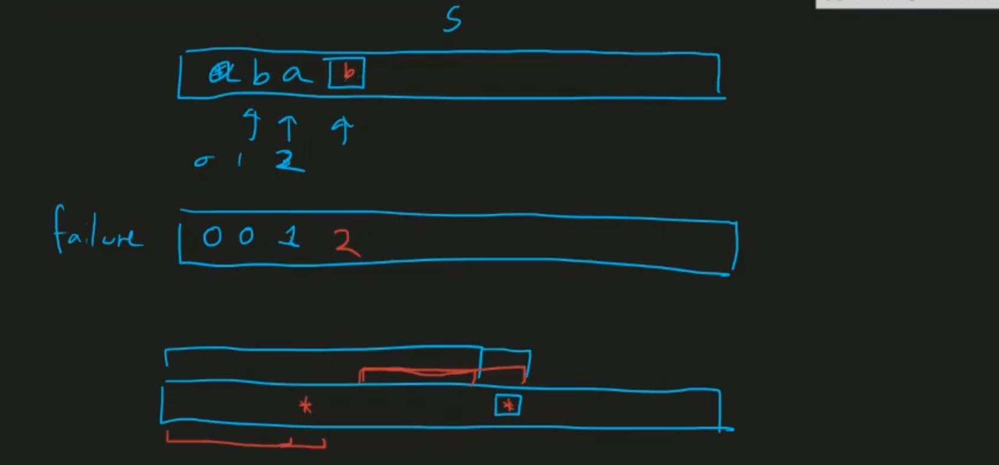
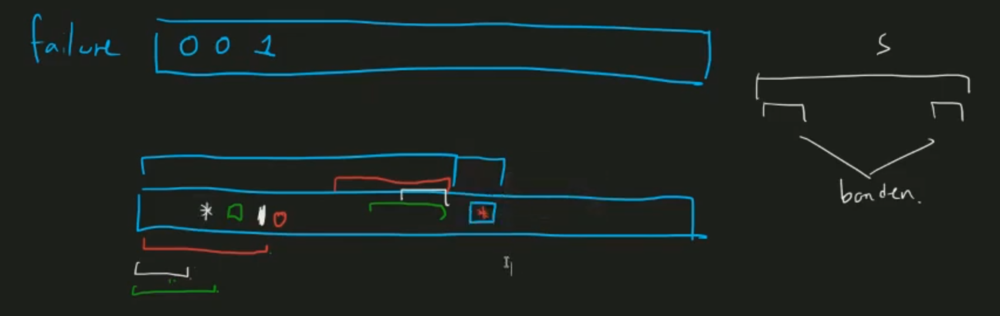
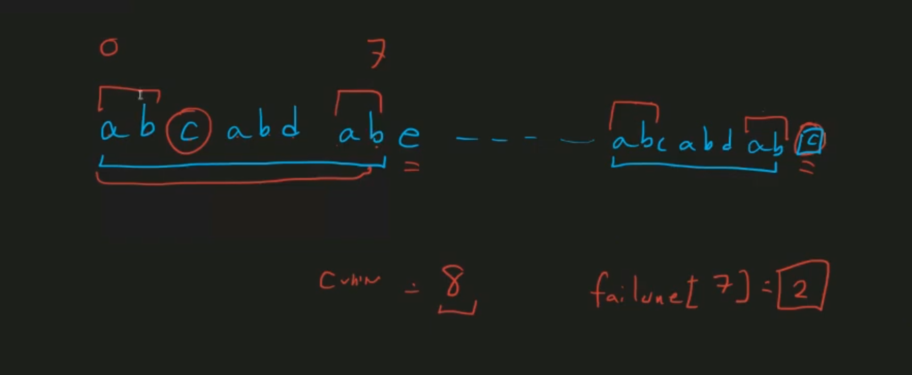
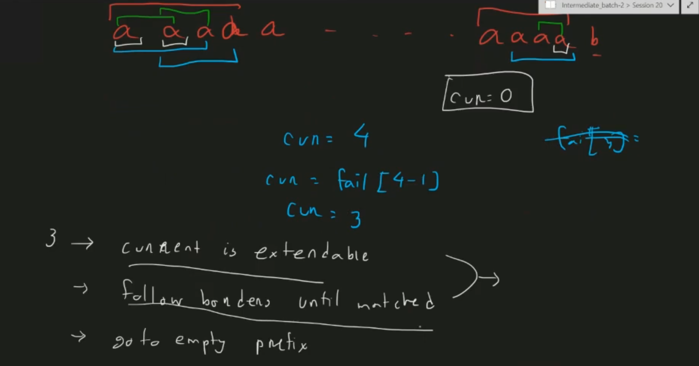

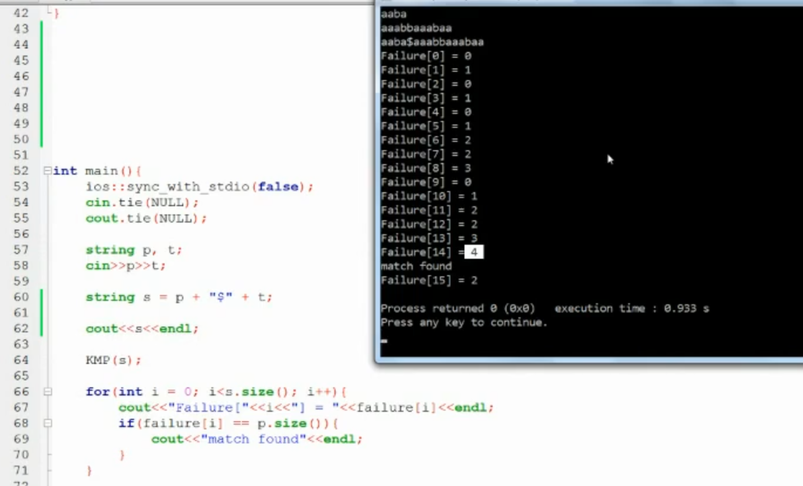
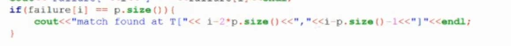

- O(n^2) -> amortized analysis -> O(n+n) -> O(n)

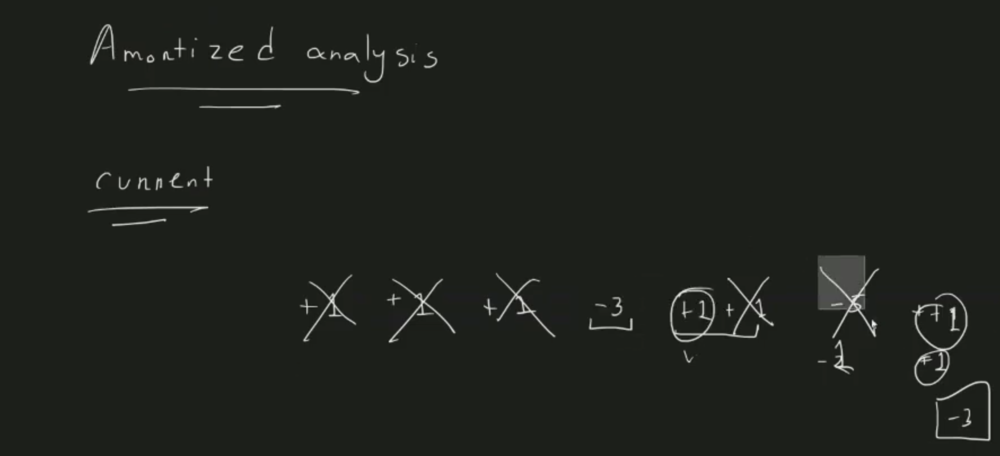
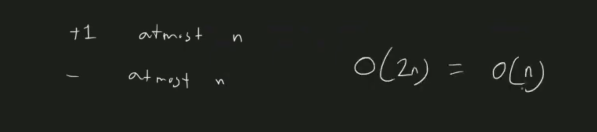

- use of failure function

- pattern to text matching

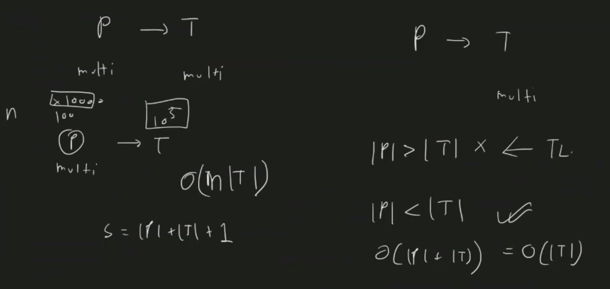
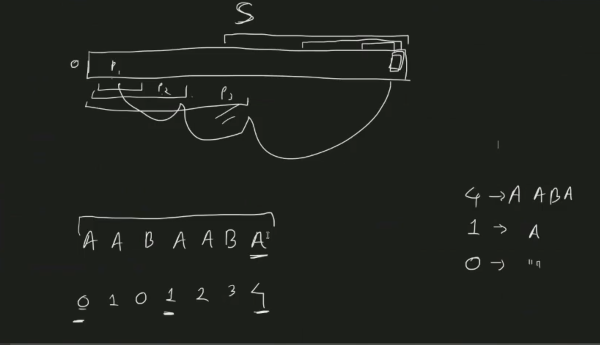
- not work for multi-pattern (aho-corasick)
- but work for multi text

- how much border of a string (prefix=sufix)

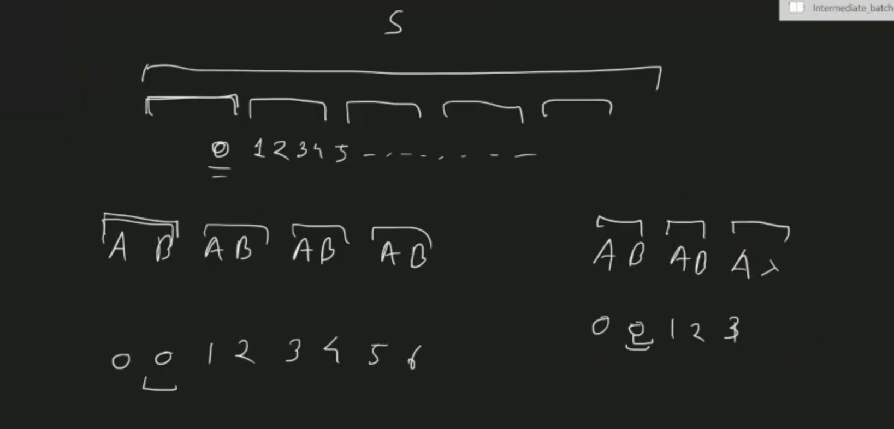

- repetation
- prefix tree

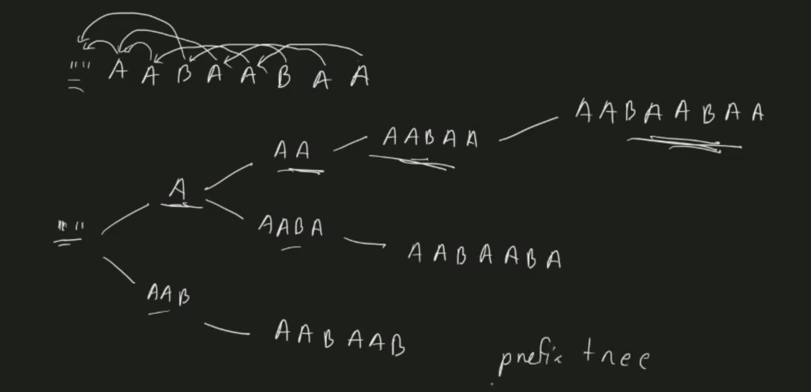
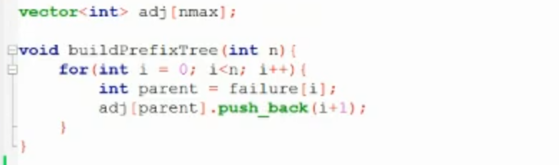

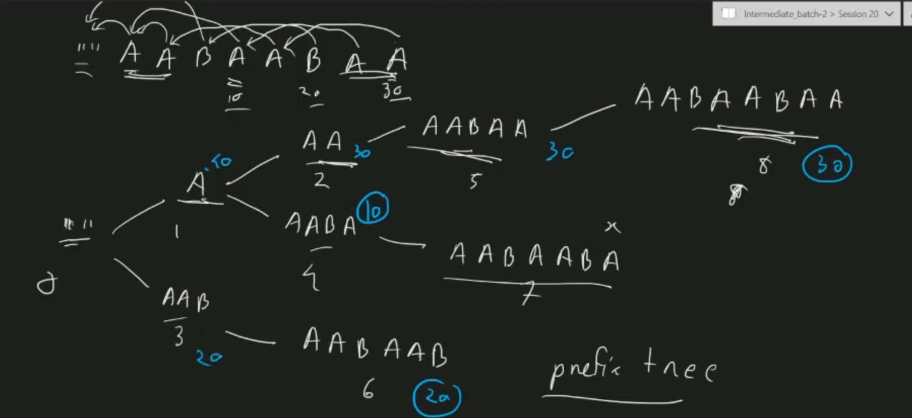