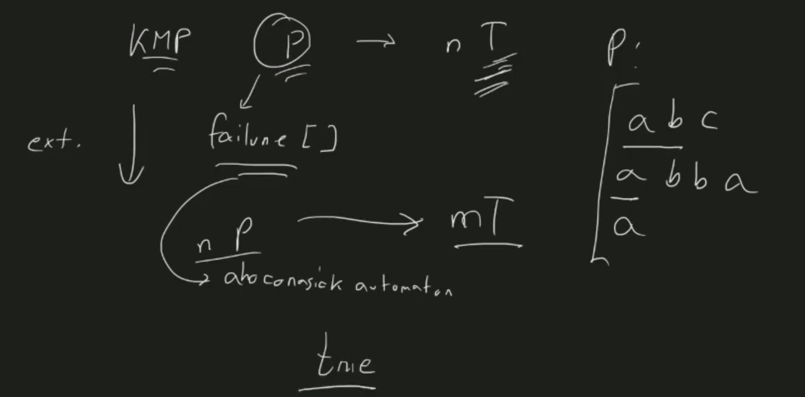
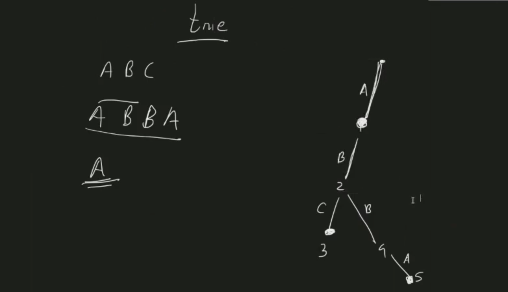
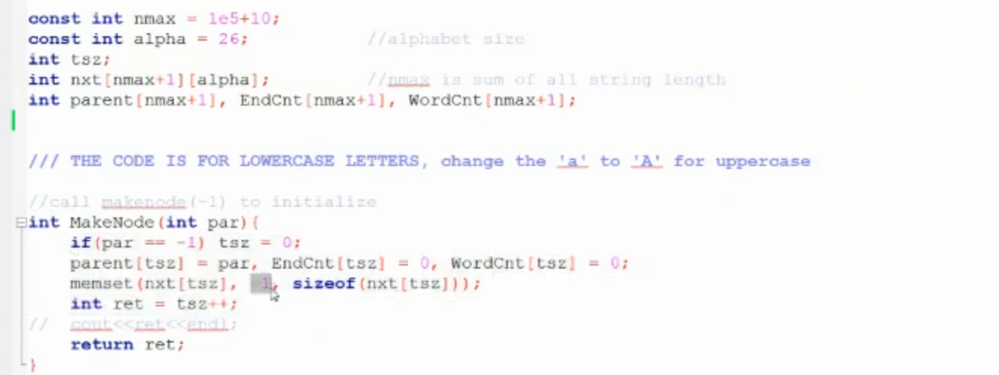
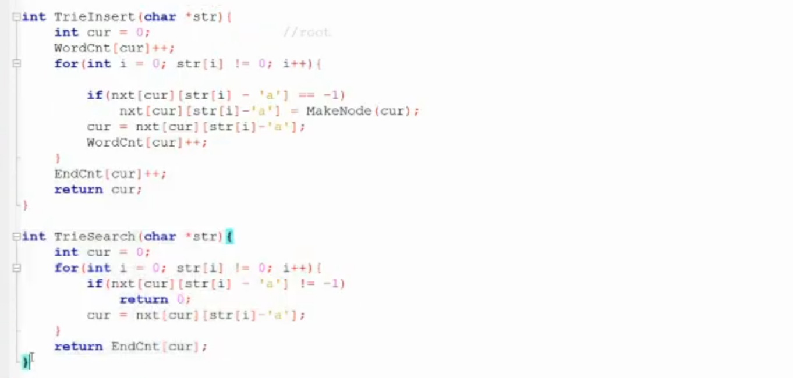

> == -1

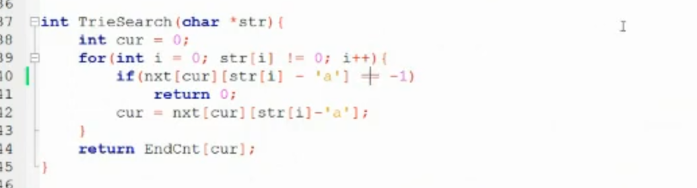
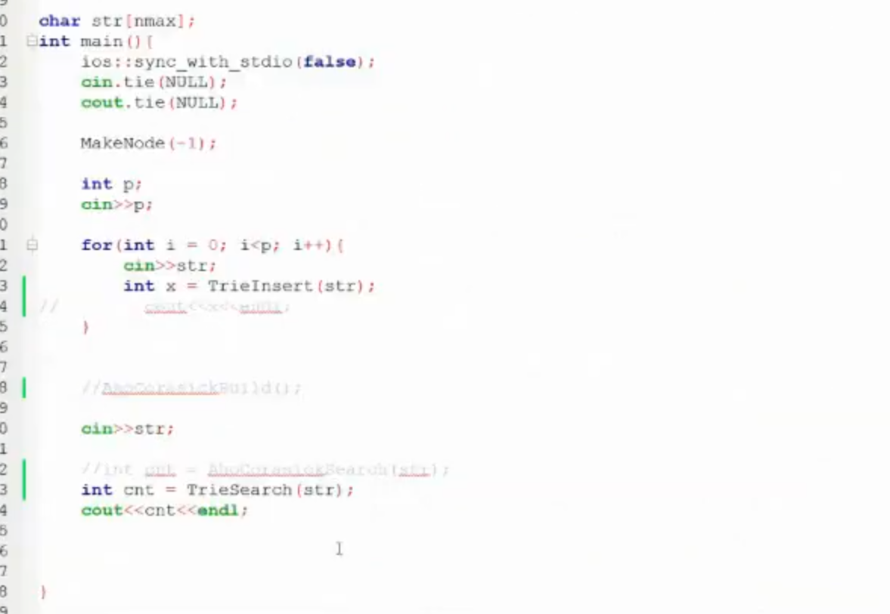
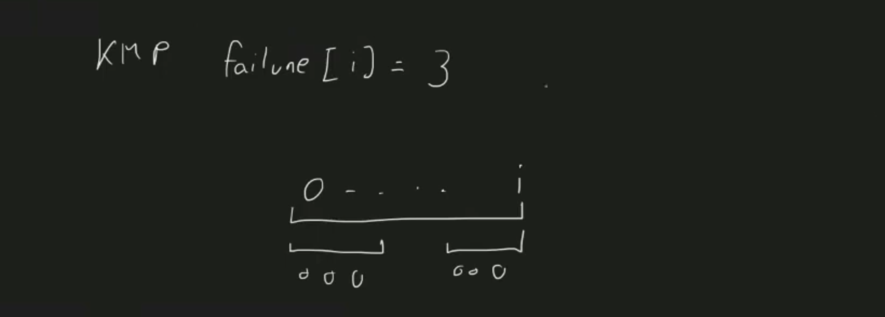
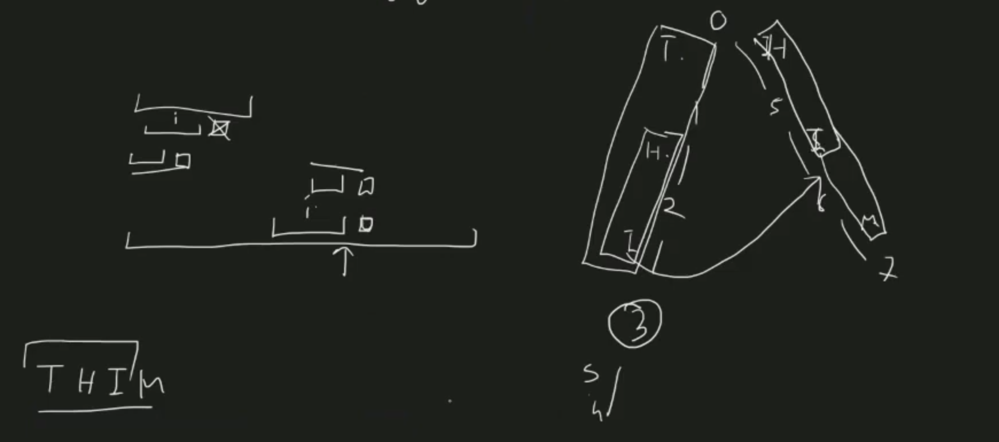
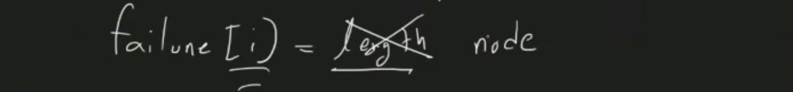
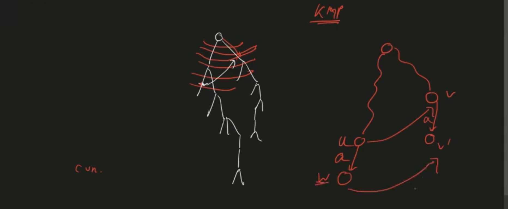
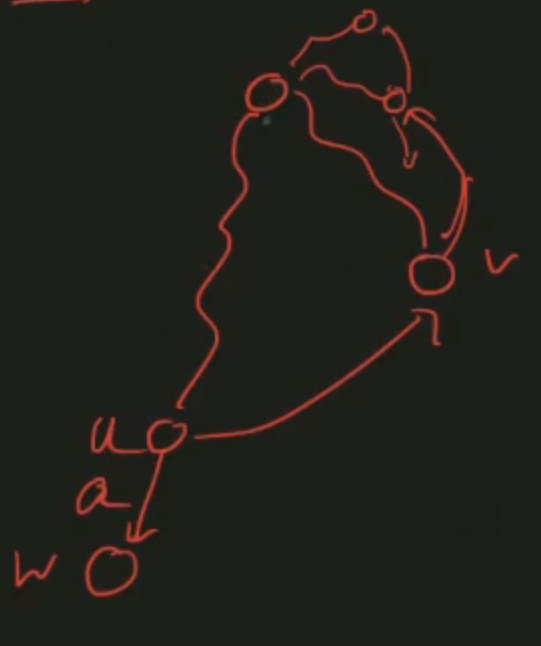
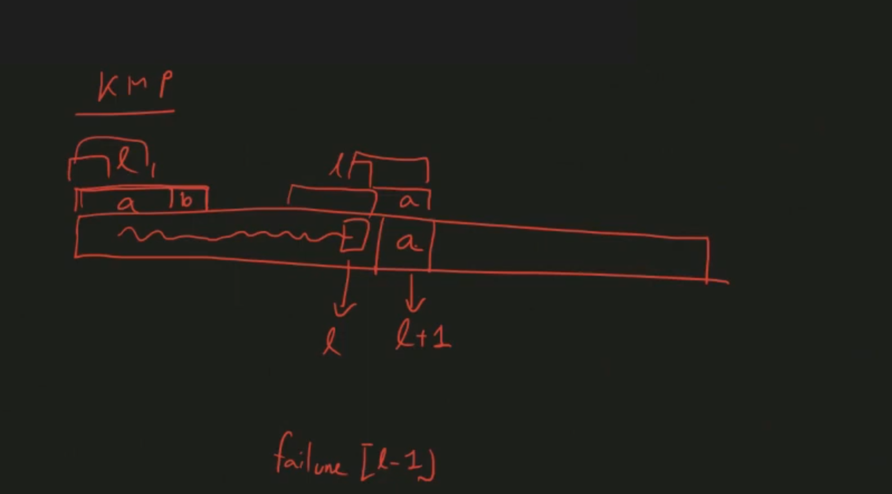
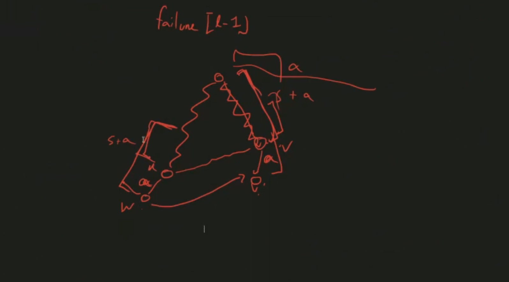
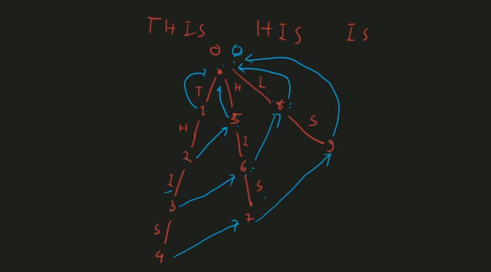
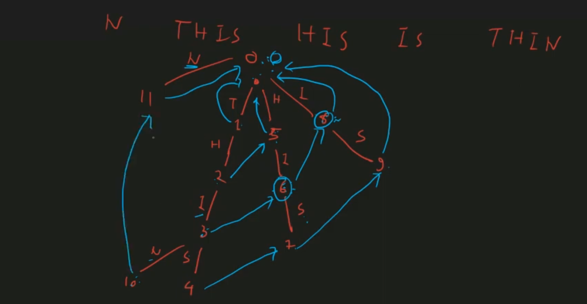

- extended function of kmp

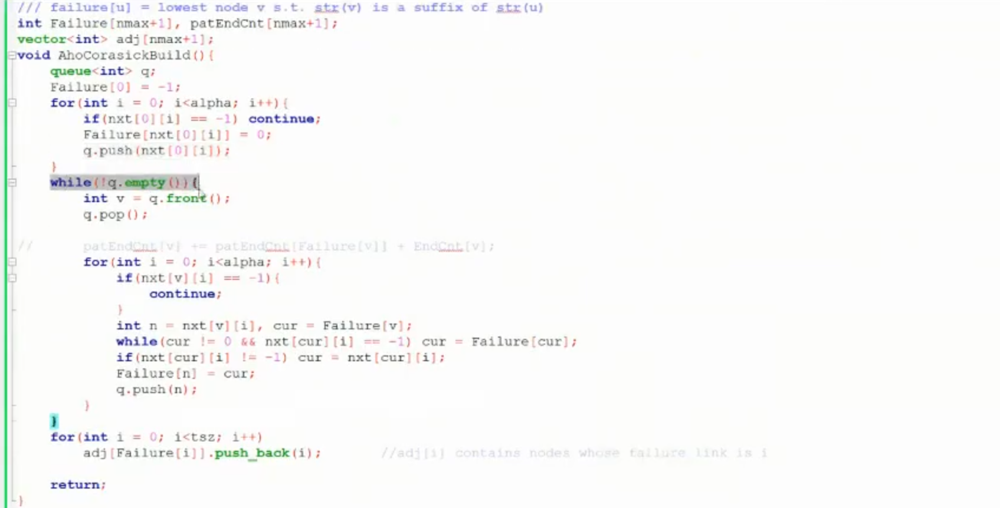
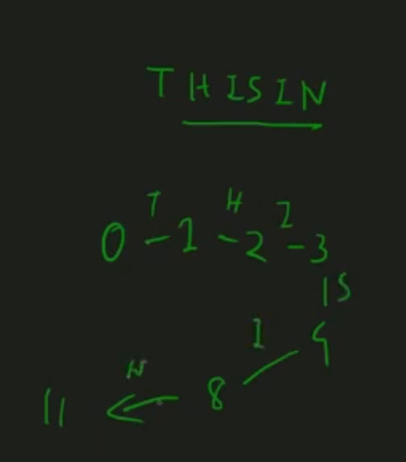

- trie + bfs

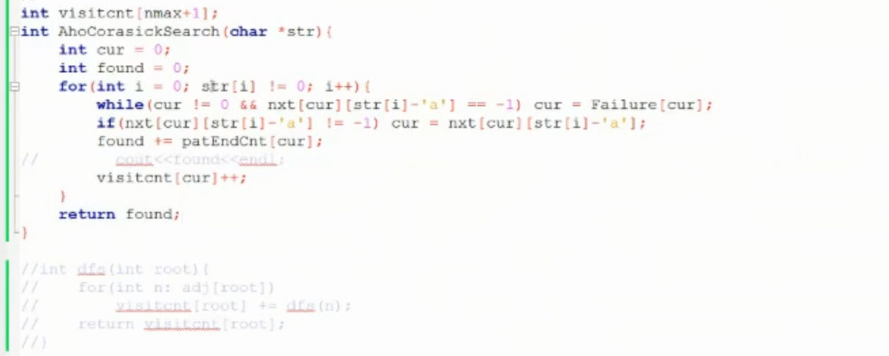

- in trie - pos at maximum matching

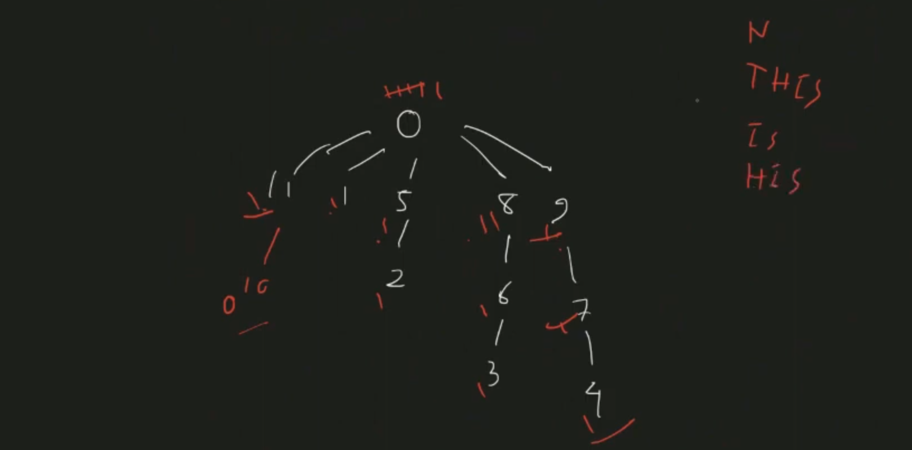
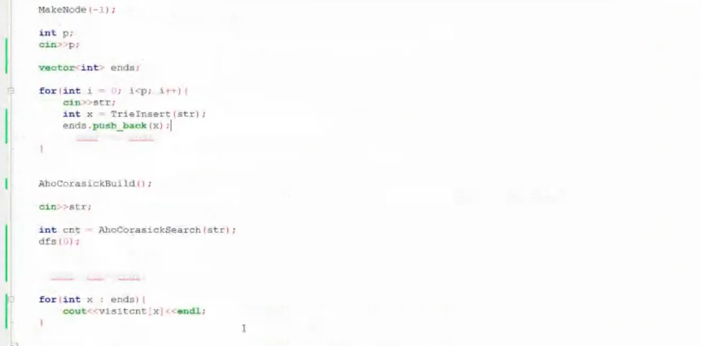

- use of aho-corasick

- random sequence ... probability of some pattern come

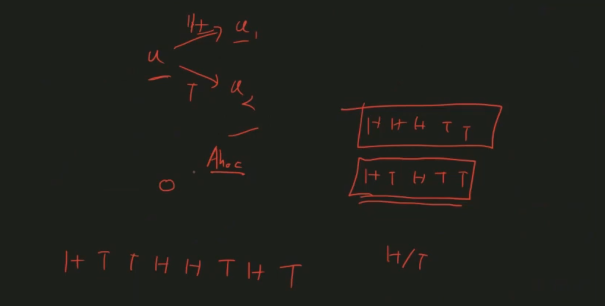

- lightoj string problems
