- ultimate algorithms

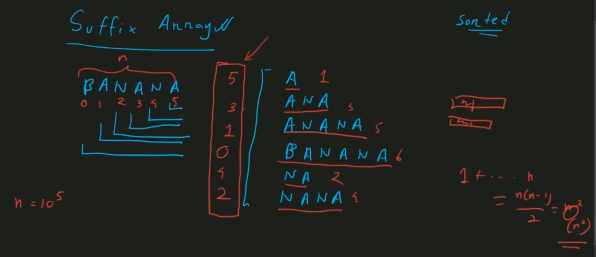
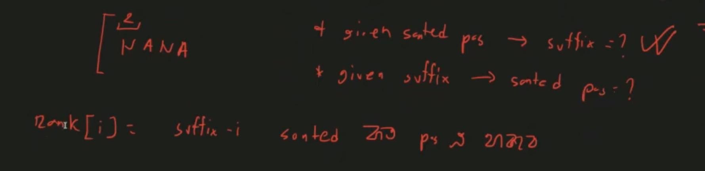

cp algorithm

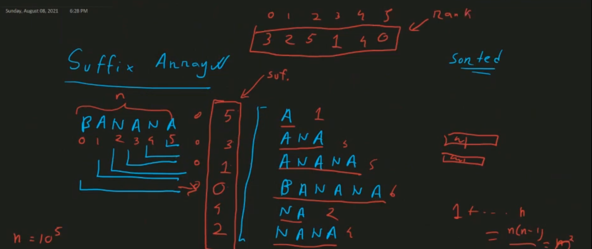
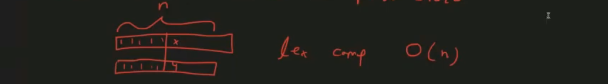

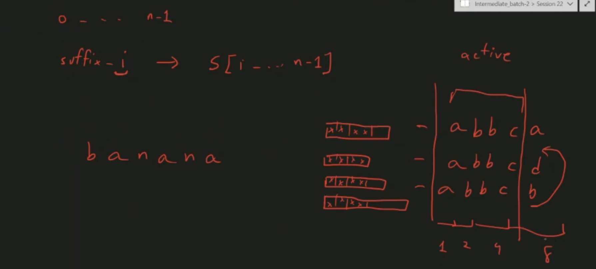

- sorted position store

- how to build suffix array

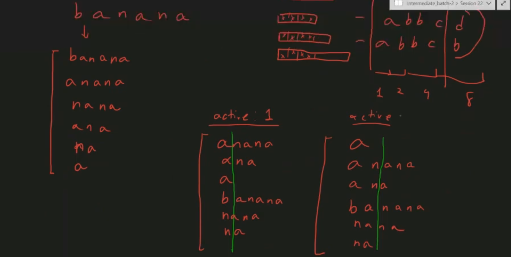
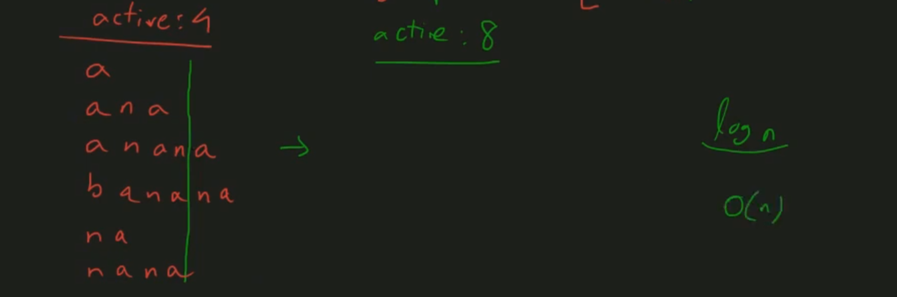
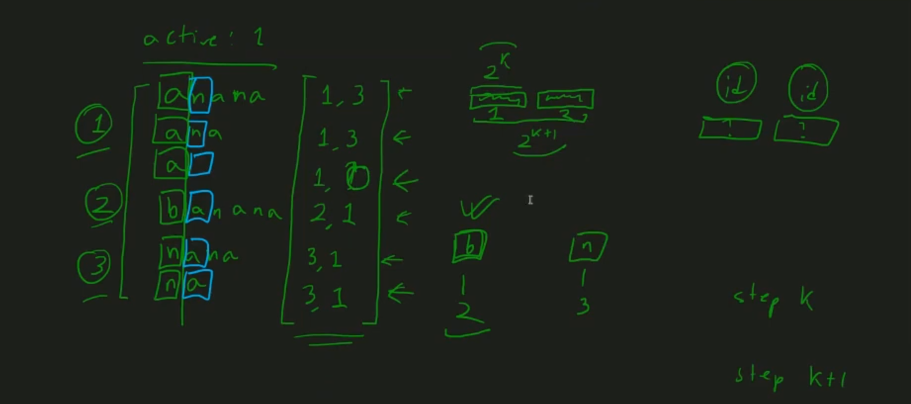
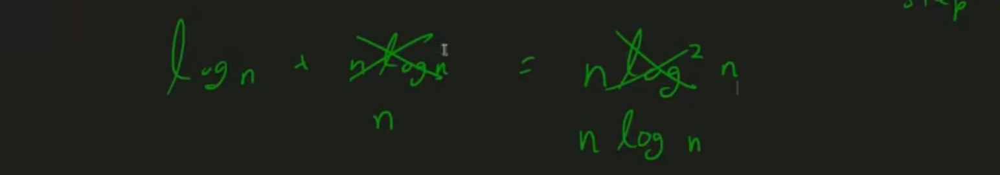

- sorted -> binary search

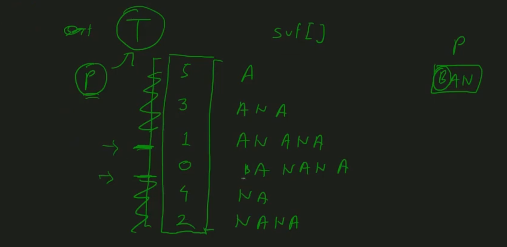
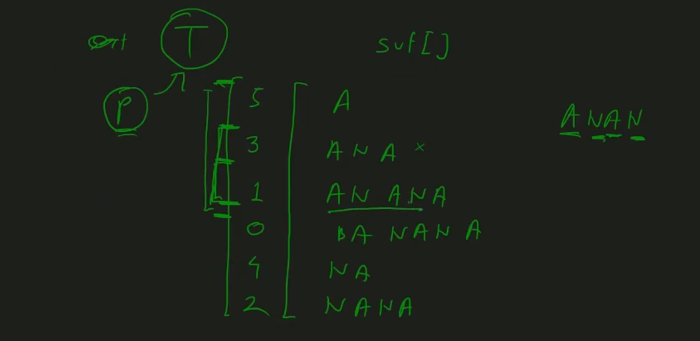

q.

- after sort ... nth suffix array
- after sort ... this suffix goes to whose place

- rank array

- string compare -> O(n) not O(1)

- prefix doubling

- use radix sort to minimize complexity

- application of suffix array

- cp algorithms
- https://www.cs.unibo.it/~sacerdot/bioinformatics1718/exams/suffix-array.pdf

- single text multi pattern problems

> aho-corasick -> firstly all pattern add then check final text but in suffix array first store final text then check ... no. of time each pattern come 

- cleaverly apply binary search

- cyclic suffix

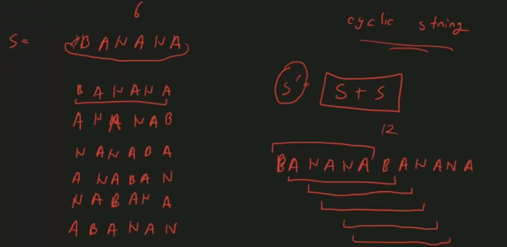
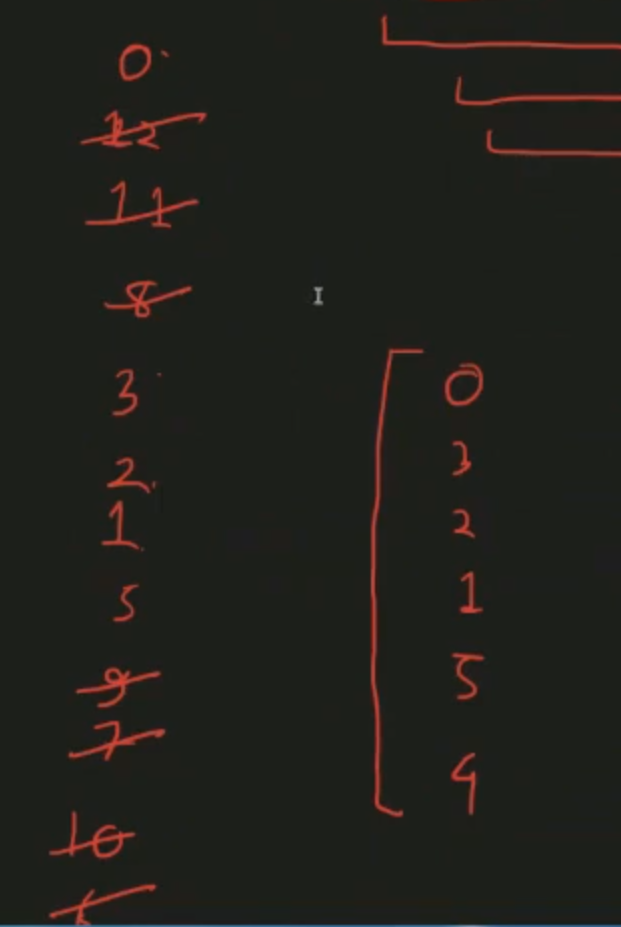

- same string + 2 times add
- subtract 2nd s - suffix

- LCP array (longest common prefix) 

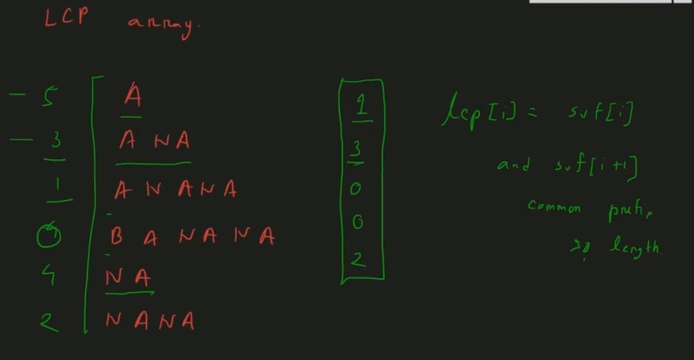

- gfg - kasai algorithm

- lcp of 3,4 (arbitrary 2 suffix)-> min(3...4) + sparse table

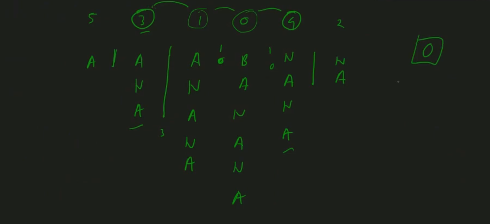
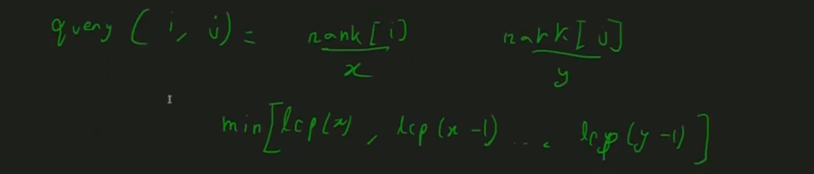

- suffix trie(no duplicate substring) - inefficient 

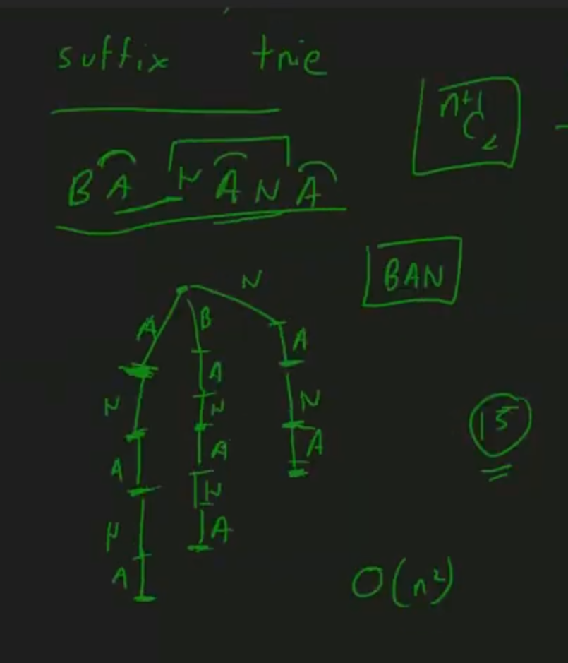

- suffix tree

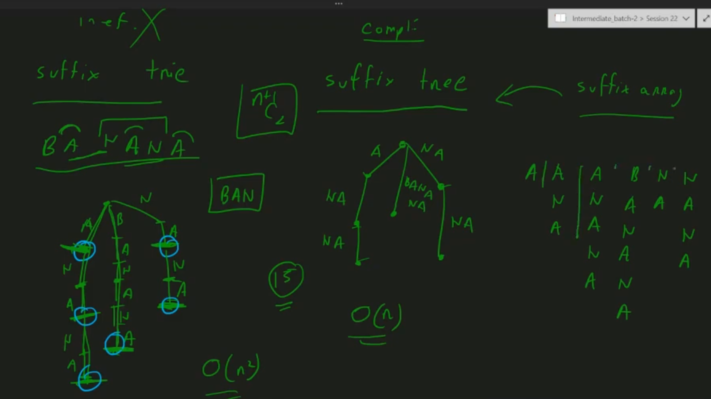
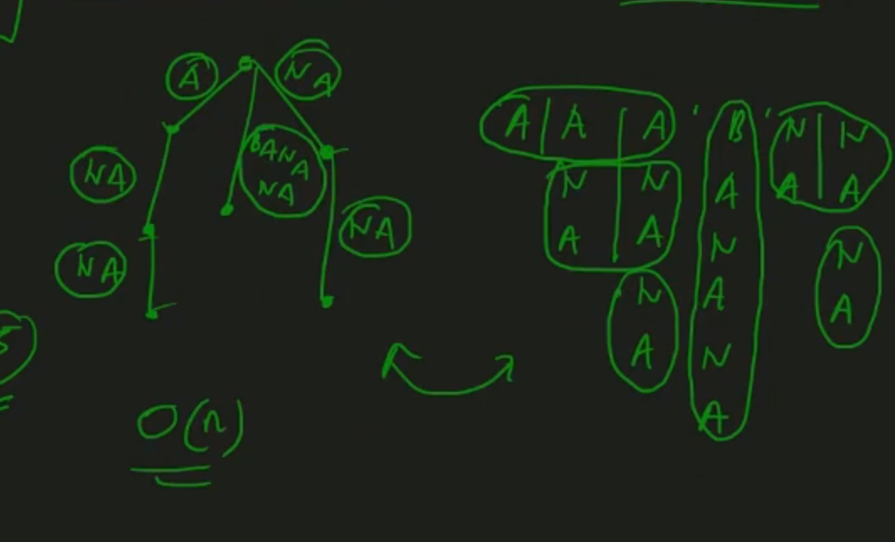
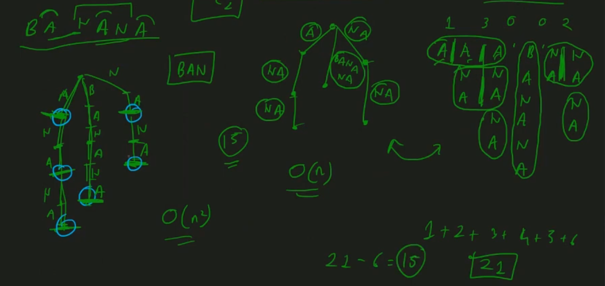
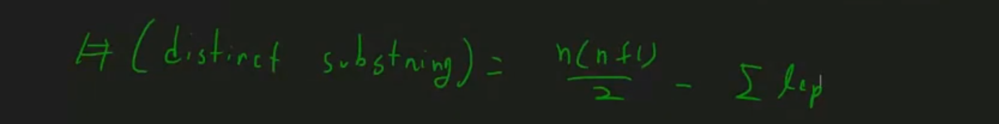

- work with two string 

- first suffix array -> then suffix tree 