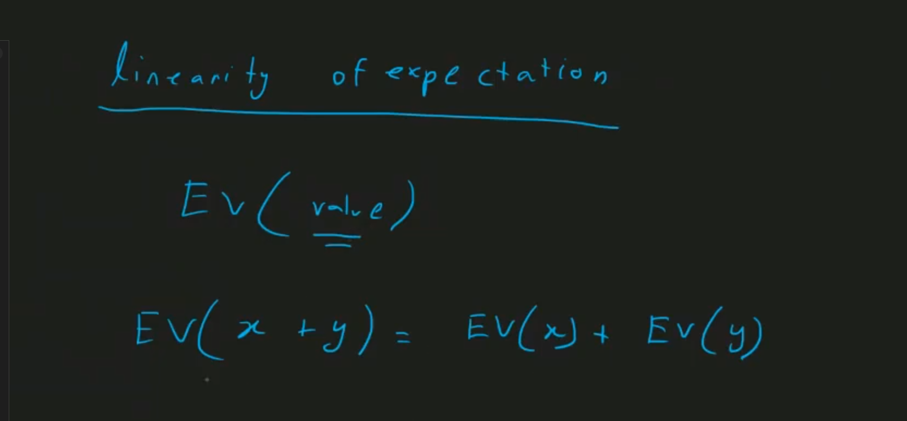

# <u>Probability & Expected Value</u>

## Probability


> probability of specific event = (measurement of that event)/measurement of full universe


> first try to convert probability problems to counting problems... it has two part favourable and universal


= 5/6

> Be Cautions


> but sometimes you can multiply... when there is no overlap, no effect on other ... independent to each other


> 10 coin -> all head -> (1/2)^10

> in probability 90% time measurement is count... but sometimes it is not


> in here measurement is area

> until this we are try to find the probability... but sometimes its given in the questions


> 3 times coin is throw... what is the probability that exactly two times encount head?


sum of all three paths probability

> in decision tree -> multiplication of all branch that are encount in that path

> sometimes we must work with doubles when solve probability

> remember: floating point is inaccurate... not compare directly, not use float in cp ... you can use doubles it's better

> 1e-5 error allow -> we must print 5 floating points

```cpp
cout<<setprecision(5)<<fixed<<ans<<endl;
```

- sometimes ans it in modulo


> so we need numerator & denominator


- Why need probability?


---

## Expected Value


> in probability we only think which is greater or less

> but in expected value we find how much?


> We have to find expected value of number of head, so value is number of head


- EV -> mean


<pre>
- Expected value = (total sum of all possible outcomes)/(number of all possible outcome)
</pre>

### Linearity of Expectation




> infinite number of coin tosses untill find head


> solve it using recursion


https://codeforces.com/blog/entry/62690


example:

---

https://bapsoj.org/contests/icpc-preliminary-dhaka-site-2024/problems/D

### Problem Explanation (Simple Words):

- You have **N boxes**.
- Each box has **two apples**: one **red apple** and one **green apple**.
- Each apple has a **weight** (a number representing how heavy it is).
- You want to **pick exactly K apples** in total (where K can be from 1 to N).
- To do this, you first **randomly select K boxes** out of the N boxes.
- For each selected box, you **randomly choose either the red apple or the green apple** (with equal probability 1/2 each).
- You then **sum the weights** of the apples you picked.
- The problem wants you to find the **expected (average) total weight** for each K from 1 to N.

---

### What does "expected total weight" mean?

It’s like if you repeat the picking process many times, the average total weight you get.

---

### Example with small numbers:

Imagine you have 3 boxes:

| Box | Red Apple Weight | Green Apple Weight |
| --- | ---------------- | ------------------ |
| 1   | 3                | 5                  |
| 2   | 1                | 3                  |
| 3   | 4                | 2                  |

- If you pick K=1 box, say box 1, the expected weight is the average of red and green weights: (3 + 5)/2 = 4.
- If you pick K=2 boxes (say box 1 and box 3), for each box, you pick red or green apple randomly, so the expected weight from box 1 is 4, from box 3 is (4 + 2)/2 = 3.
- Total expected weight = 4 + 3 = 7.
- But you also need to consider the fact you pick any 2 boxes randomly from 3, so you average over all such pairs.

---

### Key Points to understand:

1. **Selecting K boxes randomly**: All combinations of size K from the N boxes are equally likely.
2. **Choosing apple from each box randomly**: For each chosen box, red or green apple is chosen with probability 1/2.
3. **Expected weight per box**: For each box, expected weight if chosen is average of red and green apple weights.
4. **Expected total weight for K boxes**: Sum expected weights of the chosen K boxes, averaged over all combinations.

---

### How to Solve This Problem?

The problem is asking for the expected total weight for every K = 1 to N.

- Let’s define:

  [
  E_i = \text{expected weight if box } i \text{ is chosen} = \frac{\text{red}_i + \text{green}_i}{2}
  ]

- Now, if we select K boxes out of N randomly, the expected total weight is the average sum of the expected weights of any K boxes.

- The problem reduces to:

  **Find the expected sum of any K elements chosen from array ( E ) of length N.**

- The expected sum of K randomly chosen elements from N elements equals:

  [
  \text{Expected sum for K} = \frac{K}{N} \times \sum_{i=1}^N E_i
  ]

  Why? Because each element has an equal probability of being chosen (K/N), and the expectation is linear.

---

### So the final solution is:

1. Calculate ( E_i = (red_i + green_i)/2 ) for each box.

2. Calculate ( S = \sum\_{i=1}^N E_i ).

3. For each K from 1 to N, the expected total weight is:

   [
   \text{Answer}_K = \frac{K}{N} \times S
   ]

4. Since the problem asks for the answer modulo (998244353) and in the form (P \cdot Q^{-1} \mod 998244353), you have to:

   - Calculate ( S \mod 998244353 )
   - Calculate modular inverse of ( N ) modulo (998244353)
   - For each K, calculate ( \text{Answer}\_K = (K \times S \times N^{-1}) \mod 998244353 )

---

### Summary:

- The problem looks complicated because it talks about random choices and apples.
- But the expected value for each box is just the average weight of red and green apples.
- The expected total for choosing K boxes randomly is proportional to K times the average of all boxes.
- So you just need to sum the expected weights and multiply by ( K/N ) for each K.

---

LOJ 1151 snakes and ladders
LOJ 1104 - Birthday Paradox
