## Matrix Exponentiation

- to_find -> recurence relation -> nth term

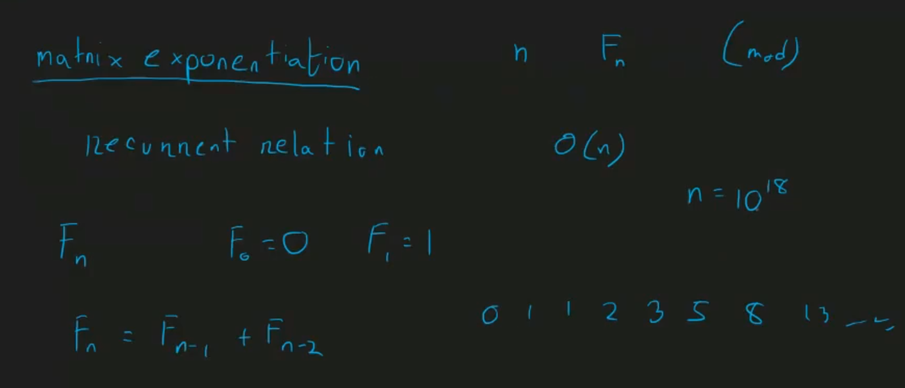


- matrix multiplication

```cpp
const int nmax = 100+5;

long long int A[nmax][nmax];
long long int B[nmax][nmax];

long long int C[nmax][nmax];
int main() {
    //O(n^3)-> O(p*q*r)
    //strassen's algo -> O(n^2.78)
    int n = 2;

    A[0][0] = 1, A[0][1] = 0;
    A[1][0] = 0, A[1][1] = 1;

    B[0][0] = 2, B[0][1] = 3;
    B[1][0] = -1, B[1][1] = 0;

    for(int i = 0; i<n; i++) {
        for(int j = 0; j<n; j++) {
            for(int k = 0; k<n; k++) {
                C[i][j] += A[i][k] * B[k][j];
                // C[i][j] %= mod;
            }
        }
    }

    for(int i = 0; i<n; i++) {
        for(int j = 0; j<n; j++) {
            cout << C[i][j] << " ";
        }
    }
    return 0;
}
```

- nth fibonacci number (nth<=1e18)

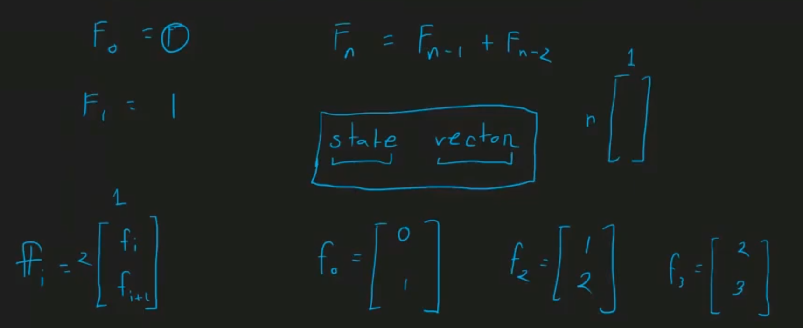

> state vector -> n row, 1 col

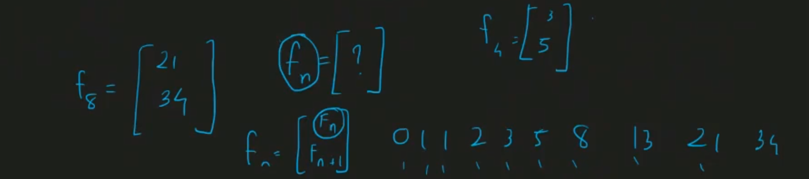
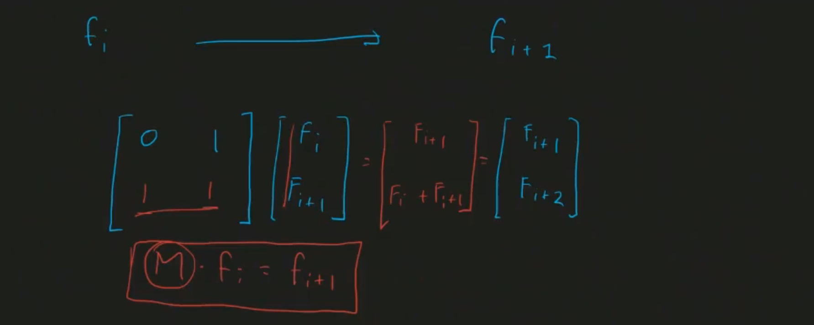
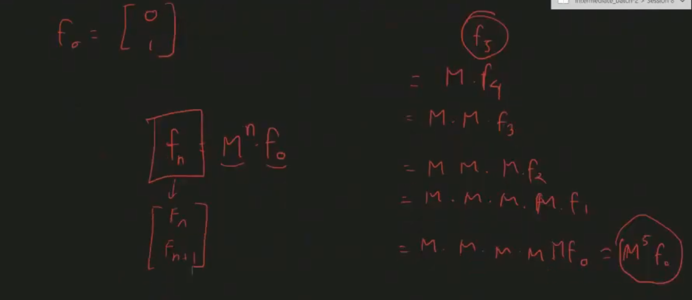
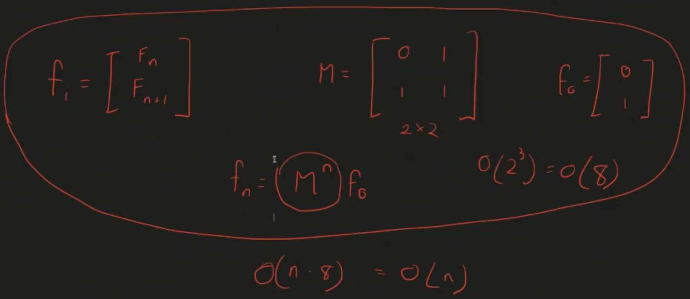

- now we have to optimise this like binary exponentiation

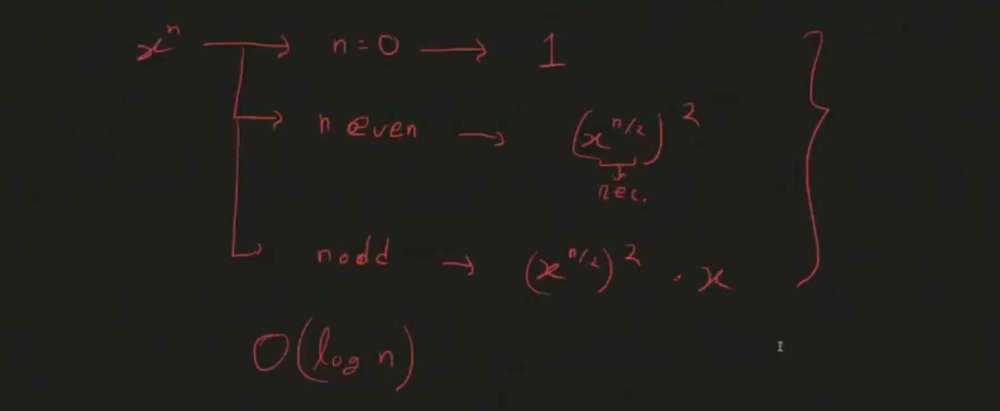
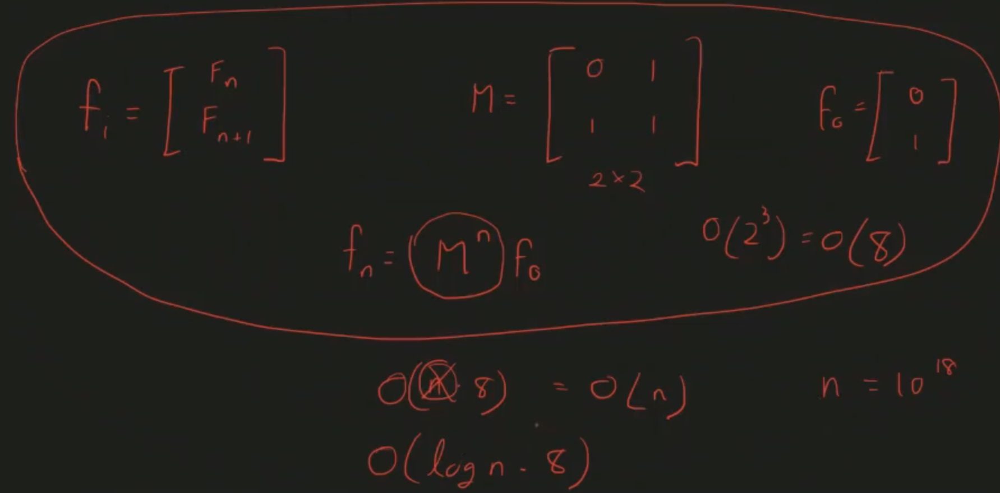

```cpp
#include <bits/stdc++.h>
using namespace std;

const int nmax = 100 + 5;
const long long int mod = 1e9 + 7;

struct Matrix {
    // after constructing val contains garbage
    long long int val[nmax][nmax];
    int row, col;

    Matrix(int _r, int _c) {
        row = _r;
        col = _c;

        /*can be used memset for clearing purpose*/
        for (int i = 0; i < row; i++)
            for (int j = 0; j < col; j++)
                val[i][j] = 0;
    }
    //matrix multiplication -> O(row*col*other.col)
    Matrix operator*(Matrix other) {  //constructor overloading
        Matrix result(row, other.col);  //O(nmax*nmax) -> because that was declaring before

        for (int i = 0; i < row; i++) {
            for (int j = 0; j < other.col; j++) {
                for (int k = 0; k < col; k++) {
                    result.val[i][j] += val[i][k] * other.val[k][j];
                    result.val[i][j] %= mod;
                }
            }
        }

        return result; //O(nmax*nmax)-> for copying
    }

    void print() {
        for (int i = 0; i < row; i++) {
            for (int j = 0; j < col; j++) {
                cout << val[i][j] << " ";
            }
            cout << endl;
        }
    }
};

/// X^n
Matrix Matexpo(Matrix X, long long int n) {
    Matrix Y(X.row, X.col);

    if (n == 0) {
        for (int i = 0; i < X.row; i++)
            Y.val[i][i] = 1;
        return Y;//identity matrix
    }

    Y = Matexpo(X, n / 2);
    Y = Y * Y;

    if (n % 2 == 1) {
        Y = Y * X;
    }

    return Y;
}

int main() {
    ios::sync_with_stdio(false);
    cin.tie(nullptr);

    long long int n; cin >> n;

    Matrix F(2, 1);

    F.val[0][0] = 0;
    F.val[1][0] = 1;

    Matrix M(2, 2);
    M.val[0][0] = 0, M.val[0][1] = 1;
    M.val[1][0] = 1, M.val[1][1] = 1;

    M = Matexpo(M, n);
    F = M * F;

    // nth fibonacci number within log(n) complexity
    cout << F.val[0][0] << endl;
    return 0;
}
```

- other recurrance relation


- different size of m

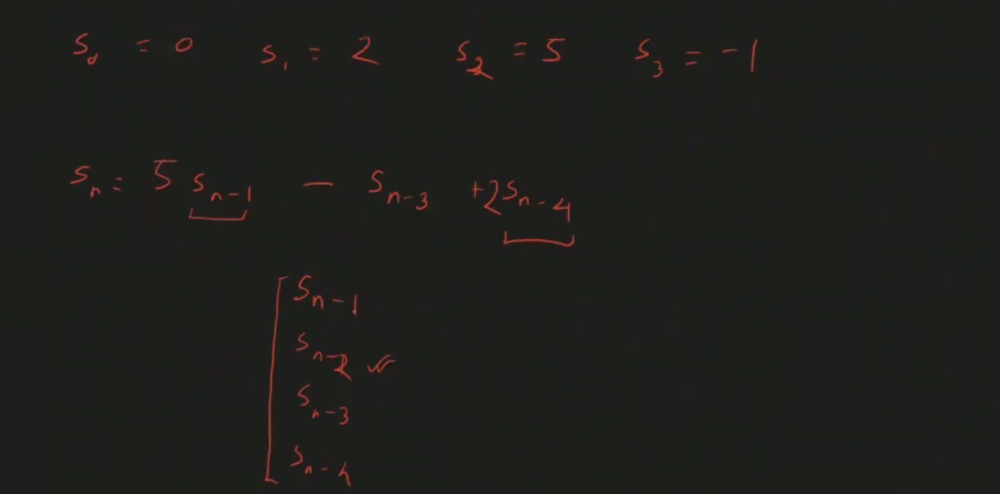
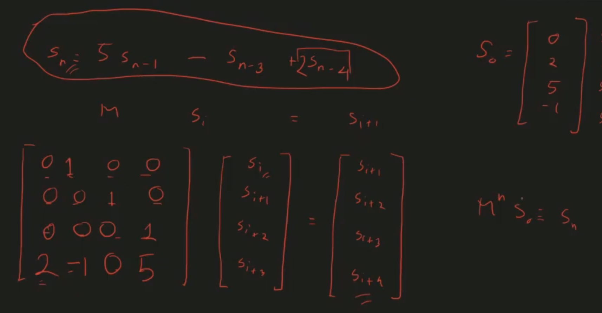

- can be done untill the recurance size n <= 200 because -> O(n^3 logn)

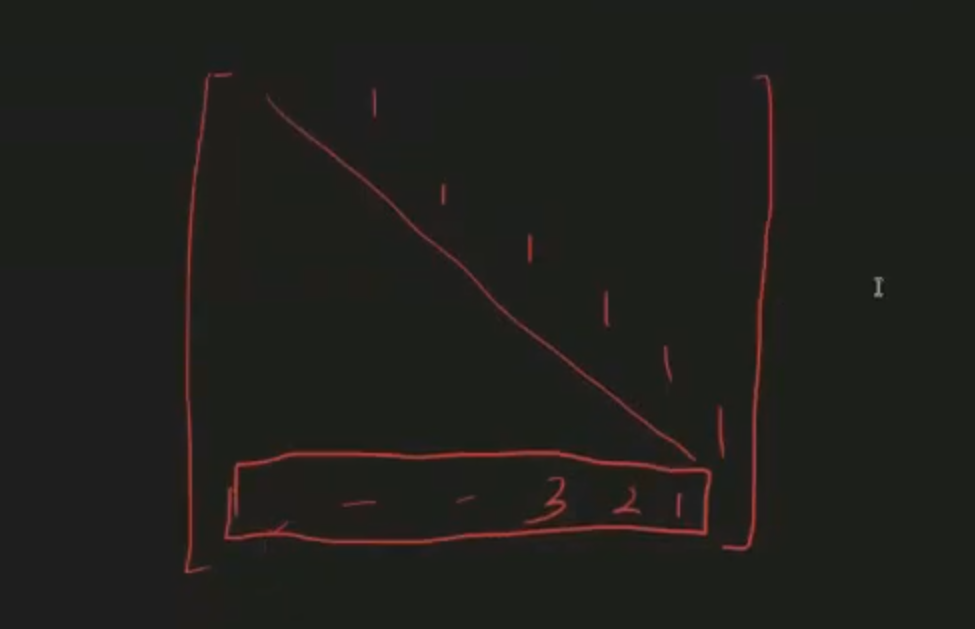

- without sequence .... other type of problems that can be solved using matrix exponentiation

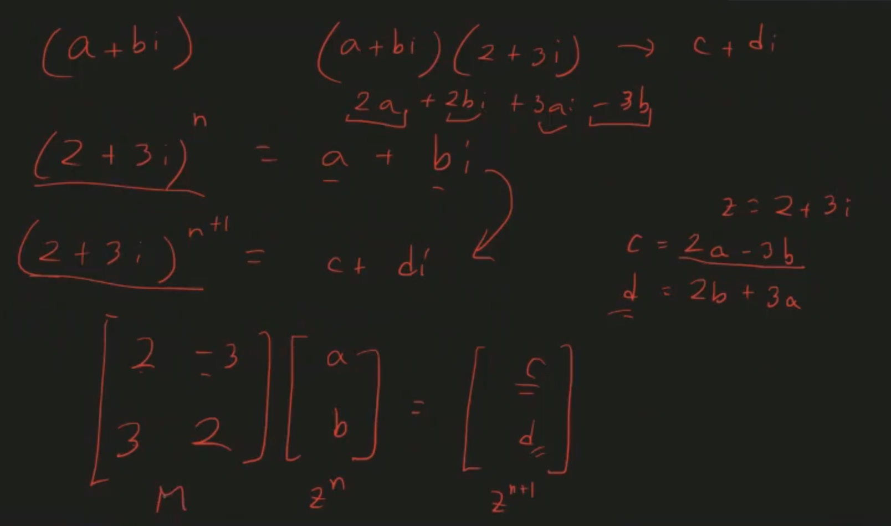

- one state to another state... have to done linear work

- summation of sequence upto nth

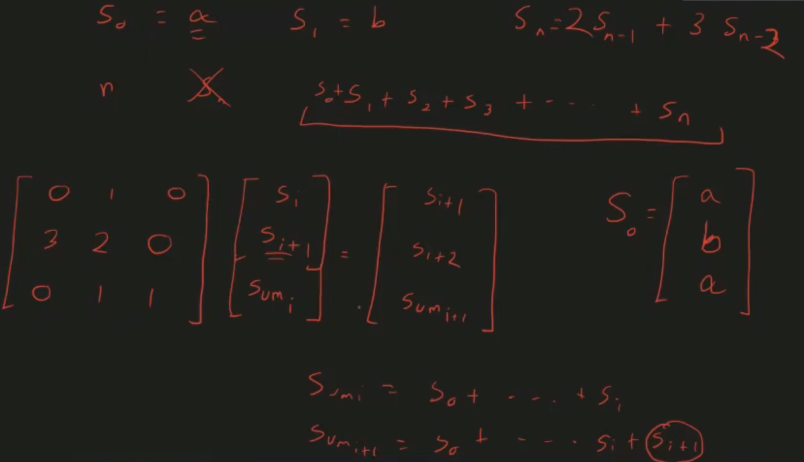

- all needed information add in a state vector

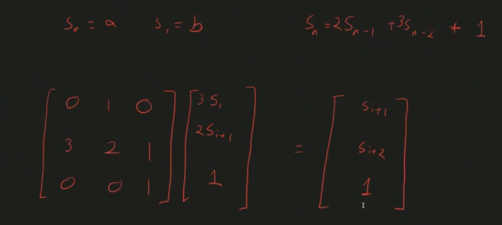

- another 1

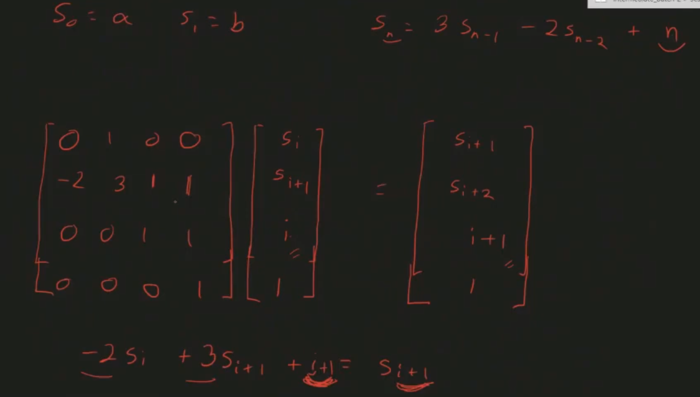

- n^2 -> i^2 i 1
- Fn = Gn-1 + Gn-2, Gn = Fn-1+Fn-2 -> fn gn fn-1 gn-1 -> add all

---

- matrix expo tells -> what happened to do multiple time than one time operation

---