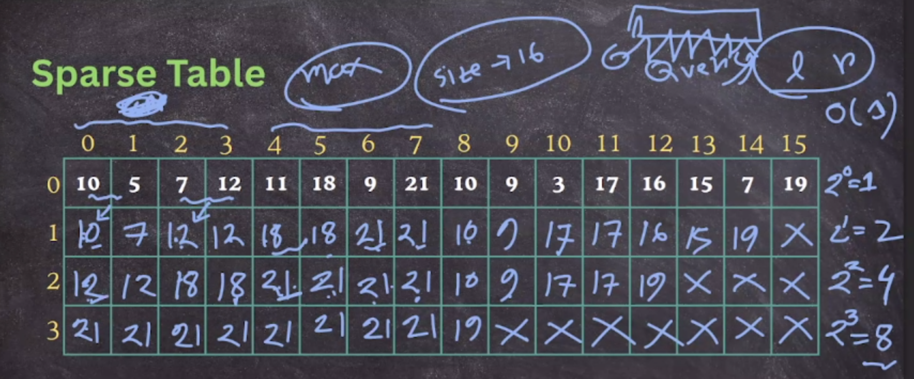
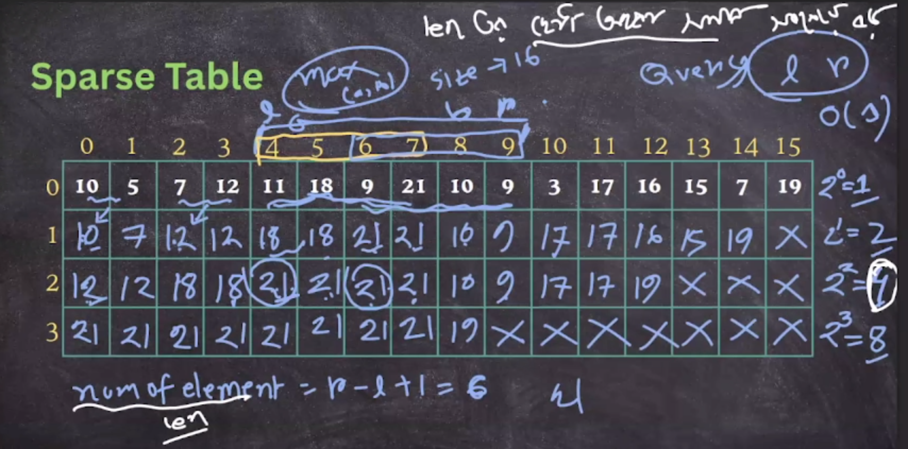
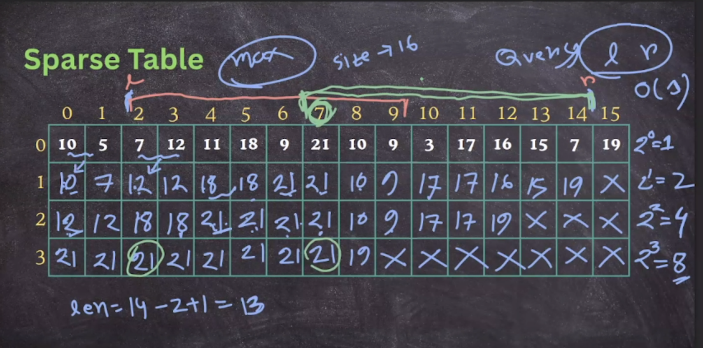
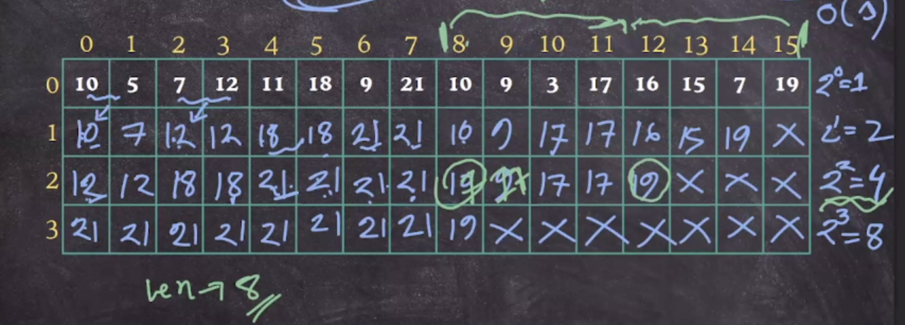
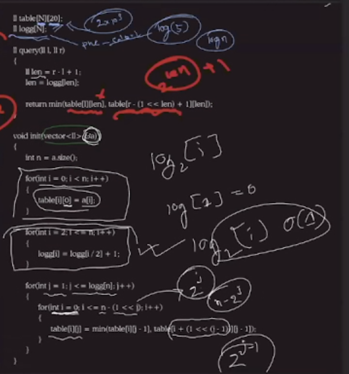
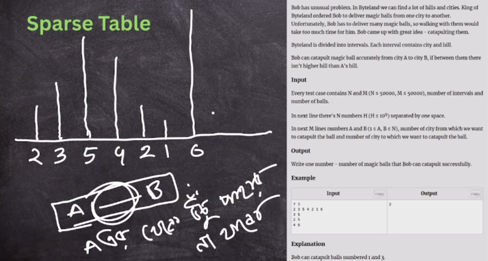
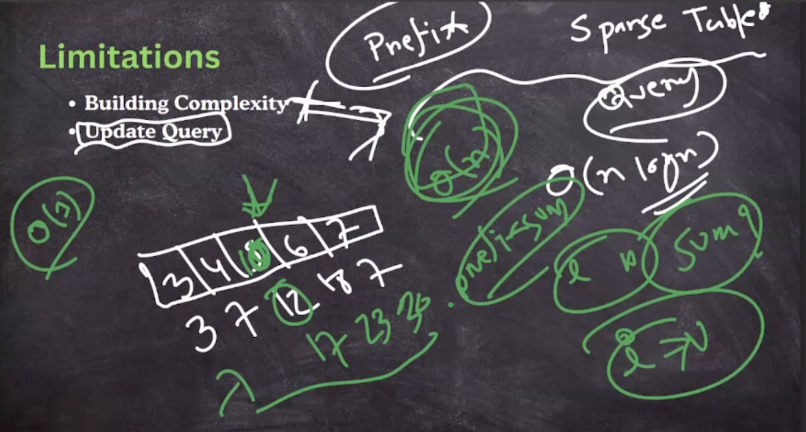

- https://codeforces.com/problemset/problem/1602/B

- idempotent operators -> sparse table
- sparse table work like prefix sum

## Sparse Table

- precalculation

- query

- [2^0, 2^1, 2^2....2^n].lowerbound(r-l+1), max(a,b)

- first x, last x

- only (gcd, lcm)-> O(logn), otherwise O(1) for answering each query

ex.

> only middles point don't have any bigger than first one

- limitations

