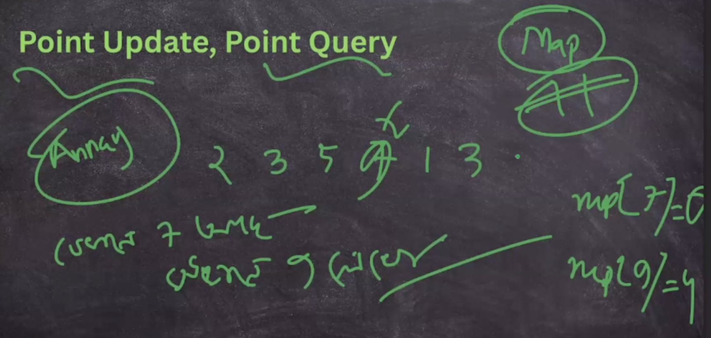
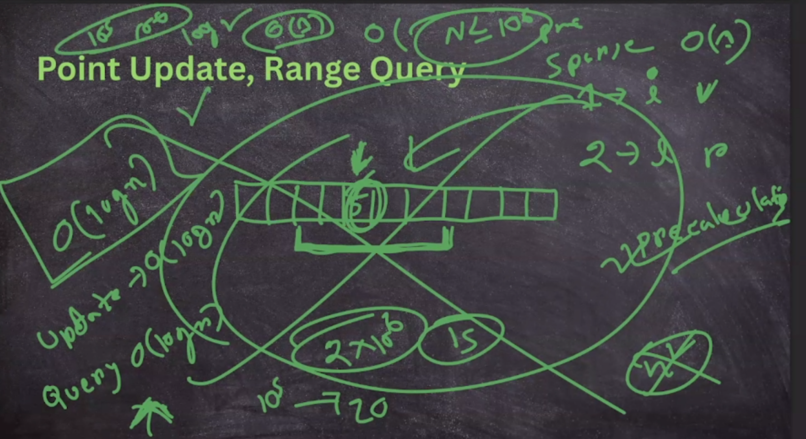
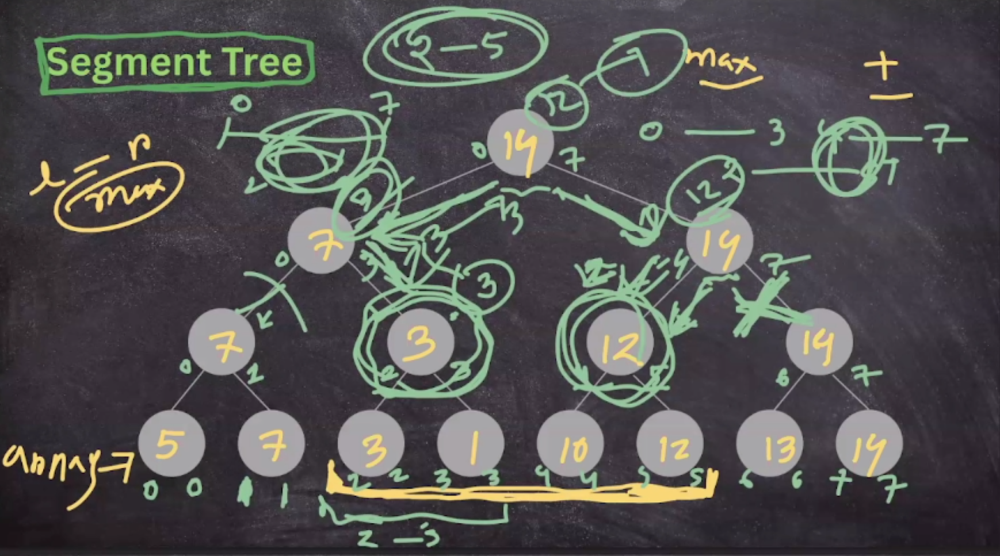
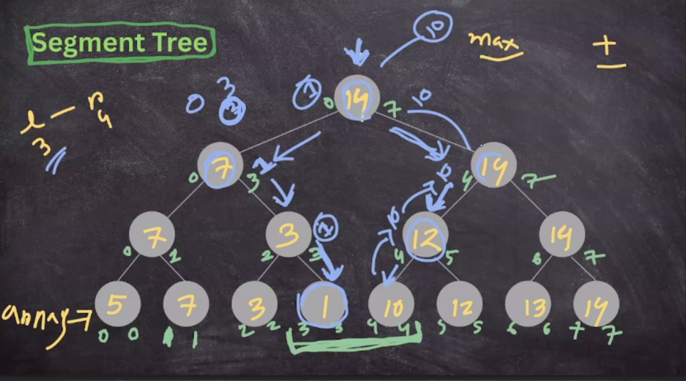
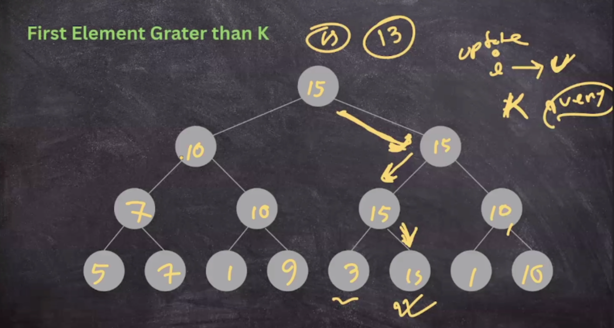

## Point Update, Point Query

- nothing need in point update, point query -> can be done using only array or map

---

## Point Update, Range Query

## Segment Tree
> applicable for all type of operation (idempotent and non-idempotent) - in log(n)  complexity

- no more than 2 branch visit for one node
- no deep dive if full common... because it already processed

ex.

---
