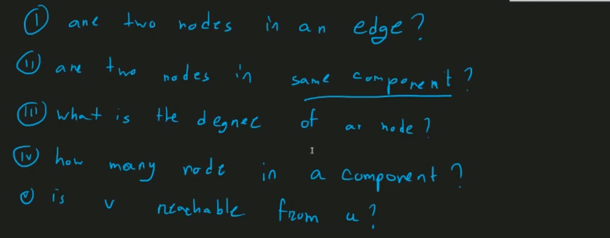
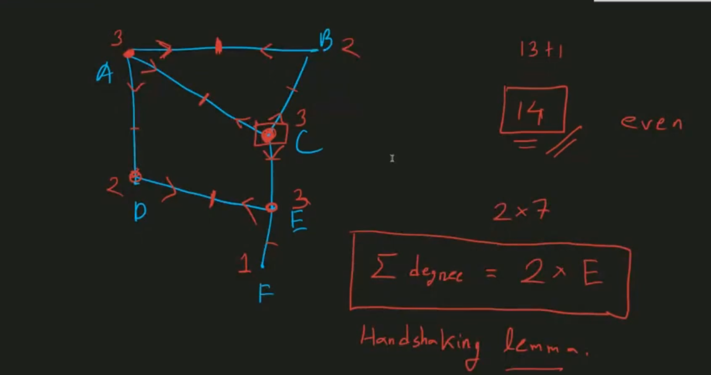
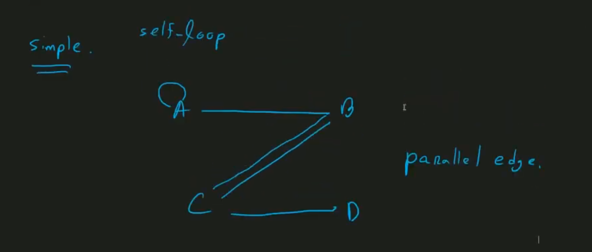
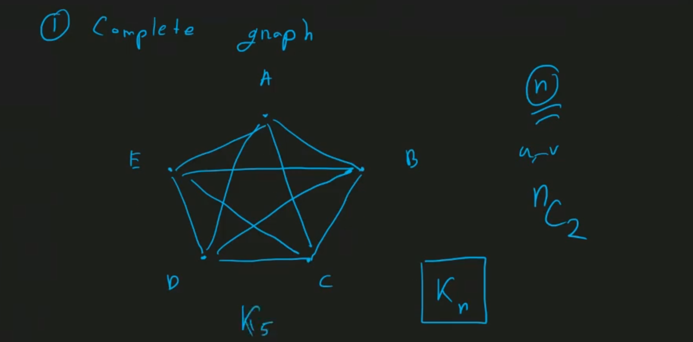
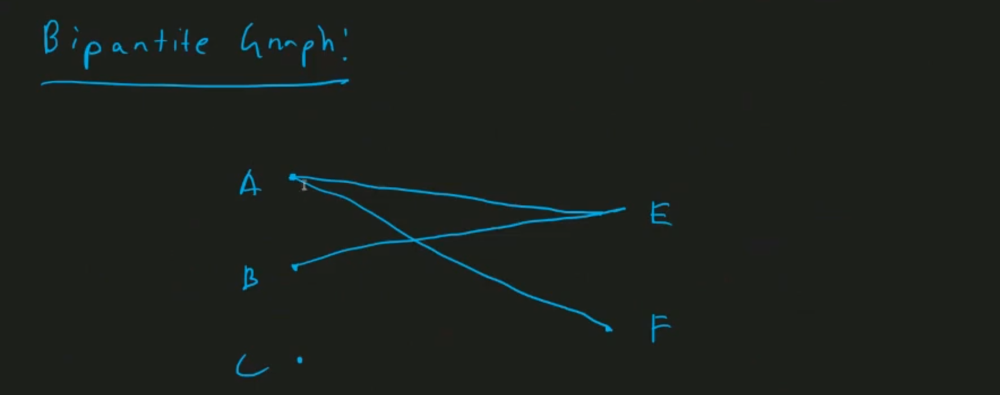
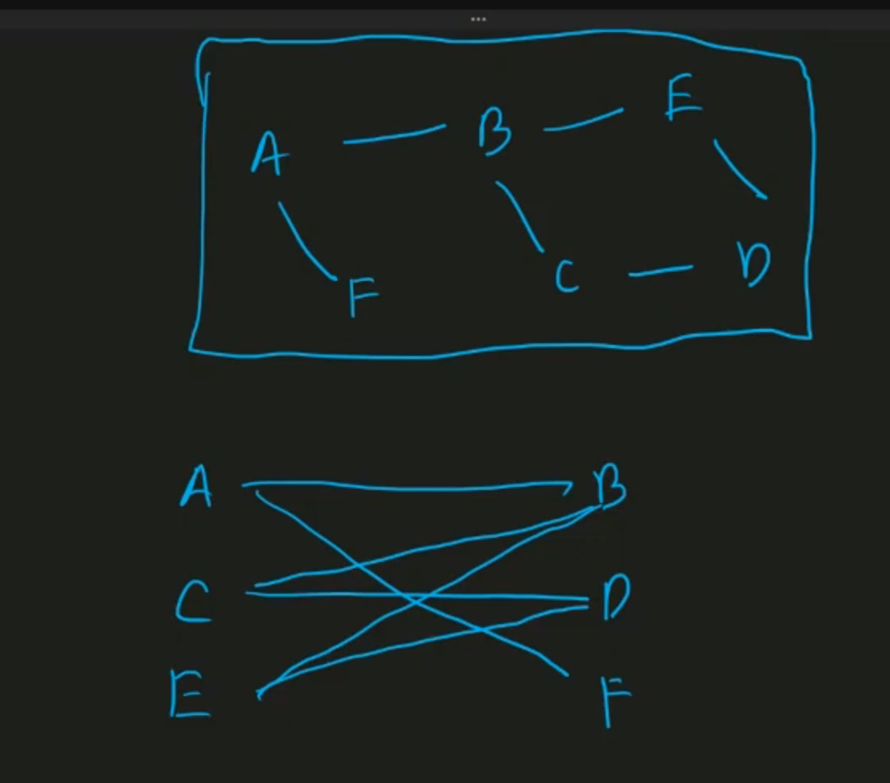
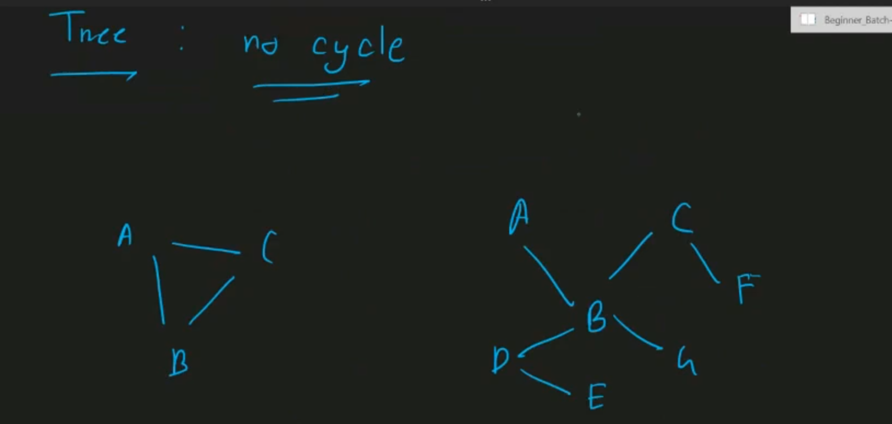
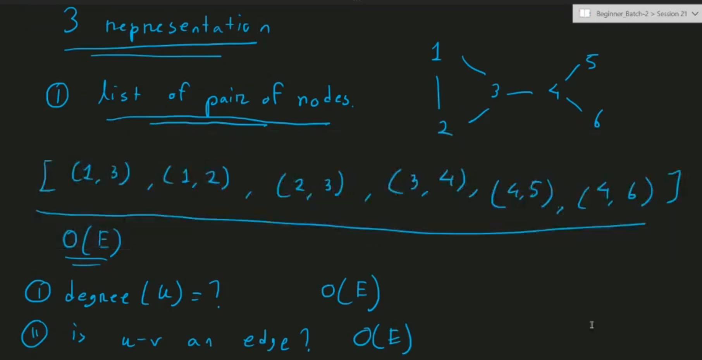
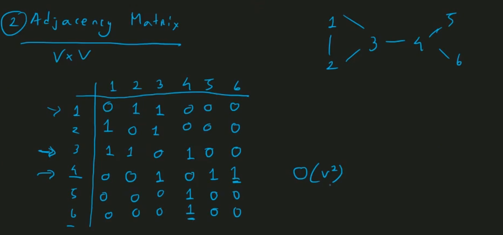
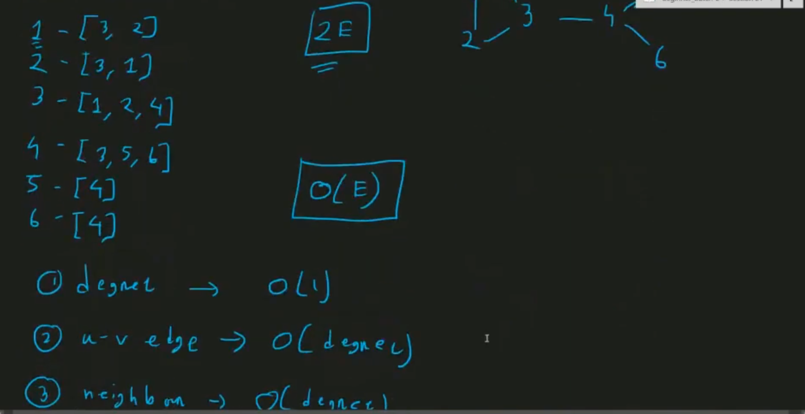

### Basic Graphs


https://medium.com/basecs/a-gentle-introduction-to-graph-theory-77969829ead8
Non-Linear Data Structures (Trees, Graphs)

<pre>
Fundamental Characteristics:
    - their data doesn’t follow an order — at least, not an obvious numerical one, like we see in arrays or linked lists.
</pre>

https://youkn0wwho.academy/topic-list/?category=basics&subCategory=very_basic_graphs

- graph theory -> roze n(discreate mathematics)

-> connection/relation <- graph theory


- adjacent/neighbour (direct connection from one node n)

- problems in graph theory can be...


> v can be edge or node disjoint
- vi -> do u,v have two different edge-disjoint path?
- vii -> does a graph have a cycle
- viii -> u_v shortest path 

#

- first graph theory problem


- sum of all degree is always even...
- and it's equal to 2*e
- handshaking lemma. 



- path, cycle


- cycle is a path where start and end in a same node
- A-C-D-B-A
#
- edge disjoint path (no edge repeated) -> node can be repeated
- edge disjoint cycle (no edge repeated)
- node disjoint path/cycle (no node, edge repeated)
- node disjoint and edge disjoint is not a same thing
- in cycle one is repeated

#

- complex graph problems (in here our techniques can be change)
> simple graph don't have self loop, parallel edge



#
upto now all is undirected/unweighted

- other property


- common weight -> time or distance


- different category of graphs 


> all node is connected to each other <br>
> nC2 = n(n-1)/2 -> O(n^2) <br>
> E = O(V^2)  <- for large graph







- graph representations

- edge list



> iii -> who are neighbours of u -> O(E)




> for dense graph adjacency matrix is good<br>
> for sparse graph adjacency matrix is not good

- adjacency list



#

https://medium.com/basecs/a-gentle-introduction-to-graph-theory-77969829ead8

<pre>
- Graphs are mathematical structures that represent pairwise relationships between objects. 
- A graph is a flow structure that represents the relationship between various objects. It can be visualized by using nodes and edges.

- Graphs don’t have any concept of a “root” node. And why would they? Nodes can be connected in any way possible, really. One node might be connected to five others! Graphs also don’t have any notion of “one-directional” flow — instead, they might have direction, or they might have no direction whatsoever. Or, to complicate matters further, they could have some links that have direction and others that don’t!

- Graph needs at least a single node in order to be considered a “graph”, referred to as a singleton graph
- Edges (sometimes referred to as links) can connect nodes in any way possible. (no real rules)
graphs can have two types of edges: a edge that has a direction or flow, and an edge that has no direction or flow.
</pre>

https://www.hackerearth.com/practice/algorithms/graphs/graph-representation/tutorial/

<pre>
Types of nodes

    - Root node: The root node is the ancestor of all other nodes in a graph. It does not have any ancestor. Each graph consists of exactly one root node. Generally, you must start traversing a graph from the root node.

    - Leaf nodes: In a graph, leaf nodes represent the nodes that do not have any successors. These nodes only have ancestor nodes. They can have any number of incoming edges but they will not have any outgoing edges.
</pre>


<pre>
- unlike trees, there is no hierarchy of nodes! Which means that we don’t need to order them, since order doesn’t matter here.
- the origin node and destination node are not fixed.
</pre>

#

https://study.com/academy/lesson/graph-theory-concepts-and-terminology.html<br>

###### Common Terms

<pre>
- Vertices(n) + Edges(m) 
        - Nodes are entities whose relationships are expressed using edges
        - Edges are the components that are used to represent the relationships between various nodes in a graph. An edge between two nodes expresses a one-way or two-way relationship between the nodes.

- Neighbours (Adjacent Vertices -> N[x]) + Degree (Number of Neighbours)
- Self Loop (edges come and goes to the same vertices)

- <b>Path</b> (everynode encounted one, not revisit any node) + <b>Walk</b> (revisit some node) + <b>Cycle</b> (going from one node and coming back to samenode (don't revisit any node except from the starting node)) 
-> every cycle or path is a walk, walk can contains cycles

- Simple Graph (doesn't contain self loop and multiple edges)
        - A graph is simple if no edge starts and ends at the same node, and there are no multiple edges between two nodes
- Bridge + Articulation Point
        - A bridge is an edge in a graph whose removal increases the number of connected components.
        - An articulation point (or cut vertex) is a vertex whose removal increases the number of connected components.

- Hamiltonian path (is a path in a graph that visits each vertex exactly once.)
- Hamiltonian cycle (if a hamiltonian path forms a closed loop)

</pre>


https://usaco.guide/CPH.pdf#page=119

<pre>
- A <b>path</b> leads from node a to node b through edges of the graph. The <b>length</b>
of a path is the number of edges in it.
- A path is a <b>cycle</b> if the first and last node is the same.
- A path is <b>simple</b> if each node appears at most once in the path.
- Two nodes are <b>neighbors or adjacent</b> if there is an edge between them.
- The <b>degree</b> of a node is the number of its neighbors

- The sum of degrees in a graph is always 2m, where m is the number of edges (<b>the sum of degrees is always even</b>).
- A graph is <b>regular</b> if the degree of every node is a constant d.

- A graph is <b>complete</b> if the degree of every node is n − 1 
        - N[x] = G - x node visit from every node (N[x]=G implies that x and all other vertices in G are part of N[x], which is true in a complete graph.)
        - every pair of distinct vertices is connected by a unique edge

- In a directed graph, the <b>indegree</b> of a node is the number of edges that end
at the node, and the <b>outdegree</b> of a node is the number of edges that start at
the node.

- In a <b>coloring</b> of a graph, each node is assigned a color so that no adjacent nodes
have the same color.
- A graph is <b>bipartite</b> if it is possible to color it using two colors 
        (It turns out that a graph is bipartite exactly when it does not contain a cycle with an odd number of edges.)
</pre>


#

###### Types of Graph

<pre>
two types of graphs are pretty common in graph theory problems: directed graphs, and undirected graphs.

- Directed graph -> Edges have a direction, meaning that edges with arrows connect one vertex to another.
        (A graph is directed if the edges can be traversed in one direction only (uni-directional))
- Undirected graph -> Edges do not have a direction, meaning that each edge can be traversed in both directions (<b>Bi-directional</b>).
</pre>


<pre>
- Cyclic + Acyclic
        - A graph is cyclic if the graph comprises a path that starts from a vertex and ends at the same vertex. That path is called a cycle. 
        - An acyclic graph is a graph that has no cycle. 
</pre>


<pre>
- Connected + Disconnected
         - A graph is connected if there is a path between any two nodes.
         - The connected parts of a graph are called its components.
         (A connected component is a set of nodes within which anynode can reach any other node.)
</pre>


<pre>
- Unweighted vs Weighted
        (In a weighted graph, each edge is assigned a weight or cost. The weights are often interpreted as edge lengths)
        - The length of a path in a weighted graph is the sum of the edge weights on the path. 
        - The smallest length path is the shortest path.
</pre>


#

###### Properties of Graph

<pre>
Longest Path Tricks

- An undirected graph where <b>each node</b> has at degree at least 2 will contain a cycle
- A directed graph where each node has at least 1 in-degree and at least 1 out-degree will contain a cycle

- The sum of all degree is even. The number of vertices with odd degree is even
</pre>

#

###### Representation of Graph

https://www.geeksforgeeks.org/graph-and-its-representations/<br>
https://usaco.guide/CPH.pdf#page=113<br>
https://www.hackerearth.com/practice/algorithms/graphs/graph-representation/tutorial/

(Adjacency List, Adjacency Matrix and Edge List)

#

- Adjacency Matrix

  (Primary use of the adjacency matrix is the Floyd-Warshall algorithm)

<pre>
-> Adding O(1), Checking O(1), Listing all edges O(N*N)
-> Memory using O(N*N) (maybe encounted memory limit exceded) (V*V binary matrix)

An adjacency matrix is a two-dimensional array that indicates which edges
the graph contains. We can efficiently check from an adjacency matrix if there is
an edge between two nodes. The matrix can be stored as an array

- A binary matrix is a matrix in which the cells can have only one of two possible values - either a 0 or 1.
- The adjacency matrix can also be modified for the weighted graph in which instead of storing 0 or 1 in A<sub>ij</sub>, the weight or cost of the edge will be stored.

- if the graph were undirected, each edge (i,j) will have two corresponding entries in the matrix, both cell (i,j) and cell (j,i). In the case of an undirected graph, the adjacency matrix is <b>symmetric</b>.

- Adjacency matrix provides <b>constant time access (O(1))</b> to determine if there is an edge between two nodes. Space complexity of the adjacency matrix is O(V<sup>2</sup>).

- best use when the graph is dense.
</pre>

https://www.geeksforgeeks.org/adjacency-matrix/


```cpp
//for directed graph
bool A[10][10];//adj[][]

void initialize()
{
    for (int i = 0; i < 10; ++i)
        for (int j = 0; j < 10; ++j)
            A[i][j] = false;
/*
where each value adj[a][b] indicates whether the graph contains an edge from
node a to node b. If the edge is included in the graph, then adj[a][b] = 1, and
otherwise adj[a][b] = 0.
*/
}

int main()
{
    int x, y, nodes, edges;
    initialize();       //Since there is no edge initially
    cin >> nodes;       //Number of nodes
    cin >> edges;       //Number of edges
    for (int i = 0; i < edges; ++i)
    {
        cin >> x >> y;
        A[x][y] = true;     //Mark the edges from vertex x to vertex y
    }
    if (A[3][4] == true)
        cout << "There is an edge between 3 and 4" << endl;
    else
        cout << "There is no edge between 2 and 3" << endl;

    return 0;
}
/*Input file
4 // nodes
5 //edges
1 2 //showing edge from node 1 to node 2
2 4 //showing edge from node 2 to node 4
3 1 //showing edge from node 3 to node 1
3 4 //showing edge from node 3 to node 4
4 2 //showing edge from node 4 to node 2 */
```

for unwighted graph instead of weight write 1 and 0 (also it's a symetric matrix(for undirected))

<pre>
The drawback of the adjacency matrix representation is that the matrix
contains n<sup>2</sup> elements, and usually most of them are zero. For this reason, the
representation cannot be used if the graph is large.
</pre>

https://csacademy.com/lesson/graph_representation

Advantages

    - Edge lookup, i.e. checking if a particular edge exists, is done easily.
    - Adding new edges, or deleting existing ones, is also straightforward.
    - If the graph is dense, i.e. the number of edges is large. This is usually the preferred method of representing the graph.
    - Certain algorithms are easier to implement using an adjacency matrix.

Disadvantages

    - The memory allocated is always an N∗N matrix, even in the case of sparse graphs, i.e. the number of edges is small.
    - For a given node finding all its neighbours, i.e. other nodes that share an edge with it, requires checking an entire row of elements in the matrix.

#

- Adjacency List with Vector (most used)

  (BFS, DFS, Dijkstra's, or other single source graph traversal algorithms)

<pre>
-> Adding O(1), Checking O(N), Listing O(M) ...M = no. of edges
-> Memory using O(M)  //O(V+E)

In the adjacency list representation, each node x in the graph is assigned an
adjacency list that consists of nodes to which there is an edge from x. Adjacency
lists are the most popular way to represent graphs, and most algorithms can be
efficiently implemented using them.

- For each node i, we store an array of its neighbours.

- For a weighted graph, the weight or cost of the edge is stored along with the vertex in the list using pairs. 
- In an undirected graph, if vertex j is in list Ai then vertex i will be in list Aj.

- A <b>sparse matrix</b> is a matrix in which most of the elements are zero, whereas a <b>dense matrix</b> is a matrix in which most of the elements are non-zero.
</pre>


```cpp
//If the graph is undirected, it can be stored in a similar way, but each edge is added in both directions.

//For a weighted graph,
vector<pair<int,int>> adj[N];
adj[1].push_back({2,5});
adj[2].push_back({3,7});
adj[2].push_back({4,6});
adj[3].push_back({4,5});
adj[4].push_back({1,2});

//The benefit of using adjacency lists
//following loop goes through all nodes to which we can move from node s:
for (auto u : adj[s]) {
        // process node u
}
```

```cpp
//for directed graph
vector <int> adj[10];

int main()
{
    int x, y, nodes, edges;
    cin >> nodes;       //Number of nodes
    cin >> edges;       //Number of edges
    for (int i = 0; i < edges; ++i)
    {
        cin >> x >> y;
        adj[x].push_back(y);        //Insert y in adjacency list of x
    }
    for (int i = 1; i <= nodes; ++i)
    {
        cout << "Adjacency list of node " << i << ": ";
        for (int j = 0; j < adj[i].size(); ++j)
        {
            if (j == adj[i].size() - 1)
                cout << adj[i][j] << endl;
            else
                cout << adj[i][j] << " --> ";
        }
    }
    return 0;
}
```


Advantages

    - For a graph with N nodes and M edges, the memory used depends on M. This makes the adjacency lists ideal for storing sparse graphs. Let's assume we have a directed graph with 5 000 nodes and (only) 10 000 edges. In the case of the adjacency matrix, we would have allocated 25 000 000 elements, whereas in the case of adjacency lists we only need 10 000.
    - For a given node finding all its neighbours requires checking only the node's list which contains a numbers of elements equal to the number of neighbours (one per neighbour).
    - Adding an edge can be done easily, by appending the neighbour(s) in the corresponding list(s).

Disadvantages

    - Edge lookup is slow, in the worst case being necessary to traverse all the elements of a node's list.
    - Erasing an edge is just as slow as the lookup.
    - If the graph is dense, the adjacency lists are probably not as good as an adjacency matrix.
    - Implementing them is slightly more difficult than an adjacency matrix. Even so, we still recommend them in most of the cases.

#

- Adjacency List with Set (Hash Table)
<pre>
When to Use set in Adjacency List?
        - You need sorted neighbors.
        - Duplicate edges must be prevented without extra checks.
        - Graphs have moderate sizes since set is slightly slower and memory-intensive.

For other cases, consider using vector<int> for adjacency lists for faster operations and reduced memory usage.

- Compared to a simple vector<int>, a set uses more memory due to the underlying balanced tree structure.
</pre>

```cpp
vector<set<int>> /*or*/ set<int>adj[N]
```

```cpp
//for undirected graph
const int N = 1e5 + 5; // Maximum number of vertices
set<int> adj[N];       // Adjacency list using set

void addEdge(int u, int v) {
    adj[u].insert(v); // Add v to the adjacency list of u
    adj[v].insert(u); // Add u to the adjacency list of v (since it's undirected)
}

void printGraph(int nodes) {
    for (int i = 0; i < nodes; i++) {
        cout << i << ": ";
        for (int neighbor : adj[i]) {
            cout << neighbor << " ";
        }
        cout << endl;
    }
}

int main() {
    int nodes = 5; // Number of vertices
    addEdge(0, 1);
    addEdge(0, 2);
    addEdge(1, 3);
    addEdge(3, 4);

    cout << "Adjacency List:" << endl;
    printGraph(nodes);

    return 0;
}
```

#

- Edge List Representation

  (We use this in weighted undirected graphs when we want to sort the edges by weight (ex. DSU) )

<pre>
An edge list contains all edges of a graph in some order. This is a convenient
way to represent a graph if the algorithm processes all edges of the graph and it
is not needed to find edges that start at a given node.
</pre>

```cpp
vector<pair<int,int>> edges;
//where each pair (a, b) denotes that there is an edge from node a to node b.
edges.push_back({1,2});
edges.push_back({2,3});
edges.push_back({2,4});
edges.push_back({3,4});
edges.push_back({4,1});

//If the graph is weighted,
vector<tuple<int,int,int>> edges;//(a,b,w)
edges.push_back({1,2,5});
edges.push_back({2,3,7});
edges.push_back({2,4,6});
edges.push_back({3,4,5});
edges.push_back({4,1,2});
```

```cpp
//edge list representation
struct Edge {
    int a, b, w;
    Edge(int start, int end, int weight):
        a(start), b(end), w(weight)
    {
    }
    bool operator<(const Edge & e)
    const { // sort order is ascending, by weight
        // to sort in descending order, just negate the value of the compare function., !
        return w < e.w;
    }
};

int n, m; // number of nodes and edges
vector<Edge> edges;
int main() {
    cin >> n >> m;
    for (int i = 0; i < m; i++) { // for each of the m edges
        int a, b, w;
        cin >> a >> b >> w;
        // a--; b--; // subtract 1 to maintain zero-indexing of vertices
        edges.push_back(Edge(a, b, w)); // add the edge to the list
    }
    sort(edges.begin(), edges.end());

    for(auto x:edges){
        auto [a,b,w] = x;
        cout<<a<<" "<<b<<" "<<w<<endl;
    }
    return 0;
}
```

<pre>
Advantages of Edge List
- Simple to Implement: Easy to create and manipulate.
- Efficient for Sparse Graphs: Works well when the number of edges is much smaller than n<sup>2</sup>.
- Kruskal's Algorithm: Directly supports edge-based algorithms like MST using Kruskal.

Disadvantages of Edge List
- Inefficient for Adjacency Queries: Checking if two vertices are connected is O(E) since all edges must be traversed.
- Memory Usage: For dense graphs, adjacency matrices or lists are more efficient in terms of storage and access time.
</pre>

#

###### Complexity in Graphs

<pre>
- Adding O(logN), Checking O(logN), Listing O(N)
-> Memory using O(M)
</pre>

https://www.hello-algo.com/en/chapter_graph/graph_operations/#922-implementation-based-on-adjacency-list

(n = no. of vertices/nodes, m = no. of edges)


#

example:

- [Aizu-ALDS1_11_A_Graph](./Aizu_ALDS1_11_A_Graph.cpp)

    <pre>
  There are two standard ways to represent a graph G=(V,E), where V is a set of vertices and E is a set of edges; Adjacency list representation and Adjacency matrix representation. 
  
  Write a program which reads a directed graph G represented by the adjacency list, and prints its adjacency-matrix representation.
  
  (Convert Adjacency List to Adjacency Matrix)
    </pre>

- [292B_Network Topology](./292B_Network%20Topology.cpp)

    <pre>
  A bus is a connected graph that is the only path, that is, the graph where all nodes are connected with two other ones except for some two nodes that are the beginning and the end of the path. A ring is a connected graph, where all nodes are connected with two other ones. A star is a connected graph, where a single central node is singled out and connected with all other nodes.
    </pre>

- [leetcode_1791. Find Center of Star Graph](./leetcode1791_Find%20Center%20of%20Star%20Graph.cpp)

    <pre>
  There is an undirected star graph consisting of n nodes labeled from 1 to n. A star graph is a graph where there is one center node and exactly n - 1 edges that connect the center node with every other node.
  
  You are given a 2D integer array edges where each edges[i] = [ui, vi] indicates that there is an edge between the nodes ui and vi. Return the center of the given star graph.
    </pre>

- [leetcode1557_Minimum Number of Vertices to Reach All Nodes.cpp](./leetcode1791_Find%20Center%20of%20Star%20Graph.cpp)

    <pre>
  Given a directed acyclic graph, with n vertices numbered from 0 to n-1, and an array edges where edges[i] = [fromi, toi] represents a directed edge from node fromi to node toi.
  
  Find the smallest set of vertices from which all nodes in the graph are reachable. It's guaranteed that a unique solution exists.
  
  Notice that you can return the vertices in any order.
    </pre>

- [330B_Road Construction](./330B_Road%20Construction.cpp)

    <pre>
  A country has n cities. Initially, there is no road in the country. One day, the king decides to construct some roads connecting pairs of cities. Roads can be traversed either way. He wants those roads to be constructed in such a way that it is possible to go from each city to any other city by traversing at most two roads. You are also given m pairs of cities — roads cannot be constructed between these pairs of cities.
  
  Your task is to construct the minimum number of roads that still satisfy the above conditions. The constraints will guarantee that this is always possible.
  
  -> like star topology
    </pre>

#
