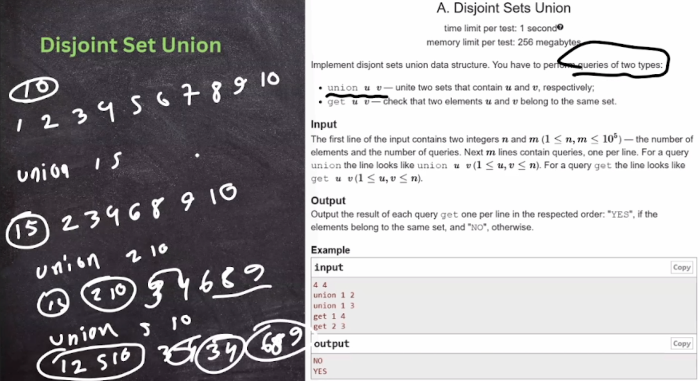
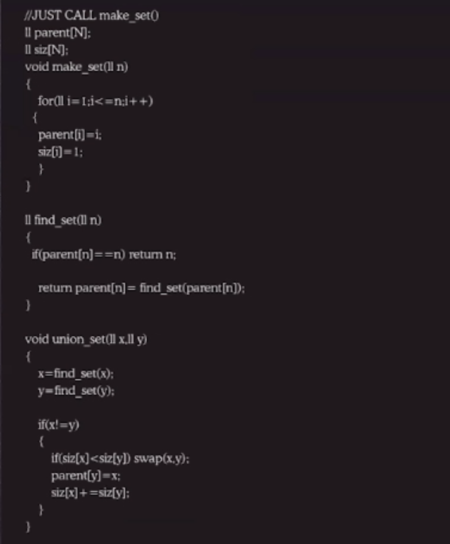
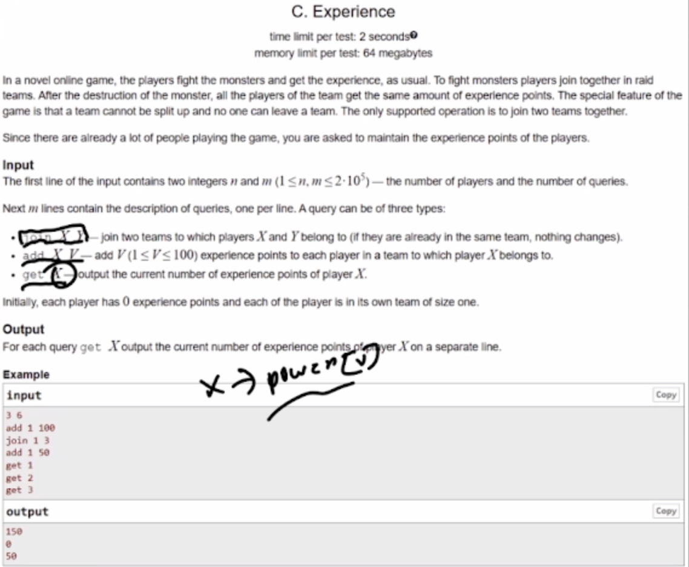

### DSU — Disjoint Set Union

[cp-algorithms reference](https://cp-algorithms.com/data_structures/disjoint_set_union.html)

#### When is DSU required?

- Used for connectivity queries on nodes/edges (e.g., are `a` and `b` in the same component?).
- Single query brute force: traverse the component containing `a` (O(N)).
- Many queries: brute force becomes O(NQ) → TLE; DSU answers in near O(1).
- Typical assumptions here: we do not handle disconnections, and we may not explicitly build the full graph.


#### Path compression: finding the parent

- Always reattach a node directly to its ultimate parent (not just the immediate parent).
- Classic find (amortized O(1)):

```cpp
int find_parent(int node) {
    if (node == parent[node]) return node;
    return parent[node] = find_parent(parent[node]);
}
```

#### Union heuristics (to keep trees shallow)

- Goal: connect smaller to bigger; avoid relying on raw height since it changes.
- References: https://takeuforward.org/data-structure/disjoint-set-union-by-rank-union-by-size-path-compression-g-46/
- Both rank and size approaches behave similarly.

**Union by rank** (rank may not always increase)

- Rank ≈ distance to the furthest leaf (counts nodes below the current node).

**Union by size** (size always increases; maintain a size array)

- Size of a node = number of nodes in its component; use `size[i]` as the component size rooted at `i`.

#### DSU implementation

```cpp
// DSU with path compression + union by size and union by rank
class dsu {
    vector<int> parent, size, rank;
public:
    dsu(int n) {
        for (int i = 0; i <= n; i++) {
            parent.push_back(i);
            size.push_back(1);
            rank.push_back(0);
        }
    }

    int findPar(int node) {
        if (parent[node] == node) return node;
        return parent[node] = findPar(parent[node]);
    }

    void unionSize(int u, int v) {
        int pu = findPar(u);
        int pv = findPar(v);
        if (pu == pv) return;
        // attach smaller to bigger
        if (size[pu] < size[pv]) {
            parent[pu] = pv;
            size[pv] += size[pu];
        } else {
            parent[pv] = pu;
            size[pu] += size[pv];
        }
    }

    void unionRank(int u, int v) {
        int pu = findPar(u);
        int pv = findPar(v);
        if (pu == pv) return;
        if (rank[pu] == rank[pv]) {
            parent[pu] = pv;
            rank[pu]++;
        } else if (rank[pu] < rank[pv]) {
            parent[pu] = pv;
        } else {
            parent[pv] = pu;
        }
    }
};
```

#### Examples

- [codechef_ABROADS_Ancient Berland Roads](./5_dsu/codechef_ABROADS_Ancient%20Berland%20Roads.cpp)

- [spoj_CLFLARR - COLORFUL ARRAY](./5_dsu/spoj_CLFLARR%20-%20COLORFUL%20ARRAY.cpp)
  - Given `n` unpainted elements (initially `0`).
  - `q` queries, each `(l, r, c)`: paint indices `l..r` with color `c` (new color overrides previous).
  - Output the final colors after all queries are processed.

---



> initially all are in different set, complexity O(n+q)


