## Geometry

Online Graph Generator -> https://www.desmos.com/calculator

### Points

example:

- https://www.codechef.com/CFUS2020/problems/CFS2005

  <pre>
  You are given a grid with dimension n x m and two points with coordinates X(x1,y1) and Y(x2,y2) . Your task is to find the number of ways in which one can go from point A(0,0)to point B(n,m) using the shortest possible path such that the shortest path neither passes through X nor through Y.
  
  n!/(r1!*r2!)
  
  S(A ∪ B ∪ C) = S(A) + S(B) + S(C) − S(A ∩ B) − S(A ∩ C) − S(B ∩ C) + S(A ∩ B ∩ C)
  -> ans = S(A ∩ B ∩ C)
  </pre>

- [codechef_LTIME24_NWAYS](codechef_LTIME24_NWAYS.cpp)

  <pre>
  Devu has two sets of points. Set A contains points having X co-ordinate 0 and Y co-ordinates varying from 1 to N(both inclusive). Set B contains points having X co-ordinate K and Y co-ordinates varying from 1 to N(both inclusive). Both sets contains N number of integral points. He wants to calculate the sum of number of ways to going to the each point of set B from the each point of set A . 
  
  bruteforce->ans = ans + fact[y2 + x2 - y1 - x1] * ifact[x2 - x1] * ifact[y2 - y1];
  
  </pre>

- https://www.spoj.com/problems/UCV2013E/

---

### Lines

---

### Circles

- https://codeforces.com/contest/2074/problem/D

### Triangles

#### Non-Degenerate Triangle

https://codeforces.com/problemset/problem/2053/A

https://codeforces.com/problemset/problem/2009/D

#### Area

https://www.youtube.com/watch?v=y9zRZYnSf2Y&list=PLpRww_DKmkSYiodL6xsSQyzjhJ8VPtq1K&index=15
https://codeforces.com/problemset/problem/1620/B

---

### Trapezoids

#### Isosceles Trapezoids

https://codeforces.com/contest/2061/problem/B

https://www.youtube.com/watch?v=AlyWS8bG3kE

---

### Quadrilaterals


---
## Computational Geometry

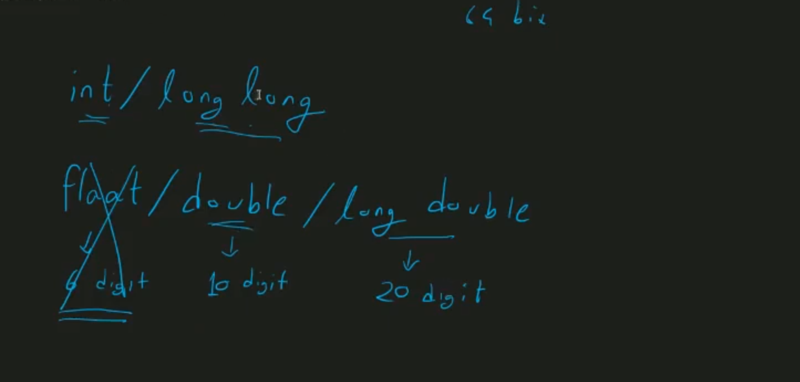


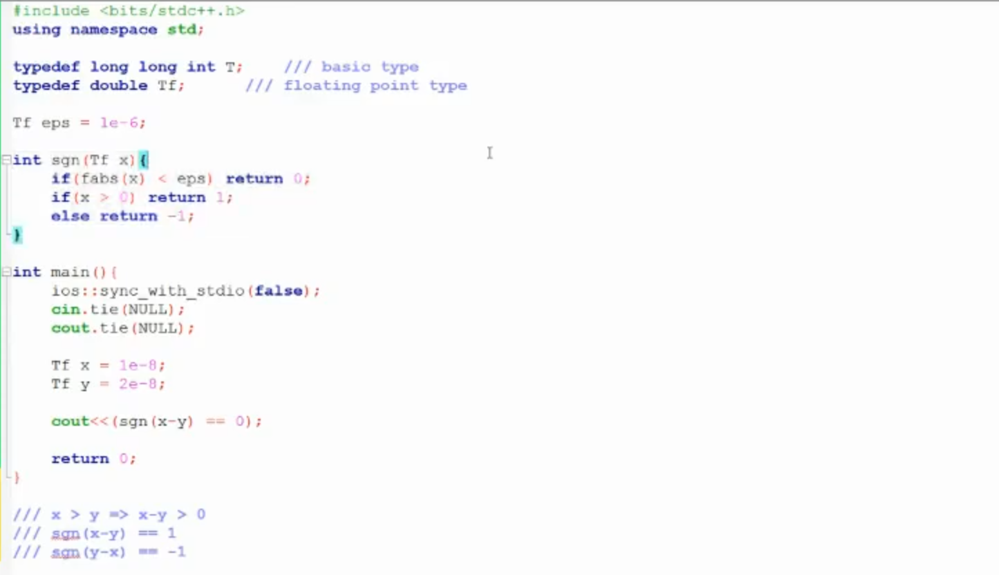
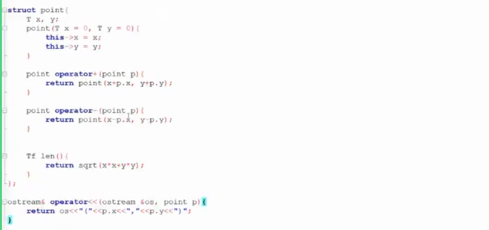
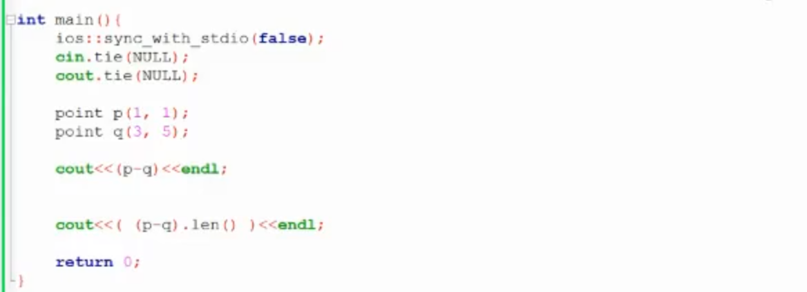
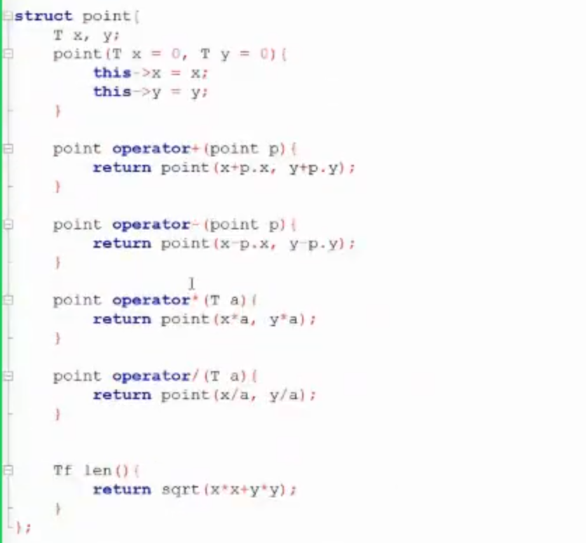
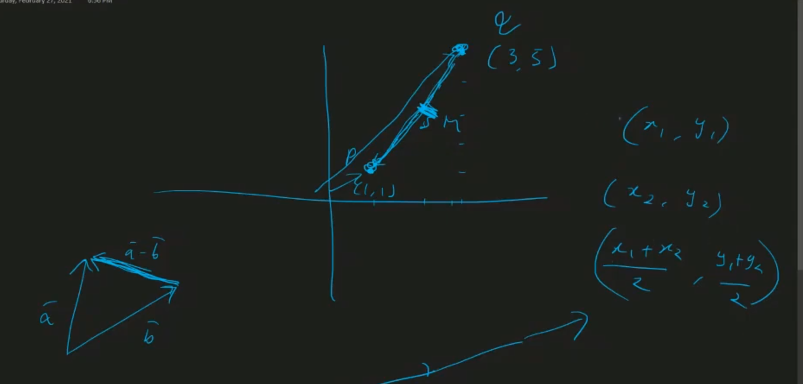

> (p+q)/2

- two equal len

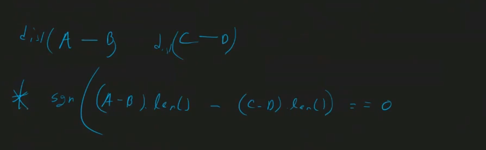
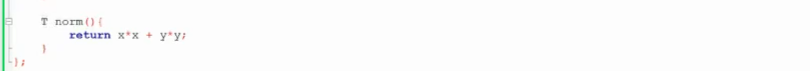


- dot product

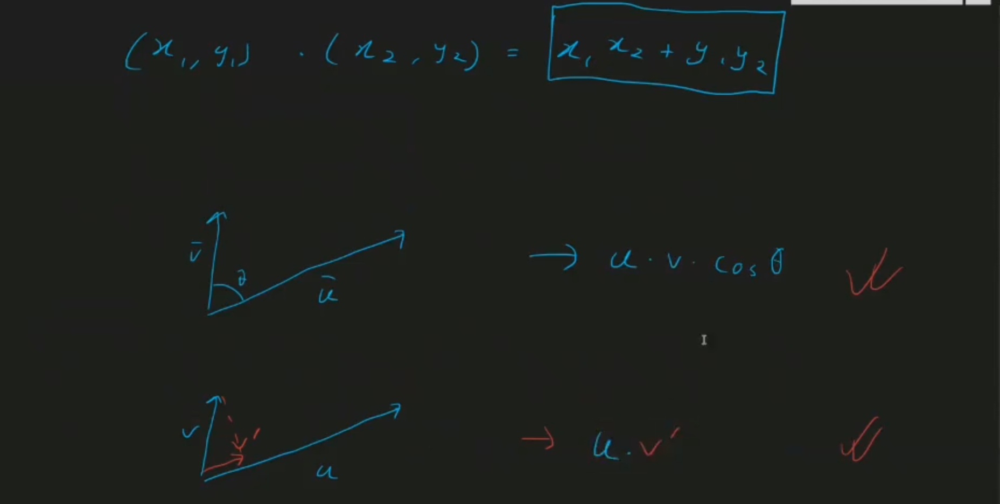
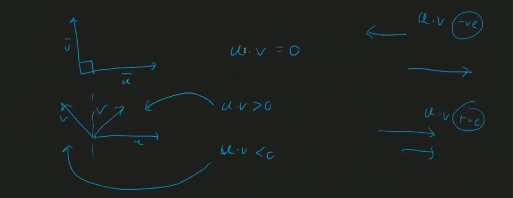
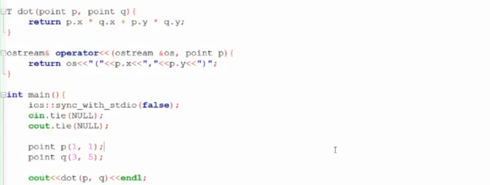

```cpp
( acos(dot(p,q)/p.len(),q.len()) )
```

- cross product

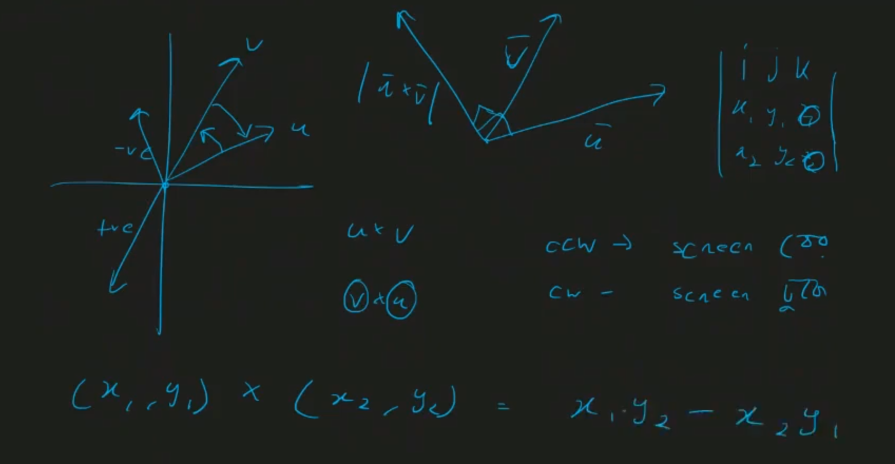
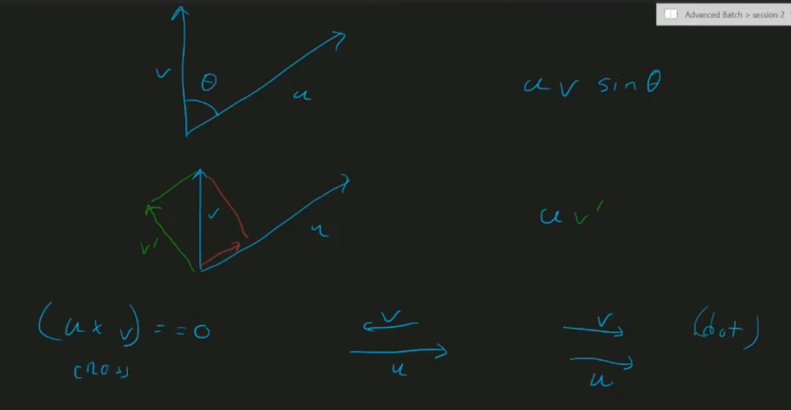
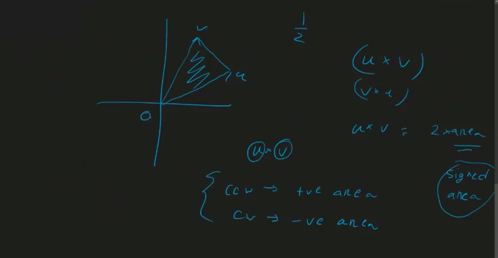

- triangle area

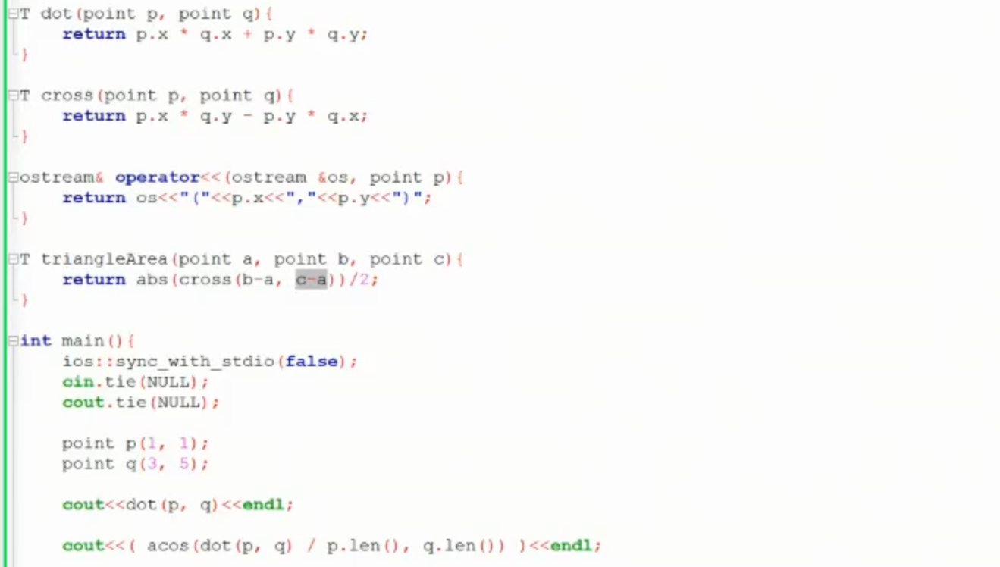
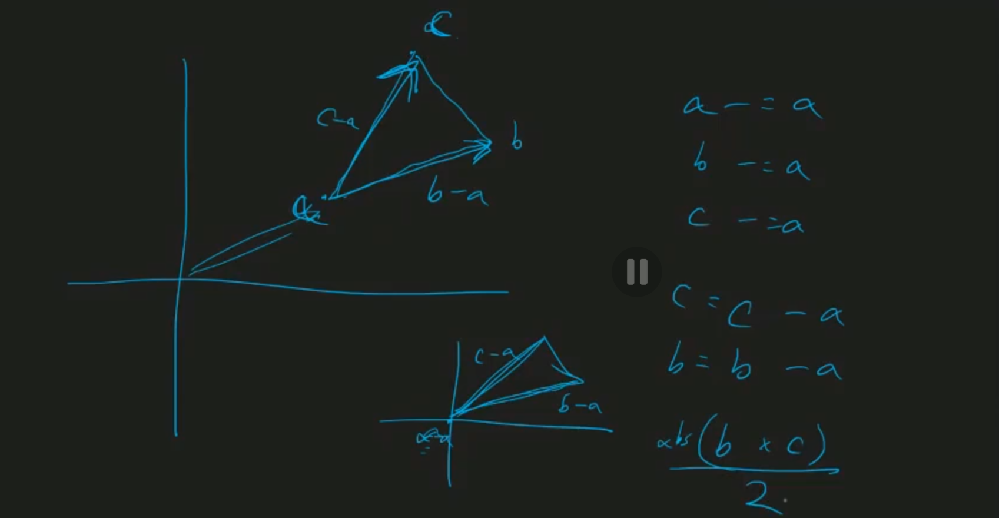
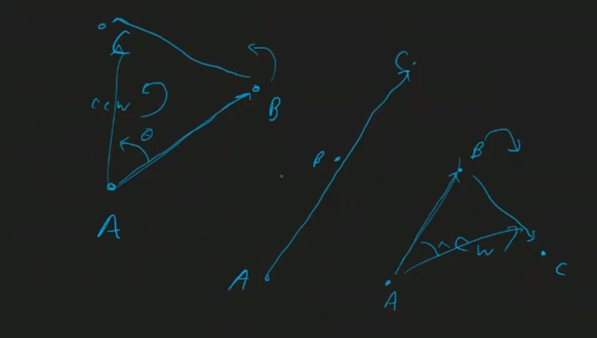

> AB = B - A, AC = C - A

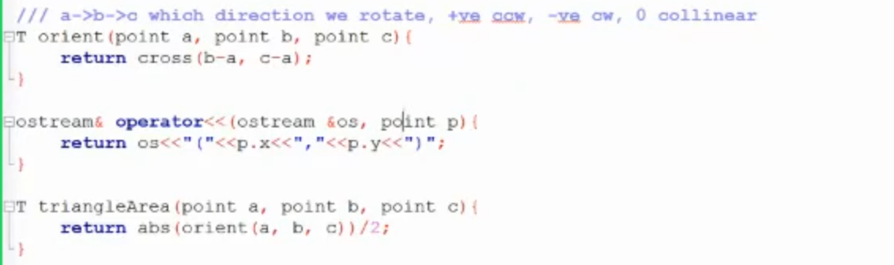
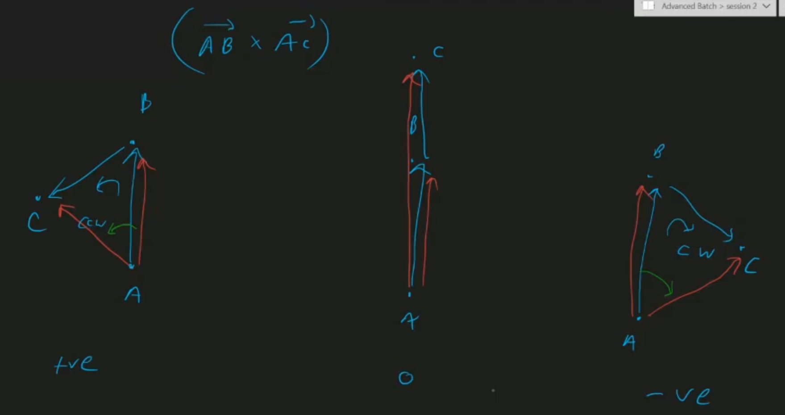

ex.

- https://cses.fi/problemset/task/2189

---
- equal check

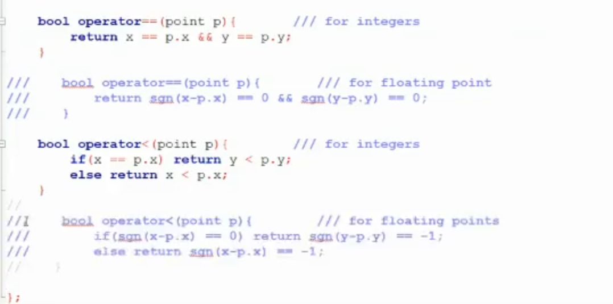


- code

```cpp
#include <bits/stdc++.h>
using namespace std;

// Typedefs for flexibility
// Use 'long long' for precise integer coordinates to avoid precision errors
// Use 'double' or 'long double' if the problem involves non-integer coordinates
typedef long long T;
typedef double Tf;    // Floating point type for lengths/angles

const Tf eps = 1e-9;
const double PI = acos(-1.0);

// Sign function for floating point comparisons
int sgn(Tf x) {
    if (fabs(x) < eps) return 0;
    if (x > 0) return 1;
    return -1;
}

struct point {
    T x, y;

    // Constructors
    point(T x = 0, T y = 0) : x(x), y(y) {}

    // Operator Overloads for Arithmetic
    point operator+(const point &p) const {
        return point(x + p.x, y + p.y);
    }

    point operator-(const point &p) const {
        return point(x - p.x, y - p.y);
    }

    // Scalar multiplication
    point operator*(T a) const {
        return point(x * a, y * a);
    }

    // Scalar division
    point operator/(T a) const {
        return point(x / a, y / a);
    }

    // Comparators
    // Note: If T is double, use sgn() for comparisons.
    // Since T is long long here, standard operators apply.
    bool operator==(const point &p) const {
      // If T is double, use sgn() for robust comparison:
      // return sgn(x - p.x) == 0 && sgn(y - p.y) == 0;
        return x == p.x && y == p.y;
    }

    bool operator<(const point &p) const {
      // If T is double, use sgn() for robust comparison:
      // if (sgn(x - p.x) != 0) return sgn(x - p.x) < 0;
      // return sgn(y - p.y) < 0;
        if (x != p.x) return x < p.x;
        return y < p.y;
    }

    // Utility functions
    // Norm: Squared length (avoids sqrt for precision)
    T norm() const {
        return x * x + y * y;
    }

    // Len: Actual length
    Tf len() const {
        return sqrt(x * x + y * y);
    }
};

// Output stream operator for easy printing: cout << p << endl;
ostream& operator<<(ostream &os, const point &p) {
    return os << "(" << p.x << "," << p.y << ")";
}

// Dot Product: p.x*q.x + p.y*q.y
// A dot B = |A||B|cos(theta)
T dot(point p, point q) {
    return p.x * q.x + p.y * q.y;
}

// Cross Product: p.x*q.y - p.y*q.x
// A cross B = |A||B|sin(theta)
// Returns z-component of cross product
T cross(point p, point q) {
    return p.x * q.y - p.y * q.x;
}

// Orientation / Turn Test
// Returns:
// +ve: Counter-Clockwise turn (Left)
// -ve: Clockwise turn (Right)
// 0  : Collinear
T orient(point a, point b, point c) {
    return cross(b - a, c - a);
}

// Triangle Area using Cross Product
// Area = 0.5 * |AB x AC|
Tf triangleArea(point a, point b, point c) {
    return abs(orient(a, b, c)) / 2.0;
}

// Angle between two vectors (in radians)
Tf angle(point p, point q) {
    return acos(dot(p, q) / (p.len() * q.len()));
}

int main() {
    // Fast I/O
    ios::sync_with_stdio(false);
    cin.tie(NULL);
    cout.tie(NULL);

    point p(1, 1);
    point q(3, 5);
    point r(5, 2);

    // 1. Basic Arithmetic
    cout << "Point P: " << p << endl;
    cout << "Point Q: " << q << endl;
    cout << "P + Q: " << (p + q) << endl;
    cout << "Q - P: " << (q - p) << endl;

    // 2. Lengths
    cout << "Dist P to Q: " << (q - p).len() << endl;
    cout << "Norm (sq dist) of P: " << p.norm() << endl;

    // 3. Dot Product & Angle
    cout << "Dot(P, Q): " << dot(p, q) << endl;
    // Angle requires floating point calculations
    cout << "Angle between P and Q (rads): " << angle(p, q) << endl;

    // 4. Orientation & Cross Product
    // Checking orientation of P -> Q -> R
    T o = orient(p, q, r);
    cout << "Orientation value (P->Q->R): " << o << endl;
    if (o > 0) cout << "Result: Left Turn (CCW)" << endl;
    else if (o < 0) cout << "Result: Right Turn (CW)" << endl;
    else cout << "Result: Collinear" << endl;

    // 5. Triangle Area
    cout << "Area of Triangle PQR: " << triangleArea(p, q, r) << endl;

    // 6. Sorting check
    vector<point> v;
    v.push_back(q);
    v.push_back(p);
    v.push_back(r);
    sort(v.begin(), v.end());

    cout << "Sorted points: ";
    for (auto pt : v) cout << pt << " ";
    cout << endl;

    return 0;
}
```

- segment


> intercept or not

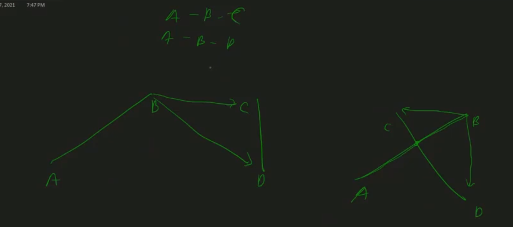
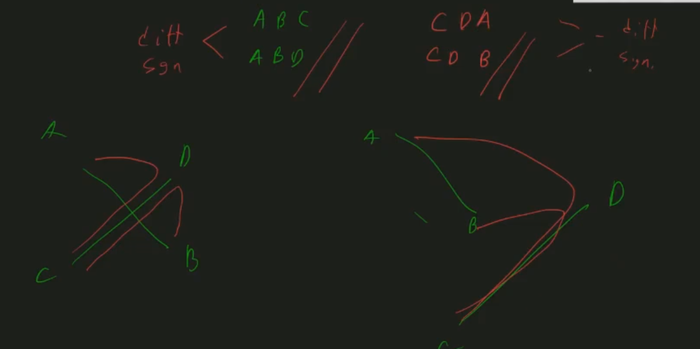
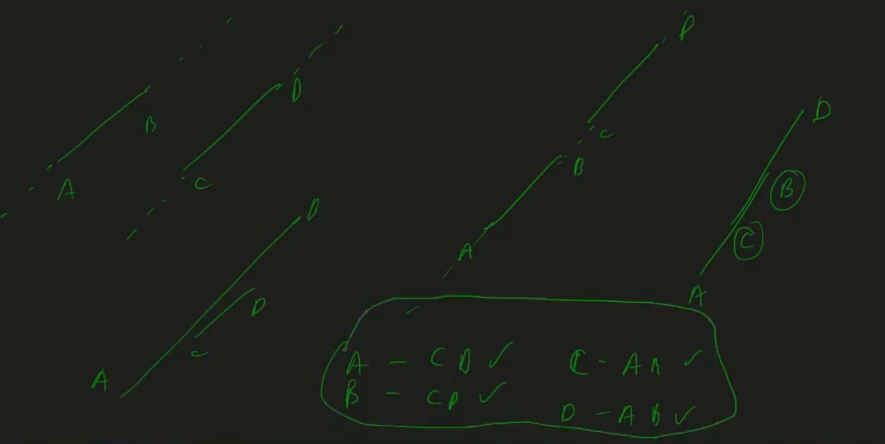
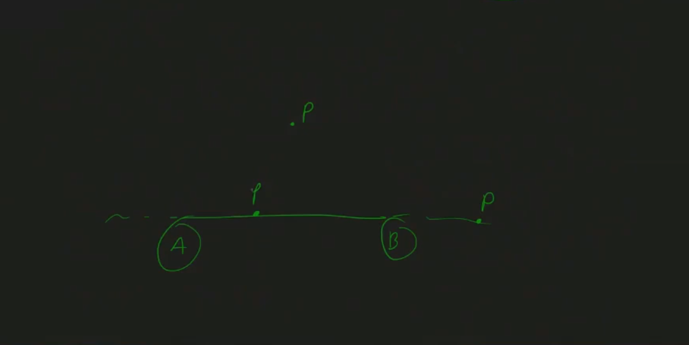
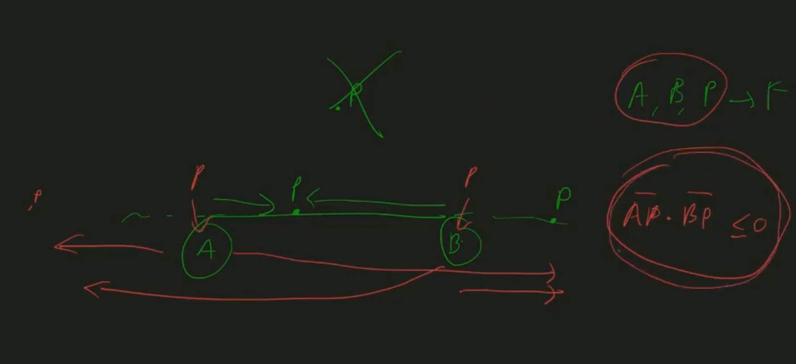

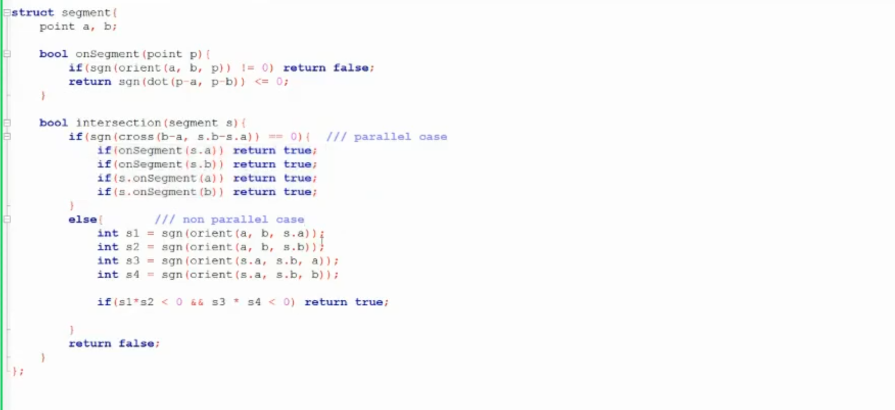
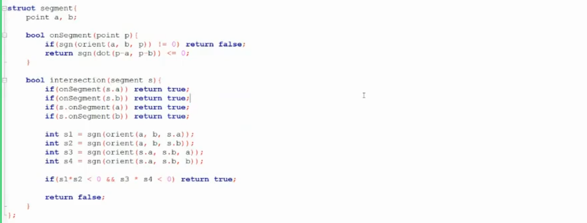

```cpp
//when no need floating point
int sgn (T x){
  if(x==0)return 0;
  if(x>0)return 1;
  else return -1;
}
```

```cpp
struct segment {
    point a, b;

    // Constructor (optional but helpful)
    segment() {}
    segment(point _a, point _b) : a(_a), b(_b) {}

    // Check if point 'p' lies on this segment
    bool onSegment(point p) {
        // 1. Must be collinear (orientation is 0)
        if (sgn(orient(a, b, p)) != 0) return false;
        
        // 2. Must be between 'a' and 'b' 
        // If dot product of (p-a) and (p-b) is <= 0, the vectors point in opposite directions
        return sgn(dot(p - a, p - b)) <= 0;
    }

    // Check if this segment intersects with segment 's'
    bool intersection(segment s) {
        // Case 1: Endpoints touching or overlapping
        if (onSegment(s.a)) return true;
        if (onSegment(s.b)) return true;
        if (s.onSegment(a)) return true;
        if (s.onSegment(b)) return true;

        // Case 2: Proper intersection (Straddle Test)
        // Checks if endpoints of 's' are on opposite sides of 'this' segment
        int s1 = sgn(orient(a, b, s.a));
        int s2 = sgn(orient(a, b, s.b));
        
        // Checks if endpoints of 'this' segment are on opposite sides of 's'
        int s3 = sgn(orient(s.a, s.b, a));
        int s4 = sgn(orient(s.a, s.b, b));

        // If both straddle, they intersect
        if (s1 * s2 < 0 && s3 * s4 < 0) return true;

        return false;
    }
};
```
ex.

https://cses.fi/problemset/task/2190

- polygon

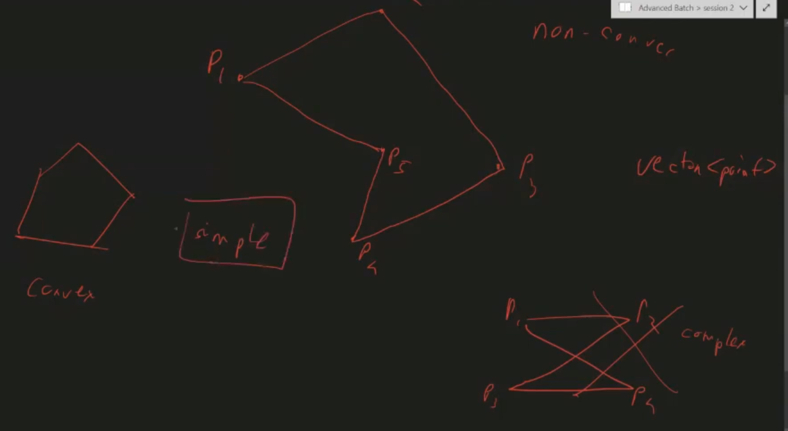

- area of a polygon

> origin at inside

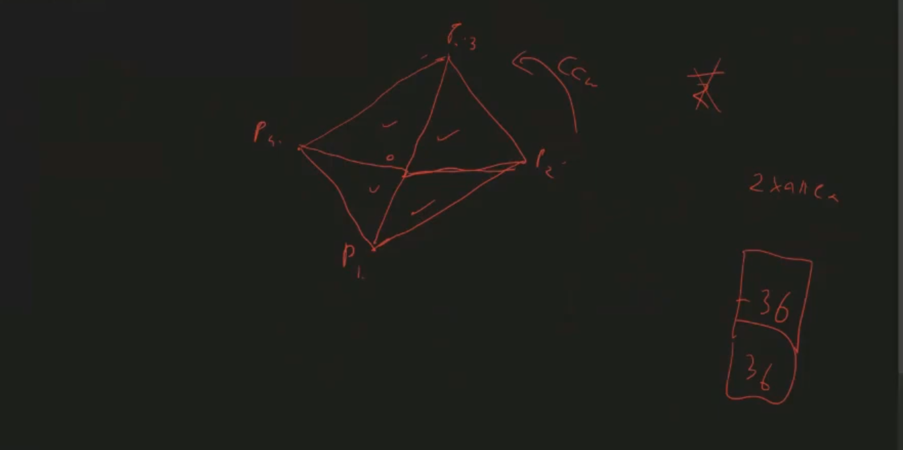

> origin at outside

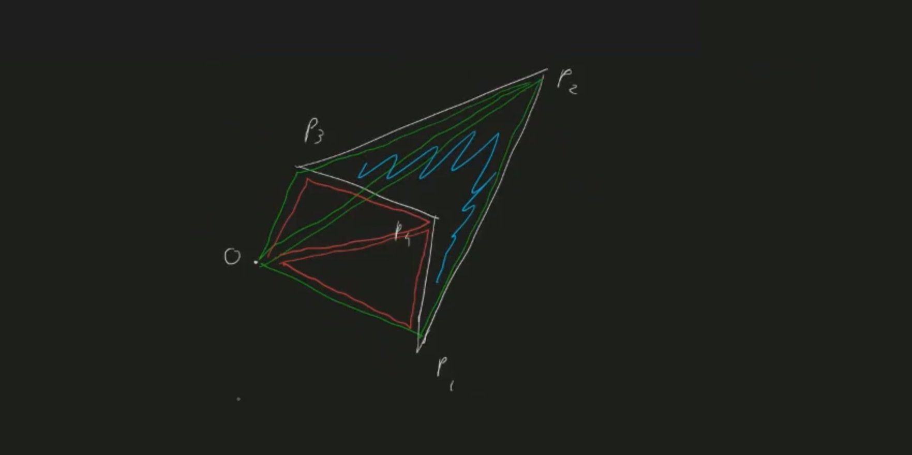

ex.

https://cses.fi/problemset/task/2191


resources:

- https://victorlecomte.com/cp-geo.pdf
- https://www.youtube.com/watch?v=G9QTjWtK_TQ